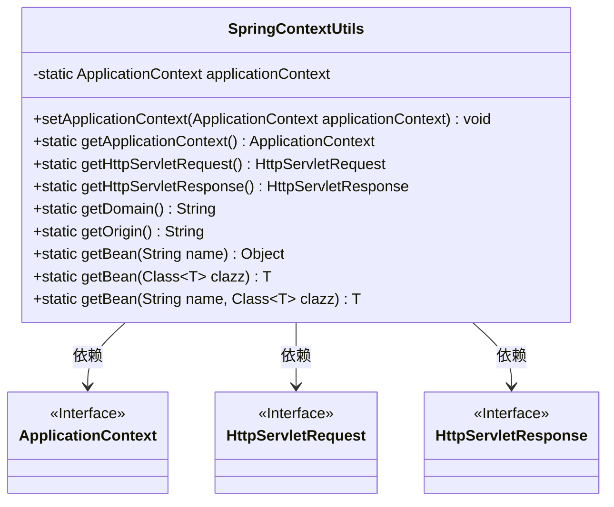

# 基础信息

|      |      |
|------|------|
| 名称 | SpringContextUtils |
| 编码语言 | .java |
| 代码路径 | JeecgBoot/jeecg-boot/jeecg-boot-base-core/src/main/java/org/jeecg/common/util/SpringContextUtils.java |
| 包名 | org.jeecg.common.util |
| 依赖项 | ['javax.servlet.http.HttpServletRequest', 'javax.servlet.http.HttpServletResponse', 'org.jeecg.common.constant.CommonConstant', 'org.jeecg.common.constant.ServiceNameConstants', 'org.springframework.beans.BeansException', 'org.springframework.context.ApplicationContext', 'org.springframework.context.ApplicationContextAware', 'org.springframework.stereotype.Component', 'org.springframework.web.context.request.RequestContextHolder', 'org.springframework.web.context.request.ServletRequestAttributes'] |
| 概述说明 | SpringContextUtils类管理应用上下文，提供获取Bean、Http请求、响应及项目根路径的方法。 |

# 说明

SpringContextUtils类是一个用于管理应用上下文的工具类，提供了多种实用方法。其主要功能包括获取应用中的Bean实例，处理HTTP请求和响应，以及获取项目的根路径。通过这些方法，开发者可以方便地访问和管理应用上下文中的资源，简化了与Spring框架的交互过程。

# 类列表 Class Summary

| 名称   | 类型  | 说明 |
|-------|------|-------------|
| SpringContextUtils | class | SpringContextUtils类用于管理应用上下文，提供获取Bean、Http请求、响应及项目根路径的方法。 |

## 类 SpringContextUtils

|      |      |
|------|------|
| 访问范围 | @Component;public |
| 类型 | class |
| 名称 | SpringContextUtils |
| 说明 | SpringContextUtils类用于管理应用上下文，提供获取Bean、Http请求、响应及项目根路径的方法。 |

### UML类图

**描述：**  
`SpringContextUtils` 类是一个工具类，用于管理和访问 Spring 应用上下文 (`ApplicationContext`) 以及 HTTP 请求和响应对象。它实现了 `ApplicationContextAware` 接口，允许在 Spring 容器启动时自动注入应用上下文。该类提供了多种静态方法，用于获取应用上下文、HTTP 请求和响应对象、项目根路径、请求来源以及通过名称或类类型获取 Spring Bean。这些功能使得在 Spring 应用中更方便地访问和管理上下文资源。

### 内部方法调用关系图

```mermaid
graph TD
    A["类SpringContextUtils"]
    B["属性: static ApplicationContext applicationContext"]
    C["方法: setApplicationContext(ApplicationContext applicationContext)"]
    D["方法: static ApplicationContext getApplicationContext()"]
    E["方法: static HttpServletRequest getHttpServletRequest()"]
    F["方法: static HttpServletResponse getHttpServletResponse()"]
    G["方法: static String getDomain()"]
    H["方法: static String getOrigin()"]
    I["方法: static Object getBean(String name)"]
    J["方法: static <T> T getBean(Class<T> clazz)"]
    K["方法: static <T> T getBean(String name, Class<T> clazz)"]

    A --> B
    A --> C
    A --> D
    A --> E
    A --> F
    A --> G
    A --> H
    A --> I
    A --> J
    A --> K
```

这段代码定义了一个名为 `SpringContextUtils` 的工具类，主要用于管理和获取Spring应用上下文（`ApplicationContext`）以及HTTP请求和响应的相关对象。该类通过实现 `ApplicationContextAware` 接口，能够在Spring容器启动时自动注入 `ApplicationContext`。此外，它还提供了多个静态方法，用于获取HTTP请求、响应对象、项目根路径、请求来源以及通过名称或类类型获取Spring容器中的Bean。这些功能使得在Spring应用中更方便地访问和管理上下文和HTTP相关的资源。

### 字段列表 Field List

| 名称  | 类型  | 说明 |
|-------|-------|------|
| applicationContext | ApplicationContext | 静态私有变量存储应用上下文实例。 |

### 方法列表 Method List

| 名称  | 类型  | 说明 |
|-------|-------|------|
| setApplicationContext | void | 重写方法，设置Spring应用上下文。 |
| getApplicationContext | ApplicationContext | 获取当前应用程序上下文的方法。 |
| getHttpServletRequest | HttpServletRequest | 获取当前HTTP请求对象的方法。 |
| getOrigin | String | 获取HTTP请求的Origin头信息。 |
| getHttpServletResponse | HttpServletResponse | 获取当前HTTP请求的响应对象。 |
| getBean | Object | 静态方法getBean通过应用上下文获取指定名称的Bean对象。 |
| getBean | T | 静态方法getBean通过应用上下文获取指定类的Bean实例。 |
| getDomain | String | 方法获取请求域名，优先使用网关路径，否则处理URL并兼容SSL。 |
| getBean | T | 静态方法通过应用上下文获取指定名称和类型的Bean实例。 |

