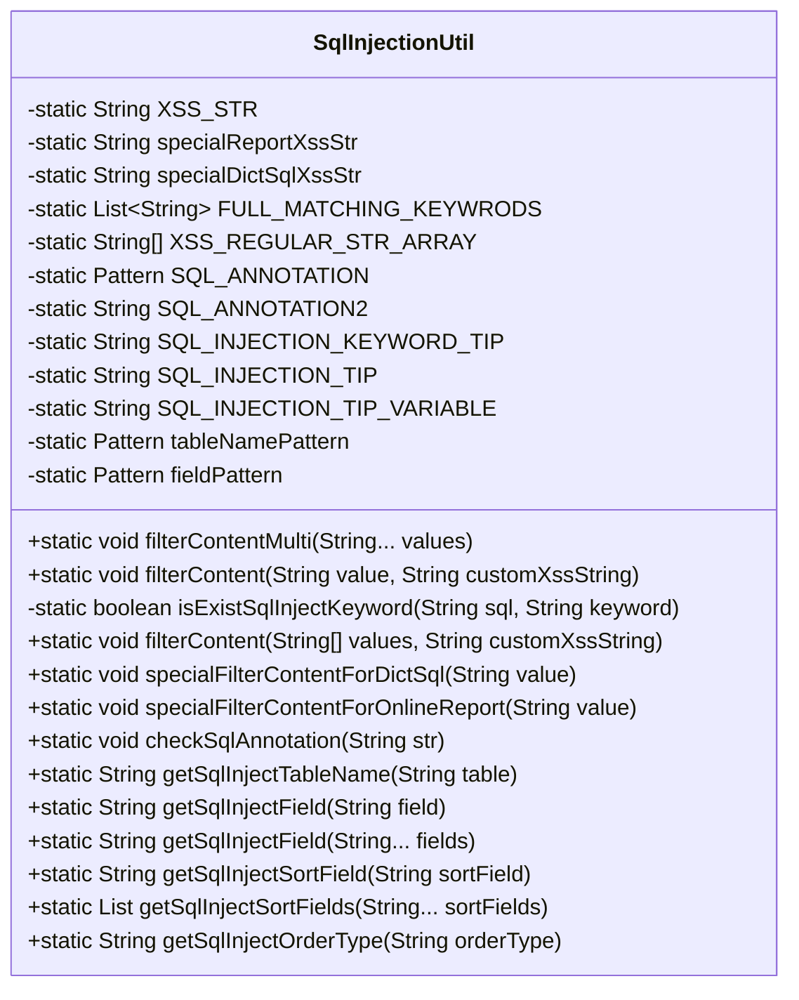

# 基础信息

|      |      |
|------|------|
| 名称 | SqlInjectionUtil |
| 编码语言 | .java |
| 代码路径 | JeecgBoot/jeecg-boot/jeecg-boot-base-core/src/main/java/org/jeecg/common/util/SqlInjectionUtil.java |
| 包名 | org.jeecg.common.util |
| 依赖项 | ['cn.hutool.core.util.ReUtil', 'lombok.extern.slf4j.Slf4j', 'org.jeecg.common.constant.CommonConstant', 'org.jeecg.common.constant.SymbolConstant', 'org.jeecg.common.exception.JeecgSqlInjectionException', 'java.util.ArrayList', 'java.util.List', 'java.util.regex.Matcher', 'java.util.regex.Pattern'] |
| 概述说明 | SqlInjectionUtil类用于检测和防止SQL注入，具备关键词过滤、正则匹配和注释校验功能。 |

# 说明

SqlInjectionUtil类是一个专门用于检测和防止SQL注入的工具类。它集成了多种功能，包括关键词过滤、正则表达式匹配以及注释校验等，以全面防范SQL注入攻击。通过关键词过滤，该类能够识别并阻止包含潜在危险SQL关键词的输入。正则匹配功能则用于验证输入是否符合安全模式，进一步确保数据的合法性。注释校验则用于检测和消除可能被恶意利用的SQL注释语句。这些功能的结合使得SqlInjectionUtil类能够有效地提升应用程序的安全性，防止SQL注入攻击的发生。

# 类列表 Class Summary

| 名称   | 类型  | 说明 |
|-------|------|-------------|
| SqlInjectionUtil | class | SqlInjectionUtil类用于检测和防止SQL注入，包含关键词过滤、正则匹配和注释校验等功能。 |

## 类 SqlInjectionUtil

|      |      |
|------|------|
| 访问范围 | @Slf4j;public |
| 类型 | class |
| 名称 | SqlInjectionUtil |
| 说明 | SqlInjectionUtil类用于检测和防止SQL注入，包含关键词过滤、正则匹配和注释校验等功能。 |

### UML类图

这段代码定义了一个名为 `SqlInjectionUtil` 的工具类，主要用于检测和防止SQL注入攻击。类中包含多个静态方法和常量，用于处理不同场景下的SQL注入检测。方法包括过滤内容、检查SQL注释、获取合法的表名和字段名等。通过正则表达式和关键词匹配，确保输入的内容不包含潜在的SQL注入风险。

### 内部方法调用关系图

```mermaid
graph TD
    A["类SqlInjectionUtil"]
    B["属性: String XSS_STR"]
    C["属性: String specialReportXssStr"]
    D["属性: String specialDictSqlXssStr"]
    E["属性: List<String> FULL_MATCHING_KEYWRODS"]
    F["属性: String[] XSS_REGULAR_STR_ARRAY"]
    G["属性: Pattern SQL_ANNOTATION"]
    H["属性: String SQL_ANNOTATION2"]
    I["属性: String SQL_INJECTION_KEYWORD_TIP"]
    J["属性: String SQL_INJECTION_TIP"]
    K["属性: String SQL_INJECTION_TIP_VARIABLE"]
    L["方法: filterContentMulti(String... values)"]
    M["方法: filterContent(String value, String customXssString)"]
    N["方法: isExistSqlInjectKeyword(String sql, String keyword)"]
    O["方法: filterContent(String[] values, String customXssString)"]
    P["方法: specialFilterContentForDictSql(String value)"]
    Q["方法: specialFilterContentForOnlineReport(String value)"]
    R["方法: checkSqlAnnotation(String str)"]
    S["方法: getSqlInjectTableName(String table)"]
    T["方法: getSqlInjectField(String field)"]
    U["方法: getSqlInjectField(String... fields)"]
    V["方法: getSqlInjectSortField(String sortField)"]
    W["方法: getSqlInjectSortFields(String... sortFields)"]
    X["方法: getSqlInjectOrderType(String orderType)"]

    A --> B
    A --> C
    A --> D
    A --> E
    A --> F
    A --> G
    A --> H
    A --> I
    A --> J
    A --> K
    A --> L
    L --> M
    M --> N
    M --> O
    A --> P
    P --> N
    A --> Q
    Q --> N
    A --> R
    A --> S
    S --> L
    A --> T
    T --> U
    A --> V
    V --> T
    A --> W
    W --> V
    A --> X
```

这段代码定义了一个 `SqlInjectionUtil` 类，主要用于检测和防止SQL注入攻击。类中包含了多个静态属性和方法，用于处理不同的SQL注入场景。通过正则表达式和关键词匹配，代码能够检测出潜在的SQL注入风险，并在发现风险时抛出异常。流程图展示了类中各个方法的调用关系，以及它们之间的依赖关系。

### 字段列表 Field List

| 名称  | 类型  | 说明 |
|-------|-------|------|
| SQL_INJECTION_KEYWORD_TIP = "请注意，存在SQL注入关键词---> {}" | String | 提示SQL注入关键词存在。 |
| SQL_ANNOTATION2 = "--" | String | SQL注释符号定义为双横线。 |
| XSS_STR = "and |exec |peformance_schema|information_schema|extractvalue|updatexml|geohash|gtid_subset|gtid_subtract|insert |select |delete |update |drop |count |chr |mid |master |truncate |char |declare |;|or |+|--" | String | 定义静态字符串XSS_STR，包含常见SQL注入和XSS攻击关键词。 |
| XSS_REGULAR_STR_ARRAY = new String[]{			"chr\\s*\\(",			"mid\\s*\\(",			" char\\s*\\(",			"sleep\\s*\\(",			"user\\s*\\(",			"show\\s+tables",			"user[\\s]*\\([\\s]*\\)",			"show\\s+databases",			"sleep\\(\\d*\\)",			"sleep\\(.*\\)",	} | String[] | XSS正则表达式数组，包含常见XSS攻击模式。 |
| SQL_INJECTION_TIP = "请注意，值可能存在SQL注入风险!--->" | String | SQL注入风险提示字符串常量定义。 |
| SQL_ANNOTATION = Pattern.compile("/\\*[\\s\\S]*\\*/") | Pattern | 定义私有静态正则表达式，用于匹配SQL注释。 |
| fieldPattern = Pattern.compile("^[a-zA-Z0-9_]+$") | Pattern | 定义静态最终字段模式，匹配字母数字下划线。 |
| FULL_MATCHING_KEYWRODS = new ArrayList<>() | List<String> | 私有静态字符串列表FULL_MATCHING_KEYWRODS初始化。 |
| SQL_INJECTION_TIP_VARIABLE = "请注意，值可能存在SQL注入风险!---> {}" | String | SQL注入风险提示变量定义为“请注意，值可能存在SQL注入风险!---> {}”。 |
| specialReportXssStr = "exec |peformance_schema|information_schema|extractvalue|updatexml|geohash|gtid_subset|gtid_subtract|insert |alter |delete |grant |update |drop |master |truncate |declare |--" | String | 定义特殊报告XSS字符串，包含敏感SQL操作和关键字。 |
| tableNamePattern = Pattern.compile("^[a-zA-Z][a-zA-Z0-9_\\$]{0,63}$") | Pattern | 定义正则表达式匹配表名，首字符为字母，后续可为字母、数字、下划线或美元符号，长度不超过64。 |
| specialDictSqlXssStr = "exec |peformance_schema|information_schema|extractvalue|updatexml|geohash|gtid_subset|gtid_subtract|insert |select |delete |update |drop |count |chr |mid |master |truncate |char |declare |;|+|--" | String | 防止SQL注入和XSS攻击的特殊字符过滤字符串。 |

### 方法列表 Method List

| 名称  | 类型  | 说明 |
|-------|-------|------|
| filterContent | void | 过滤字符串数组内容，空值直接返回。 |
| specialFilterContentForDictSql | void | 过滤SQL注入风险，检查注释、关键词和正则匹配。 |
| isExistSqlInjectKeyword | boolean | 检测SQL语句中是否存在注入关键词，匹配空格及特殊字符。 |
| getSqlInjectField | String | 方法检查字段合法性，防止SQL注入，返回合法字段或抛出异常。 |
| filterContent | void | 方法过滤内容，检查SQL注入风险，包括注释、关键词和正则匹配。 |
| getSqlInjectOrderType | String | 静态方法获取SQL注入排序类型，默认降序。 |
| checkSqlAnnotation | void | 检查SQL字符串，禁止注释并防止SQL注入风险。 |
| getSqlInjectSortField | String | 该方法将驼峰命名字段转换为下划线格式并防止SQL注入。 |
| filterContentMulti | void | 静态方法`filterContentMulti`用于多值过滤，调用`filterContent`处理。 |
| getSqlInjectTableName | String | 该方法截取表名并验证其合法性，防止SQL注入风险。 |
| specialFilterContentForOnlineReport | void | 在线报告内容过滤：校验SQL注释，检测SQL注入风险。 |
| getSqlInjectField | String | 静态方法检查SQL注入字段并返回逗号分隔的字符串。 |
| getSqlInjectSortFields | List | 该方法将输入的排序字段处理为防SQL注入的安全格式并返回列表。 |

