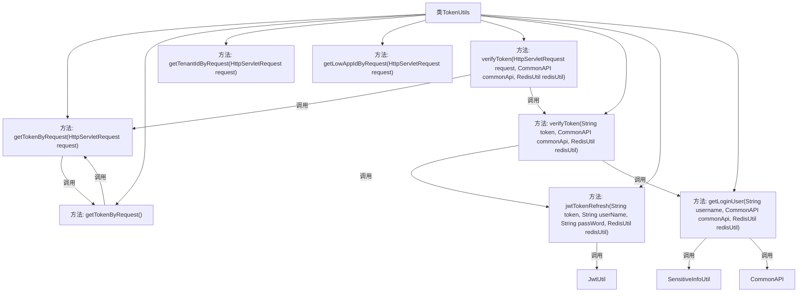

# 基础信息

|      |      |
|------|------|
| 名称 | TokenUtils |
| 编码语言 | .java |
| 代码路径 | JeecgBoot/jeecg-boot/jeecg-boot-base-core/src/main/java/org/jeecg/common/util/TokenUtils.java |
| 包名 | org.jeecg.common.util |
| 依赖项 | ['lombok.extern.slf4j.Slf4j', 'org.apache.commons.lang3.StringUtils', 'org.jeecg.common.api.CommonAPI', 'org.jeecg.common.constant.CacheConstant', 'org.jeecg.common.constant.CommonConstant', 'org.jeecg.common.constant.TenantConstant', 'org.jeecg.common.desensitization.util.SensitiveInfoUtil', 'org.jeecg.common.exception.JeecgBoot401Exception', 'org.jeecg.common.system.util.JwtUtil', 'org.jeecg.common.system.vo.LoginUser', 'javax.servlet.http.HttpServletRequest'] |
| 概述说明 | TokenUtils类提供获取token、验证有效性、支持刷新和用户信息获取功能。 |

# 说明

TokenUtils类是一个功能丰富的工具类，主要用于从请求中提取token、租户ID和低代码应用ID。它提供了验证token有效性的功能，确保token的合法性和安全性。此外，该类还支持token的刷新操作，能够在token过期或需要更新时进行自动刷新。同时，TokenUtils类还具备获取用户信息的能力，能够根据token提取并返回相关的用户数据。这些功能使得TokenUtils类在处理用户认证和授权时非常实用和高效。

# 类列表 Class Summary

| 名称   | 类型  | 说明 |
|-------|------|-------------|
| TokenUtils | class | TokenUtils类提供从请求中获取token、租户ID、低代码应用ID的方法，并验证token有效性，支持token刷新和用户信息获取。 |

## 类 TokenUtils

|      |      |
|------|------|
| 访问范围 | @Slf4j;public |
| 类型 | class |
| 名称 | TokenUtils |
| 说明 | TokenUtils类提供从请求中获取token、租户ID、低代码应用ID的方法，并验证token有效性，支持token刷新和用户信息获取。 |

### UML类图

```mermaid
classDiagram
    class TokenUtils {
        +String getTokenByRequest(HttpServletRequest request)
        +String getTokenByRequest()
        +String getTenantIdByRequest(HttpServletRequest request)
        +String getLowAppIdByRequest(HttpServletRequest request)
        +boolean verifyToken(HttpServletRequest request, CommonAPI commonApi, RedisUtil redisUtil)
        +boolean verifyToken(String token, CommonAPI commonApi, RedisUtil redisUtil)
        -boolean jwtTokenRefresh(String token, String userName, String passWord, RedisUtil redisUtil)
        +LoginUser getLoginUser(String username, CommonAPI commonApi, RedisUtil redisUtil)
    }

    class HttpServletRequest {
        <<Interface>>
        +String getParameter(String name)
        +String getHeader(String name)
        +String getRequestURL()
    }

    class CommonAPI {
        <<Interface>>
        +LoginUser getUserByName(String username)
    }

    class RedisUtil {
        +boolean hasKey(String key)
        +Object get(String key)
        +void set(String key, Object value)
        +void expire(String key, long timeout)
    }

    class LoginUser {
        +int getStatus()
    }

    class JwtUtil {
        +String getUsername(String token)
        +boolean verify(String token, String userName, String passWord)
        +String sign(String userName, String passWord)
    }

    class SensitiveInfoUtil {
        +void handlerObject(Object obj, boolean encrypt)
    }

    class JeecgBoot401Exception {
        +JeecgBoot401Exception(String message)
    }

    class oConvertUtils {
        +String getString(Object obj)
        +boolean isNotEmpty(String str)
    }

    class SpringContextUtils {
        +HttpServletRequest getHttpServletRequest()
    }

    TokenUtils --> HttpServletRequest : 依赖
    TokenUtils --> CommonAPI : 依赖
    TokenUtils --> RedisUtil : 依赖
    TokenUtils --> LoginUser : 依赖
    TokenUtils --> JwtUtil : 依赖
    TokenUtils --> SensitiveInfoUtil : 依赖
    TokenUtils --> JeecgBoot401Exception : 依赖
    TokenUtils --> oConvertUtils : 依赖
    TokenUtils --> SpringContextUtils : 依赖
```

这段代码定义了一个 `TokenUtils` 类，主要用于处理与Token相关的操作，包括从HTTP请求中获取Token、验证Token的有效性、刷新Token以及获取登录用户信息。`TokenUtils` 类依赖于多个其他类和接口，如 `HttpServletRequest`、`CommonAPI`、`RedisUtil` 等，通过这些依赖关系实现了Token的管理和验证功能。代码中使用了多种工具类和方法来处理Token的解密、验证和刷新，确保系统的安全性和用户的在线状态。

### 内部方法调用关系图

这段代码定义了一个名为 `TokenUtils` 的工具类，主要用于处理与Token相关的操作。类中包含了多个静态方法，用于从HTTP请求中获取Token、租户ID、低代码应用ID，以及验证Token的有效性。其中，`verifyToken` 方法通过调用 `jwtTokenRefresh` 和 `getLoginUser` 方法来确保Token的有效性和用户状态。此外，`getLoginUser` 方法通过Redis缓存或直接调用 `CommonAPI` 来获取用户信息。整个流程涉及多个方法之间的调用关系，确保了Token处理的完整性和安全性。

### 字段列表 Field List

| 名称  | 类型  | 说明 |
|-------|-------|------|

### 方法列表 Method List

| 名称  | 类型  | 说明 |
|-------|-------|------|
| verifyToken | boolean | 验证token有效性，检查用户状态及token是否过期。 |
| getLoginUser | LoginUser | 通过Redis获取缓存用户，解决微服务挂掉时的互调问题。 |
| getTokenByRequest | String | 从请求中获取token，优先从参数获取，其次从头部获取。 |
| getLowAppIdByRequest | String | 从请求中获取低应用ID，优先从参数中获取，其次从头部获取。 |
| getTokenByRequest | String | 通过请求获取令牌的静态方法，处理异常并返回令牌。 |
| getTenantIdByRequest | String | 从HTTP请求中获取租户ID，优先从参数获取，其次从头部获取。 |
| verifyToken | boolean | 静态方法验证请求令牌，记录URL并调用工具类验证。 |
| jwtTokenRefresh | boolean | 刷新JWT令牌并更新缓存，验证无效时生成新令牌。 |

