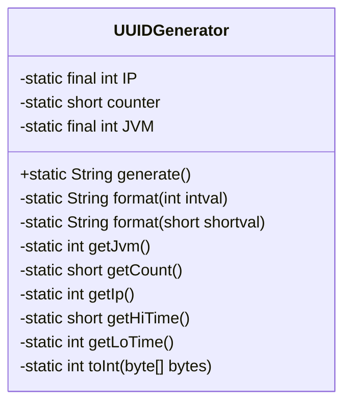
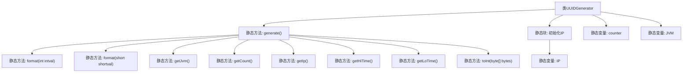

# 基础信息

|      |      |
|------|------|
| 名称 | UUIDGenerator |
| 编码语言 | .java |
| 代码路径 | JeecgBoot/jeecg-boot/jeecg-boot-base-core/src/main/java/org/jeecg/common/util/UUIDGenerator.java |
| 包名 | org.jeecg.common.util |
| 依赖项 | ['java.net.InetAddress'] |
| 概述说明 | 生成32位UUID，结合IP、JVM、时间戳和计数器。 |

# 说明

生成32位UUID的过程结合了多个关键因素以确保唯一性和安全性。首先，使用IP地址来标识生成UUID的设备，确保不同设备生成的UUID具有区分性。其次，结合JVM（Java虚拟机）的信息，进一步确保在同一设备上不同JVM实例生成的UUID也不相同。时间戳的引入则保证了UUID在时间维度上的唯一性，避免在同一设备上短时间内生成重复的UUID。最后，计数器的使用用于在同一时间戳下生成多个UUID时，确保每个UUID的唯一性。通过综合这些因素，生成的32位UUID具有高度的唯一性和安全性，适用于需要唯一标识符的各种场景。

# 类列表 Class Summary

| 名称   | 类型  | 说明 |
|-------|------|-------------|
| UUIDGenerator | class | 生成32位UUID，结合IP、JVM、时间戳和计数器。 |

## 类 UUIDGenerator

|      |      |
|------|------|
| 访问范围 | public |
| 类型 | class |
| 名称 | UUIDGenerator |
| 说明 | 生成32位UUID，结合IP、JVM、时间戳和计数器。 |

### UML类图

**描述：**
`UUIDGenerator` 类用于生成一个32位的UUID。它通过组合IP地址、JVM标识、当前时间的高位和低位以及一个计数器来生成唯一的ID。类中包含多个静态方法，如 `getIp()` 获取本地IP地址，`getHiTime()` 和 `getLoTime()` 获取当前时间的高位和低位，`getCount()` 用于生成一个递增的计数器。`format()` 方法用于将整数和短整型格式化为固定长度的十六进制字符串。最终，`generate()` 方法将这些部分组合成一个32位的UUID字符串。

### 内部方法调用关系图

这段代码定义了一个`UUIDGenerator`类，用于生成32位的UUID。类中包含多个静态方法，分别用于获取IP地址、JVM标识、时间戳和计数器等信息，并将这些信息格式化为16进制字符串，最终拼接成一个32位的UUID。静态块用于初始化IP地址，静态变量用于存储IP、计数器和JVM标识。流程图展示了类中各个方法和变量的调用关系。

### 字段列表 Field List

| 名称  | 类型  | 说明 |
|-------|-------|------|
| IP | int | 定义私有的静态整型常量IP。 |
| counter = (short) 0 | short | 声明并初始化静态短整型变量counter为0。 |
| JVM = (int) (System.currentTimeMillis() >>> 8) | int | 定义JVM常量，值为当前时间毫秒右移8位。 |

### 方法列表 Method List

| 名称  | 类型  | 说明 |
|-------|-------|------|
| getCount | short | 同步方法返回计数器值并自增。 |
| toInt | int | 将字节数组转换为整数的私有静态方法。 |
| getIp | int | 私有静态方法返回IP常量值。 |
| getJvm | int | 私有静态方法getJvm返回JVM变量。 |
| generate | String | 静态方法generate拼接IP、JVM、高低时间和计数字段并返回字符串。 |
| getLoTime | int | 定义私有静态方法getLoTime，返回当前系统时间的毫秒数。 |
| format | String | 将short值格式化为4位十六进制字符串。 |
| getHiTime | short | 获取当前时间的高32位并转换为short类型。 |
| format | String | 将整数转换为8位十六进制字符串，不足部分补零。 |

