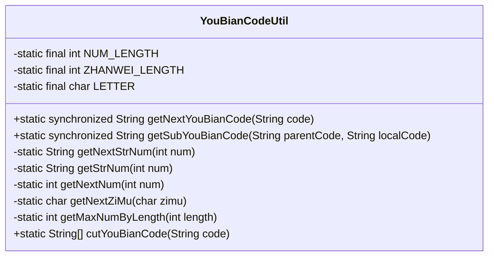
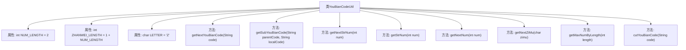

# 基础信息

|      |      |
|------|------|
| 名称 | YouBianCodeUtil |
| 编码语言 | .java |
| 代码路径 | JeecgBoot/jeecg-boot/jeecg-boot-base-core/src/main/java/org/jeecg/common/util/YouBianCodeUtil.java |
| 包名 | org.jeecg.common.util |
| 依赖项 | ['io.netty.util.internal.StringUtil'] |
| 概述说明 | 生成字母数字组合编码，支持自动递增的工具类。 |

# 说明

该工具类用于生成同级或下级编码，支持字母和数字的组合，并具备自动递增功能。它能够根据设定的规则生成唯一的编码，适用于需要层次化或序列化编码的场景。通过自动递增机制，确保每次生成的编码都是唯一的，避免重复。该工具类设计灵活，可适应不同编码格式的需求，提高编码生成的效率和准确性。

# 类列表 Class Summary

| 名称   | 类型  | 说明 |
|-------|------|-------------|
| YouBianCodeUtil | class | 生成同级或下级编码的工具类，支持字母和数字组合，自动递增。 |

## 类 YouBianCodeUtil

|      |      |
|------|------|
| 访问范围 | public |
| 类型 | class |
| 名称 | YouBianCodeUtil |
| 说明 | 生成同级或下级编码的工具类，支持字母和数字组合，自动递增。 |

### UML类图

### 类图描述：
`YouBianCodeUtil` 类用于生成和管理编码，主要用于生成下一个编码或子编码。类中包含多个静态方法，如 `getNextYouBianCode` 用于获取同级下一个编码，`getSubYouBianCode` 用于获取下级的下一个编码。此外，类中还包括一些辅助方法，如 `getNextStrNum` 用于生成补零的数字，`getNextZiMu` 用于生成下一个字母，`getMaxNumByLength` 用于根据数字位数获取最大值。类中的常量 `NUM_LENGTH` 和 `ZHANWEI_LENGTH` 用于控制编码的位数和占位符长度。

### 内部方法调用关系图

**描述：**
`YouBianCodeUtil` 类用于生成和管理特定的编码格式。该类包含多个静态方法，用于处理编码的生成、递增、补零、字母递增等操作。主要方法包括 `getNextYouBianCode` 用于获取同级下一个编码，`getSubYouBianCode` 用于获取下级编码，以及其他辅助方法如 `getNextStrNum`、`getStrNum`、`getNextNum`、`getNextZiMu` 和 `getMaxNumByLength`。这些方法共同协作，确保生成的编码符合特定的格式和规则。

### 字段列表 Field List

| 名称  | 类型  | 说明 |
|-------|-------|------|
| NUM_LENGTH = 2 | int | 定义常量NUM_LENGTH，值为2。 |
| ZHANWEI_LENGTH = 1+ NUM_LENGTH | int | 定义常量ZHANWEI_LENGTH，值为NUM_LENGTH加1。 |
| LETTER= 'Z' | char | 定义常量字符LETTER，值为'Z'。 |

### 方法列表 Method List

| 名称  | 类型  | 说明 |
|-------|-------|------|
| getNextStrNum | String | 私有方法获取下一个数字的字符串表示。 |
| getStrNum | String | 静态方法生成指定位数的数字字符串。 |
| getMaxNumByLength | int | 根据长度生成最大数字，长度为0返回0。 |
| getNextZiMu | char | 静态方法返回下一个字母，若当前为特定字母则返回'A'。 |
| getNextNum | int | 该方法将传入的整数加1并返回结果。 |
| cutYouBianCode | String[] | 静态方法cutYouBianCode根据NUM_LENGTH分割字符串并返回数组。 |
| getNextYouBianCode | String | 静态同步方法生成递增编码，处理字母和数字组合，支持重置。 |
| getSubYouBianCode | String | 静态同步方法获取子编码，根据父编码和本地编码生成新编码。 |

