# 基础信息

|      |      |
|------|------|
| 名称 | util |
| 编码语言 | .java |
| 代码路径 | JeecgBoot/jeecg-boot/jeecg-boot-base-core/src/main/java/org/jeecg/common/util |
| 包名 | JeecgBoot.jeecg-boot.jeecg-boot-base-core.src.main.java.org.jeecg.common.util |
| 概述说明 | 代码模块专注于字符串和文件安全过滤，防止注入攻击和恶意文件上传，提升系统安全性。 |

# 说明

## 概述

该代码模块属于JeecgBoot项目中的`jeecg-boot-base-core`模块，主要提供了一系列工具类和功能，涵盖了字符串和文件的安全过滤、日期时间处理、数据加密、SQL解析、动态数据库管理、文件操作、短信发送、反射操作、浏览器检测、日志管理、Token管理、应用上下文管理等多个方面。模块通过多种机制确保系统的安全性、灵活性和高效性，适用于复杂的业务场景和多样化的开发需求。

## 主要业务场景

1. **字符串和文件安全过滤**：
   - **字符串安全过滤**：通过`StrAttackFilter`类过滤字符串中的特殊字符，防止字符串注入攻击，适用于表单提交、API请求等场景。
   - **文件类型安全过滤**：通过`SsrfFileTypeFilter`类确保上传或下载的文件类型安全，防止恶意文件上传，适用于文件上传和下载操作。

2. **日期时间处理**：
   - **日期时间格式化与计算**：`DateUtils`类提供日期时间的格式化、转换、计算和比较功能，适用于处理日期时间相关需求。
   - **日期范围获取**：`DateRangeUtils`类通过枚举获取多种日期范围，简化了日期范围获取的过程，适用于处理不同时间段的场景。

3. **数据加密与安全**：
   - **AES加密与解密**：`AesEncryptUtil`类简化了AES加密的配置和使用，适用于数据传输和存储的加密保护。
   - **SQL注入检测与防范**：`SqlInjectionUtil`类通过关键词过滤、正则匹配和注释校验，防止SQL注入攻击，适用于数据库操作场景。

4. **SQL解析与管理**：
   - **SQL查询解析与表信息提取**：`JSqlParserAllTableManager`类解析SQL语句，提取表信息，适用于多表查询和嵌套查询场景。
   - **SQL模板解析**：`FreemarkerParseFactory`类解析SQL模板，支持动态生成SQL语句，适用于需要动态生成SQL的场景。

5. **动态数据库管理**：
   - **数据库类型识别与方言映射**：`DbTypeUtils`类识别数据库类型并返回相应的方言信息，适用于多种数据库的兼容性操作。
   - **动态数据源管理**：`DynamicDBUtil`类支持动态数据源的切换和资源优化，适用于频繁切换数据源的场景。

6. **文件操作与管理**：
   - **MinIO文件管理**：`MinioUtil`类支持文件的上传、下载和删除操作，适用于MinIO文件存储管理。
   - **文件下载**：`FileDownloadUtils`类支持多种下载方式，适用于单文件下载、多文件压缩下载和网络资源下载。

7. **短信发送与限制**：
   - **短信发送**：`DySmsHelper`类提供短信发送功能，适用于需要发送短信的场景。
   - **短信发送限制**：`DySmsLimit`类限制单一IP地址的短信发送频率，防止短信滥发，适用于短信发送频率控制。

8. **反射操作与工具类**：
   - **反射操作**：`ReflectHelper`类用于获取和设置对象的属性值，处理Map类型数据，适用于反射机制的核心应用场景。
   - **多功能工具类**：`CommonUtils`类集成了文件上传、文件名处理、中文检测、数据库类型获取和URL生成等功能，适用于多种常见操作。

9. **浏览器检测与日志管理**：
   - **浏览器检测**：`BrowserUtils`类检测浏览器类型、版本、语言及设备类型，适用于兼容性优化和用户行为分析。
   - **日志管理**：`PmsUtil`类用于错误日志的保存和生成，适用于系统运行中的问题追踪和分析。

10. **Token管理与应用上下文**：
    - **Token管理**：`TokenUtils`类提取和验证token，支持token刷新和用户信息获取，适用于用户认证和授权场景。
    - **应用上下文管理**：`SpringContextUtils`类获取应用中的Bean实例和处理HTTP请求，适用于与Spring框架的交互。

11. **数据安全与隐私保护**：
    - **SQL黑名单校验**：`AbstractQueryBlackListHandler`类拦截敏感SQL查询，防止未经授权的数据访问，适用于数据访问权限控制。
    - **数据加密与签名**：`SecurityTools`类提供AES加密、RSA签名和密钥生成功能，适用于数据的安全传输和存储。

通过这些功能，该模块能够满足复杂业务场景下对安全性、灵活性和高效性的多样化需求，提升系统的整体性能和可维护性。

### 包内部结构视图

```mermaid
graph TD
    util --> filter
    util --> superSearch
    util --> encryption
    util --> sqlparse
    util --> dynamic
    util --> sqlInjection
    util --> oss
    util --> security
    filter --> StrAttackFilter.java
    filter --> SsrfFileTypeFilter.java
    util --> oConvertUtils.java
    util --> FillRuleUtil.java
    util --> IpUtils.java
    superSearch --> QueryRuleVo.java
    superSearch --> ObjectParseUtil.java
    superSearch --> QueryRuleEnum.java
    util --> RestDesformUtil.java
    util --> DateUtils.java
    util --> DateRangeUtils.java
    util --> Md5Util.java
    util --> AssertUtils.java
    encryption --> AesEncryptUtil.java
    encryption --> EncryptedString.java
    util --> RestUtil.java
    sqlparse --> vo
    sqlparse --> JSqlParserAllTableManager.java
    sqlparse --> JSqlParserUtils.java
    vo --> SelectSqlInfo.java
    util --> MinioUtil.java
    util --> SqlInjectionUtil.java
    dynamic --> db
    db --> DbTypeUtils.java
    db --> FreemarkerParseFactory.java
    db --> DynamicDBUtil.java
    db --> DataSourceCachePool.java
    util --> PasswordUtil.java
    util --> HTMLUtils.java
    util --> CommonUtils.java
    sqlInjection --> InjectionSyntaxObjectAnalyzer.java
    sqlInjection --> parse
    sqlInjection --> InjectionAstNodeVisitor.java
    sqlInjection --> SqlInjectionAnalyzer.java
    parse --> ParserSupport.java
    parse --> ConstAnalyzer.java
    parse --> SqlSyntaxNormalizer.java
    oss --> OssBootUtil.java
    util --> YouBianCodeUtil.java
    util --> MyClassLoader.java
    util --> UUIDGenerator.java
    util --> ImportExcelUtil.java
    util --> DySmsLimit.java
    util --> DySmsHelper.java
    util --> FileDownloadUtils.java
    util --> ReflectHelper.java
    util --> BrowserUtils.java
    util --> PmsUtil.java
    util --> TokenUtils.java
    util --> SpringContextUtils.java
    security --> AbstractQueryBlackListHandler.java
    security --> entity
    security --> SecurityTools.java
    security --> JdbcSecurityUtil.java
    entity --> SecurityReq.java
    entity --> SecuritySignReq.java
    entity --> SecuritySignResp.java
    entity --> MyKeyPair.java
    entity --> SecurityResp.java
    util --> BrowserType.java
```

该流程图展示了`util`目录下的层级结构，包含了多个子目录和文件。`util`目录下主要有`filter`、`superSearch`、`encryption`、`sqlparse`、`dynamic`、`sqlInjection`、`oss`和`security`等子目录，每个子目录下又有多个文件或进一步的子目录。该图清晰地展示了各文件和目录之间的层级关系，帮助理解项目的组织结构。

# 文件列表 File List

| 名称   | 类型  | 说明 |
|-------|------|-------------|
| [RestDesformUtil.java](RestDesformUtil.md) | file | RestDesformUtil类处理数据操作，支持HTTP与API交互。 |
| [IpUtils.java](IpUtils.md) | file | IpUtils类支持获取客户端和服务器IP，适用于代理和反向代理场景。 |
| [ReflectHelper.java](ReflectHelper.md) | file | ReflectHelper类提供反射操作，支持属性处理、Map操作及实体类转换。 |
| [DySmsLimit.java](DySmsLimit.md) | file | DySmsLimit类限制IP每分钟最多发送5条短信，超20条加入黑名单，支持清空计数。 |
| [YouBianCodeUtil.java](YouBianCodeUtil.md) | file | 生成字母数字组合编码，支持自动递增的工具类。 |
| [PasswordUtil.java](PasswordUtil.md) | file | PasswordUtil类支持PBEWithMD5AndDES加密、解密及盐值生成。 |
| [MinioUtil.java](MinioUtil.md) | file | MinioUtil类管理MinIO存储，支持上传、下载、删除及获取外链。 |
| [BrowserType.java](BrowserType.md) | file | 信息为空，无法生成概要描述。 |
| [DateRangeUtils.java](DateRangeUtils.md) | file | DateRangeUtils类通过枚举获取多种日期范围。 |
| [SpringContextUtils.java](SpringContextUtils.md) | file | SpringContextUtils类管理应用上下文，提供获取Bean、Http请求、响应及项目根路径的方法。 |
| [TokenUtils.java](TokenUtils.md) | file | TokenUtils类提供获取token、验证有效性、支持刷新和用户信息获取功能。 |
| [PmsUtil.java](PmsUtil.md) | file | PmsUtil类用于保存错误日志，具备路径设置和日志文件生成功能。 |
| [BrowserUtils.java](BrowserUtils.md) | file | 该工具可检测浏览器类型、版本、语言及设备信息。 |
| [FileDownloadUtils.java](FileDownloadUtils.md) | file | FileDownloadUtils类支持单文件、多文件压缩及网络资源下载，确保目录存在并生成唯一文件名。 |
| [DySmsHelper.java](DySmsHelper.md) | file | DySmsHelper类负责短信发送，含AK配置、参数验证及发送功能。 |
| [ImportExcelUtil.java](ImportExcelUtil.md) | file | 导入Excel工具类，处理数据及错误信息。 |
| [UUIDGenerator.java](UUIDGenerator.md) | file | 生成32位UUID，结合IP、JVM、时间戳和计数器。 |
| [MyClassLoader.java](MyClassLoader.md) | file | MyClassLoader实现类加载、获取类全名及类路径功能。 |
| [CommonUtils.java](CommonUtils.md) | file | CommonUtils类提供文件上传、文件名处理、中文检测、数据库类型获取及URL生成等功能。 |
| [HTMLUtils.java](HTMLUtils.md) | file | HTMLUtils类支持HTML文本获取和Markdown转HTML功能。 |
| [AssertUtils.java](AssertUtils.md) | file | AssertUtils类提供多种断言方法，用于验证对象状态并抛出异常。 |
| [SqlInjectionUtil.java](SqlInjectionUtil.md) | file | SqlInjectionUtil类用于检测和防止SQL注入，具备关键词过滤、正则匹配和注释校验功能。 |
| [RestUtil.java](RestUtil.md) | file | RestUtil类支持REST API调用，处理多种请求和参数，返回JSON或原生响应。 |
| [Md5Util.java](Md5Util.md) | file | MD5工具类提供字节数组转十六进制字符串及MD5编码功能。 |
| [DateUtils.java](DateUtils.md) | file | DateUtils类实现日期时间格式化、转换、计算和比较功能。 |
| [FillRuleUtil.java](FillRuleUtil.md) | file | FillRuleUtil类根据ruleCode执行规则，获取参数并调用指定方法处理数据。 |
| [oConvertUtils.java](oConvertUtils.md) | file | oConvertUtils类提供对象判空、字符串解码、数字转换等工具方法。 |
| [security](security/_module.md) | package | 抽象类实现SQL黑名单校验，拦截敏感查询，增强数据安全。 |
| [oss](oss/_module.md) | package | OssBootUtil类管理阿里云OSS文件操作，支持自定义桶和路径过滤。 |
| [sqlInjection](sqlInjection/_module.md) | package | InjectionSyntaxObjectAnalyzer类检测SQL注入漏洞，禁用危险函数和子查询。ParserSupport解析SQL语句，ConstAnalyzer分析常量表达式。SqlSyntaxNormalizer管理线程局部变量，InjectionAstNodeVisitor禁止联合查询。SqlInjectionAnalyzer检测并控制SQL注入检查。 |
| [dynamic](dynamic/_module.md) | package | DbTypeUtils类映射数据库类型与方言，FreemarkerParseFactory类解析SQL模板，DynamicDBUtil类管理动态数据源，DataSourceCachePool类管理缓存。 |
| [sqlparse](sqlparse/_module.md) | package | SelectSqlInfo类存储SQL查询信息，JSqlParserAllTableManager解析SQL表信息，JSqlParserUtils提取SQL表和字段名。 |
| [encryption](encryption/_module.md) | package | 提供AES加密功能，支持CBC模式，默认使用预定义密钥和初始化向量，确保数据安全性和一致性。 |
| [superSearch](superSearch/_module.md) | package | 输入内容为空，无法生成总结。请提供具体信息。 |
| [filter](filter/_module.md) | package | StrAttackFilter类过滤特殊字符，确保字符串安全。SsrfFileTypeFilter类通过白名单和文件头验证确保文件安全。 |

