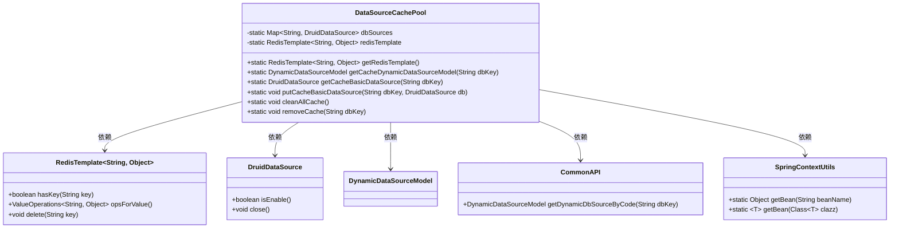
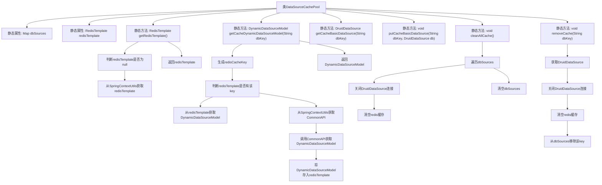

# 基础信息

|      |      |
|------|------|
| 名称 | DataSourceCachePool |
| 编码语言 | .java |
| 代码路径 | JeecgBoot/jeecg-boot/jeecg-boot-base-core/src/main/java/org/jeecg/common/util/dynamic/db/DataSourceCachePool.java |
| 包名 | org.jeecg.common.util.dynamic.db |
| 依赖项 | ['com.alibaba.druid.pool.DruidDataSource', 'org.jeecg.common.api.CommonAPI', 'org.jeecg.common.constant.CacheConstant', 'org.jeecg.common.system.vo.DynamicDataSourceModel', 'org.jeecg.common.util.SpringContextUtils', 'org.springframework.data.redis.core.RedisTemplate', 'java.util.HashMap', 'java.util.Map'] |
| 概述说明 | DataSourceCachePool类管理本地和Redis缓存，支持数据源操作。 |

# 说明

DataSourceCachePool类负责管理本地缓存和Redis缓存，提供了对数据源的获取、添加、删除和清空等操作功能。该类旨在高效管理缓存数据，确保数据的一致性和可用性，支持多种缓存操作以满足不同场景需求。

# 类列表 Class Summary

| 名称   | 类型  | 说明 |
|-------|------|-------------|
| DataSourceCachePool | class | DataSourceCachePool类管理本地和Redis缓存，支持获取、添加、删除和清空数据源。 |

## 类 DataSourceCachePool

|      |      |
|------|------|
| 访问范围 | public |
| 类型 | class |
| 名称 | DataSourceCachePool |
| 说明 | DataSourceCachePool类管理本地和Redis缓存，支持获取、添加、删除和清空数据源。 |

### UML类图

**描述：**  
`DataSourceCachePool` 类用于管理数据源连接池的缓存，支持本地缓存和 Redis 缓存。它通过 `DruidDataSource` 管理数据库连接，并通过 `RedisTemplate` 与 Redis 进行交互。`CommonAPI` 用于获取动态数据源模型，`SpringContextUtils` 用于获取 Spring 上下文中的 Bean。该类提供了获取、添加、删除和清空缓存的方法，确保数据源的高效管理和资源释放。

### 内部方法调用关系图

这段代码定义了一个`DataSourceCachePool`类，用于管理数据源连接池的缓存。它通过本地Map和Redis缓存来存储和获取数据源，提供了获取、添加、清空和移除缓存的方法。代码中包含了从Spring上下文中获取Redis模板的逻辑，并确保在清空或移除缓存时关闭相应的数据源连接。

### 字段列表 Field List

| 名称  | 类型  | 说明 |
|-------|-------|------|
| redisTemplate | RedisTemplate<String, Object> | 私有静态RedisTemplate变量用于存储键值对对象。 |
| dbSources = new HashMap<>() | Map<String, DruidDataSource> | 定义私有静态Map变量dbSources，存储字符串与DruidDataSource的映射。 |

### 方法列表 Method List

| 名称  | 类型  | 说明 |
|-------|-------|------|
| getRedisTemplate | RedisTemplate<String, Object> | 获取RedisTemplate实例，若为空则从Spring上下文获取。 |
| getCacheBasicDataSource | DruidDataSource | 静态方法获取指定数据库连接池对象。 |
| putCacheBasicDataSource | void | 静态方法putCacheBasicDataSource将DruidDataSource存入dbSources映射中，键为dbKey。 |
| cleanAllCache | void | 清理所有缓存，关闭数据源连接并清空Redis缓存。 |
| getCacheDynamicDataSourceModel | DynamicDataSourceModel | 获取动态数据源模型，优先从Redis缓存读取，若不存在则从数据库获取并缓存。 |
| removeCache | void | 移除指定数据库缓存，关闭连接并清空Redis和本地缓存。 |

