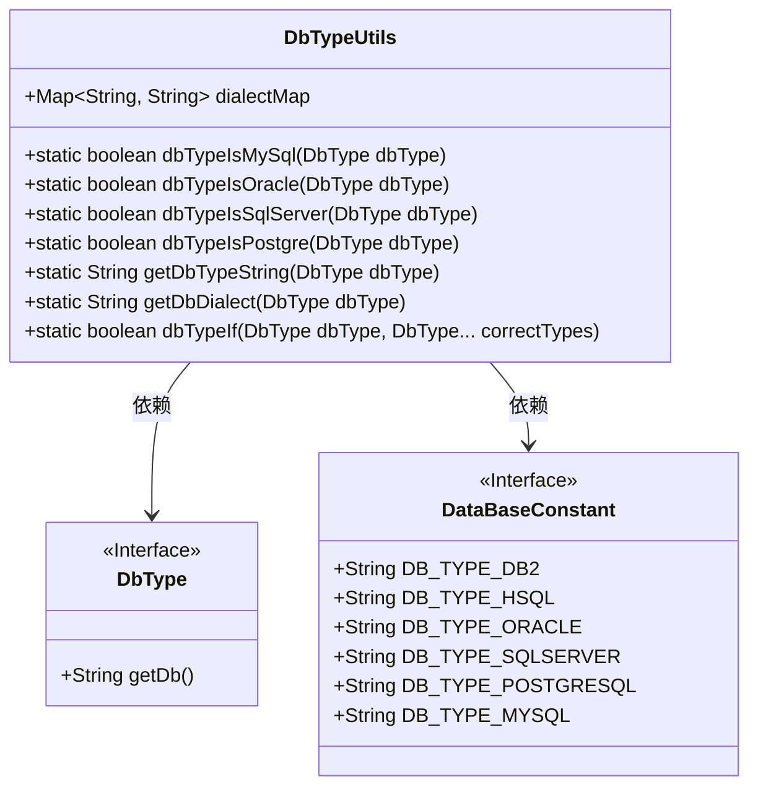
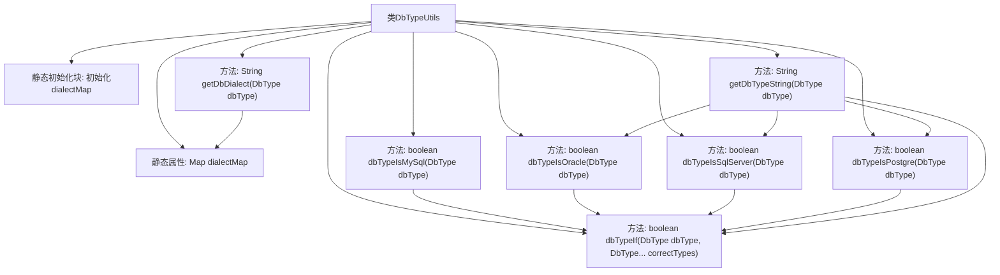

# 基础信息

|      |      |
|------|------|
| 名称 | DbTypeUtils |
| 编码语言 | .java |
| 代码路径 | JeecgBoot/jeecg-boot/jeecg-boot-base-core/src/main/java/org/jeecg/common/util/dynamic/db/DbTypeUtils.java |
| 包名 | org.jeecg.common.util.dynamic.db |
| 依赖项 | ['com.baomidou.mybatisplus.annotation.DbType', 'org.jeecg.common.constant.DataBaseConstant', 'java.util.HashMap', 'java.util.Map'] |
| 概述说明 | DbTypeUtils类实现数据库类型与方言的映射，支持类型判断和方言获取。 |

# 说明

DbTypeUtils类主要负责数据库类型与方言之间的映射关系，提供判断数据库类型和获取对应方言的功能。该类通过内置的映射机制，能够准确识别不同的数据库类型，并根据需要返回相应的方言信息，从而支持数据库操作的多样性和兼容性。

# 类列表 Class Summary

| 名称   | 类型  | 说明 |
|-------|------|-------------|
| DbTypeUtils | class | DbTypeUtils类包含数据库类型与方言映射，提供类型判断和方言获取功能。 |

## 类 DbTypeUtils

|      |      |
|------|------|
| 访问范围 | public |
| 类型 | class |
| 名称 | DbTypeUtils |
| 说明 | DbTypeUtils类包含数据库类型与方言映射，提供类型判断和方言获取功能。 |

### UML类图

这段代码定义了一个`DbTypeUtils`工具类，用于处理与数据库类型相关的操作。该类包含一个静态的`dialectMap`，用于存储不同数据库类型对应的Hibernate方言。`DbTypeUtils`提供了多个静态方法，用于判断数据库类型是否为MySQL、Oracle、SQL Server或PostgreSQL，并根据枚举类型获取数据库类型字符串或方言字符串。`DbType`和`DataBaseConstant`是两个接口，分别用于定义数据库类型和常量。`DbTypeUtils`依赖于这两个接口来完成其功能。

### 内部方法调用关系图

这段代码定义了一个名为 `DbTypeUtils` 的工具类，主要用于处理数据库类型相关的操作。类中包含一个静态的 `dialectMap`，用于存储不同数据库类型对应的Hibernate方言。代码通过静态初始化块对 `dialectMap` 进行初始化，并提供了多个方法来判断数据库类型是否为MySQL、Oracle、SQL Server或PostgreSQL。此外，还提供了根据数据库类型获取数据库类型字符串和数据库方言字符串的方法。这些方法通过 `dbTypeIf` 方法进行统一的类型判断，确保代码的复用性和简洁性。

### 字段列表 Field List

| 名称  | 类型  | 说明 |
|-------|-------|------|
| dialectMap = new HashMap<String, String>() | Map<String, String> | 定义静态Map变量dialectMap，用于存储字符串键值对。 |

### 方法列表 Method List

| 名称  | 类型  | 说明 |
|-------|-------|------|
| dbTypeIsMySql | boolean | 该方法判断数据库类型是否为MySQL及其相关类型。 |
| dbTypeIsPostgre | boolean | 判断数据库类型是否为PostgreSQL或其变种。 |
| dbTypeIf | boolean | 检查数据库类型是否匹配指定类型，匹配则返回true，否则返回false。 |
| dbTypeIsSqlServer | boolean | 判断数据库类型是否为SQL Server或SQL Server 2005。 |
| dbTypeIsOracle | boolean | 检查数据库类型是否为Oracle或其变种。 |
| getDbDialect | String | 静态方法获取数据库方言，依据数据库类型返回对应方言。 |
| getDbTypeString | String | 根据数据库类型返回对应的数据库类型字符串。 |

