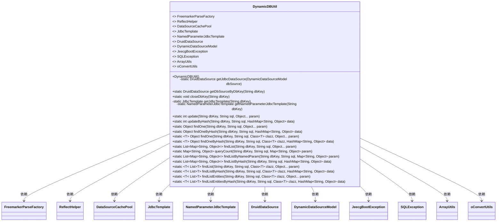

# 基础信息

|      |      |
|------|------|
| 名称 | DynamicDBUtil |
| 编码语言 | .java |
| 代码路径 | JeecgBoot/jeecg-boot/jeecg-boot-base-core/src/main/java/org/jeecg/common/util/dynamic/db/DynamicDBUtil.java |
| 包名 | org.jeecg.common.util.dynamic.db |
| 依赖项 | ['com.alibaba.druid.pool.DruidDataSource', 'lombok.extern.slf4j.Slf4j', 'org.apache.commons.lang3.ArrayUtils', 'org.jeecg.common.exception.JeecgBootException', 'org.jeecg.common.exception.JeecgBootException', 'org.jeecg.common.system.vo.DynamicDataSourceModel', 'org.jeecg.common.util.ReflectHelper', 'org.jeecg.common.util.oConvertUtils', 'org.springframework.jdbc.core.JdbcTemplate', 'org.springframework.jdbc.core.namedparam.NamedParameterJdbcTemplate', 'javax.sql.DataSource', 'java.sql.SQLException', 'java.util.HashMap', 'java.util.List', 'java.util.Map'] |
| 概述说明 | DynamicDBUtil类管理动态数据源，支持连接操作。 |

# 说明

DynamicDBUtil类是一个用于管理动态数据源的工具类，其主要功能包括获取、关闭、查询和更新数据库连接。通过该类，用户可以高效地操作和管理数据库连接，确保数据源的动态切换和资源优化。该类设计旨在简化数据库连接的管理流程，提升系统的灵活性和可维护性。

# 类列表 Class Summary

| 名称   | 类型  | 说明 |
|-------|------|-------------|
| DynamicDBUtil | class | DynamicDBUtil类用于管理动态数据源，支持获取、关闭、查询和更新数据库连接。 |

## 类 DynamicDBUtil

|      |      |
|------|------|
| 访问范围 | @Slf4j;public |
| 类型 | class |
| 名称 | DynamicDBUtil |
| 说明 | DynamicDBUtil类用于管理动态数据源，支持获取、关闭、查询和更新数据库连接。 |

### UML类图

### 描述：
`DynamicDBUtil` 是一个用于动态管理数据库连接的实用工具类。它提供了多种方法来获取、关闭和管理数据库连接，并支持通过SQL语句进行数据查询和更新操作。该类依赖于多个外部接口和工具类，如 `FreemarkerParseFactory`、`ReflectHelper`、`DataSourceCachePool` 等，以实现其功能。`DynamicDBUtil` 通过缓存机制优化了数据库连接的获取，并提供了丰富的查询和更新方法，支持多种数据类型和SQL语法。

### 内部方法调用关系图

这段代码定义了一个名为 `DynamicDBUtil` 的类，用于管理动态数据源的连接、查询和更新操作。类中包含了多个私有和公有方法，用于获取数据源、关闭连接、执行SQL查询和更新操作。代码通过 `DruidDataSource` 管理数据库连接池，并通过 `JdbcTemplate` 和 `NamedParameterJdbcTemplate` 执行SQL语句。流程图展示了类中各个方法之间的调用关系，清晰地描述了数据源获取、SQL执行和结果处理的流程。

### 字段列表 Field List

| 名称  | 类型  | 说明 |
|-------|-------|------|

### 方法列表 Method List

| 名称  | 类型  | 说明 |
|-------|-------|------|
| findListByNamedParam | List<Map<String, Object>> | 通过命名参数查询数据库并返回结果列表。 |
| getNamedParameterJdbcTemplate | NamedParameterJdbcTemplate | 获取指定数据库的命名参数JDBC模板实例。 |
| closeDbKey | void | 关闭指定数据库连接并提交事务，清理缓存。 |
| findOne | Object | 方法通过SQL查询数据库，将结果映射到指定类对象。 |
| findListEntitiesByHash | List<T> | 静态方法通过哈希查找数据库实体列表并转换为指定类对象。 |
| findListEntities | List<T> | 静态方法通过SQL查询数据库并返回指定类型的实体列表。 |
| findOneByHash | Object | 通过哈希查找并反射设置对象属性。 |
| update | int | 根据数据库键和SQL更新数据，返回影响行数。 |
| findListByHash | List<Map<String, Object>> | 通过数据库键和SQL模板查询数据，返回结果列表。 |
| findListByHash | List<T> | 根据数据库键和SQL模板查询数据并返回指定类型列表。 |
| queryCount | Map<String, Object> | 静态方法queryCount通过NamedParameterJdbcTemplate执行SQL查询并返回结果。 |
| findOneByHash | Object | 通过哈希查询单个对象，若结果为空或多于一个则记录错误，返回首个结果。 |
| updateByHash | int | 根据哈希表更新数据库，返回影响行数。 |
| findList | List<T> | 静态方法根据SQL查询数据库，返回指定类型的列表。 |
| getJdbcTemplate | JdbcTemplate | 通过dbKey获取数据源并创建JdbcTemplate实例。 |
| getDbSourceByDbKey | DruidDataSource | 根据dbKey获取数据库连接，优先从缓存获取，否则创建新连接并设置超时时间。 |
| findOne | Object | 方法findOne通过SQL查询数据库，返回单个结果，若结果为空或多于一个则记录错误。 |
| findList | List<Map<String, Object>> | 静态方法findList通过JdbcTemplate执行SQL查询，返回结果列表。 |
| getJdbcDataSource | DruidDataSource | 创建Druid数据源，验证URL格式，设置连接参数，启用连接池。 |

