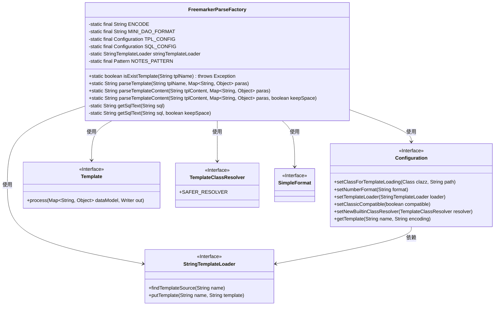
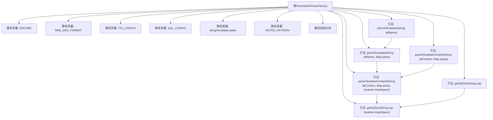

# 基础信息

|      |      |
|------|------|
| 名称 | FreemarkerParseFactory |
| 编码语言 | .java |
| 代码路径 | JeecgBoot/jeecg-boot/jeecg-boot-base-core/src/main/java/org/jeecg/common/util/dynamic/db/FreemarkerParseFactory.java |
| 包名 | org.jeecg.common.util.dynamic.db |
| 依赖项 | ['freemarker.cache.StringTemplateLoader', 'freemarker.core.ParseException', 'freemarker.core.TemplateClassResolver', 'freemarker.template.Configuration', 'freemarker.template.Template', 'lombok.extern.slf4j.Slf4j', 'org.apache.commons.lang3.StringUtils', 'org.jeecg.common.constant.DataBaseConstant', 'org.jeecg.common.constant.SymbolConstant', 'org.jeecgframework.codegenerate.generate.util.SimpleFormat', 'java.io.StringWriter', 'java.util.Map', 'java.util.regex.Pattern'] |
| 概述说明 | FreemarkerParseFactory类解析SQL模板，提供缓存、参数格式化等功能，确保SQL生成安全高效。 |

# 说明

FreemarkerParseFactory类主要用于解析SQL模板，具备多种功能以确保SQL生成过程的安全性和效率。该类集成了模板缓存机制，能够有效提升解析速度。同时，它支持参数格式化功能，确保传入的参数能够正确嵌入SQL语句中。此外，该类还提供了注释去除功能，能够自动清理模板中的注释内容，避免不必要的干扰。通过这些功能，FreemarkerParseFactory类在解析SQL模板时能够保证生成的安全性和高效性。

# 类列表 Class Summary

| 名称   | 类型  | 说明 |
|-------|------|-------------|
| FreemarkerParseFactory | class | FreemarkerParseFactory类用于解析SQL模板，包含模板缓存、参数格式化、注释去除等功能，确保SQL生成安全高效。 |

## 类 FreemarkerParseFactory

|      |      |
|------|------|
| 访问范围 | @Slf4j;public |
| 类型 | class |
| 名称 | FreemarkerParseFactory |
| 说明 | FreemarkerParseFactory类用于解析SQL模板，包含模板缓存、参数格式化、注释去除等功能，确保SQL生成安全高效。 |

### UML类图

**描述：**  
`FreemarkerParseFactory` 类是一个用于解析 FreeMarker 模板的工具类。它包含了对模板的加载、解析、以及 SQL 文本的处理功能。类中使用了 `Configuration` 来管理模板的配置，`StringTemplateLoader` 用于加载模板内容，`Template` 用于处理模板与数据的结合，`TemplateClassResolver` 用于解析模板中的类，`SimpleFormat` 用于格式化参数。通过这些组件的协作，类能够有效地处理模板并生成最终的 SQL 语句。

### 内部方法调用关系图

**描述：**  
`FreemarkerParseFactory`类主要用于处理FreeMarker模板的解析和格式化。它包含多个静态常量和变量，用于配置模板解析环境。类中的静态初始化块用于初始化模板配置，确保模板解析的安全性。主要方法包括`isExistTemplate`用于检查模板是否存在，`parseTemplate`和`parseTemplateContent`用于解析模板内容，`getSqlText`用于格式化SQL文本，去除无效字段和注释。这些方法通过调用内部逻辑和工具类，确保模板解析的准确性和安全性。

### 字段列表 Field List

| 名称  | 类型  | 说明 |
|-------|-------|------|
| stringTemplateLoader = new StringTemplateLoader() | StringTemplateLoader | 初始化字符串模板加载器实例。 |
| MINI_DAO_FORMAT = "DaoFormat" | String | 定义私有静态常量MINI_DAO_FORMAT，值为"DaoFormat"。 |
| NOTES_PATTERN = Pattern            .compile("(?ms)/\\*.*?\\*/|^\\s*//.*?$") | Pattern | 定义静态正则模式匹配注释内容。 |
| ENCODE = "utf-8" | String | 定义私有静态常量字符串ENCODE为"utf-8"。 |
| TPL_CONFIG = new Configuration(Configuration.DEFAULT_INCOMPATIBLE_IMPROVEMENTS) | Configuration | 定义私有静态常量TPL_CONFIG，使用默认配置初始化。 |
| SQL_CONFIG = new Configuration(Configuration.DEFAULT_INCOMPATIBLE_IMPROVEMENTS) | Configuration | SQL_CONFIG为私有静态最终配置实例，使用默认不兼容改进初始化。 |

### 方法列表 Method List

| 名称  | 类型  | 说明 |
|-------|-------|------|
| isExistTemplate | boolean | 检查模板是否存在，异常时记录日志并返回false。 |
| parseTemplateContent | String | 静态方法解析模板内容，传入模板字符串和参数映射，默认不启用调试模式。 |
| parseTemplate | String | 解析SQL模板，处理参数并返回SQL语句，异常时记录错误并抛出运行时异常。 |
| parseTemplateContent | String | 解析SQL模板，处理参数并生成SQL语句，异常时记录错误信息。 |
| getSqlText | String | 该方法清理SQL语句，移除注释、多余空格及特定关键字如“where”和“and”。 |
| getSqlText | String | 私有静态方法获取SQL文本，调用重载方法并传递SQL字符串和false参数。 |

