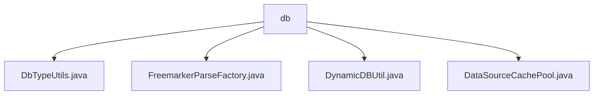

# 基础信息

|      |      |
|------|------|
| 名称 | db |
| 编码语言 | .java |
| 代码路径 | JeecgBoot/jeecg-boot/jeecg-boot-base-core/src/main/java/org/jeecg/common/util/dynamic/db |
| 包名 | JeecgBoot.jeecg-boot.jeecg-boot-base-core.src.main.java.org.jeecg.common.util.dynamic.db |
| 概述说明 | DbTypeUtils类映射数据库类型与方言，FreemarkerParseFactory类解析SQL模板，DynamicDBUtil类管理动态数据源，DataSourceCachePool类管理缓存。 |

# 说明

## 概述

该代码模块主要围绕动态数据库管理展开，提供了一系列工具类和功能来支持数据库类型识别、SQL模板解析、动态数据源管理以及缓存管理。通过这些组件的协同工作，模块能够实现高效、安全且灵活的数据库操作，支持多种数据库类型和数据源的动态切换，同时确保缓存数据的一致性和可用性。

## 主要业务场景

1. **数据库类型与方言映射**：  
   `DbTypeUtils` 类用于识别数据库类型并返回相应的方言信息，支持多种数据库的兼容性操作。适用于需要根据数据库类型执行不同SQL语句或方言的场景。

2. **SQL模板解析**：  
   `FreemarkerParseFactory` 类负责解析SQL模板，支持模板缓存、参数格式化和注释去除功能。适用于需要动态生成SQL语句的场景，确保SQL生成过程的安全性和效率。

3. **动态数据源管理**：  
   `DynamicDBUtil` 类提供了获取、关闭、查询和更新数据库连接的功能，支持动态数据源的切换和资源优化。适用于需要频繁切换数据源或管理多个数据库连接的场景。

4. **缓存管理**：  
   `DataSourceCachePool` 类负责管理本地缓存和Redis缓存，支持数据源的获取、添加、删除和清空等操作。适用于需要高效管理缓存数据并确保数据一致性的场景。

通过这些功能，该模块能够满足复杂业务场景下对数据库操作的多样化需求，提升系统的灵活性和可维护性。

### 包内部结构视图

该流程图展示了`db`目录下的四个文件：`DbTypeUtils.java`、`FreemarkerParseFactory.java`、`DynamicDBUtil.java`和`DataSourceCachePool.java`。这些文件都属于同一个目录，没有更深层次的嵌套关系，因此所有文件直接与`db`目录相连。

# 文件列表 File List

| 名称   | 类型  | 说明 |
|-------|------|-------------|
| [DbTypeUtils.java](DbTypeUtils.md) | file | DbTypeUtils类实现数据库类型与方言的映射，支持类型判断和方言获取。 |
| [DataSourceCachePool.java](DataSourceCachePool.md) | file | DataSourceCachePool类管理本地和Redis缓存，支持数据源操作。 |
| [DynamicDBUtil.java](DynamicDBUtil.md) | file | DynamicDBUtil类管理动态数据源，支持连接操作。 |
| [FreemarkerParseFactory.java](FreemarkerParseFactory.md) | file | FreemarkerParseFactory类解析SQL模板，提供缓存、参数格式化等功能，确保SQL生成安全高效。 |

