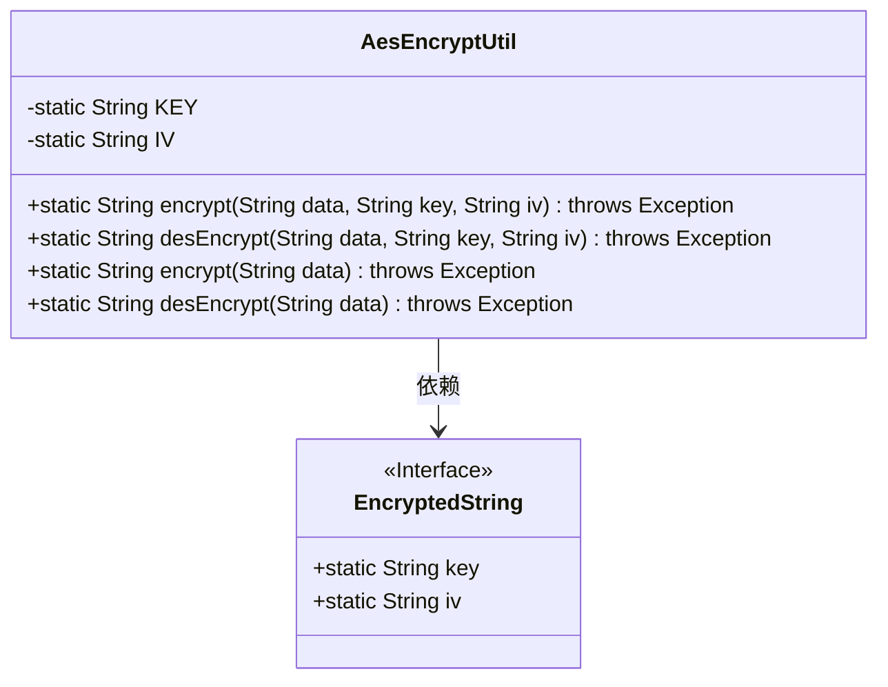

# 基础信息

|      |      |
|------|------|
| 名称 | AesEncryptUtil |
| 编码语言 | .java |
| 代码路径 | JeecgBoot/jeecg-boot/jeecg-boot-base-core/src/main/java/org/jeecg/common/util/encryption/AesEncryptUtil.java |
| 包名 | org.jeecg.common.util.encryption |
| 依赖项 | ['org.apache.shiro.codec.Base64', 'javax.crypto.Cipher', 'javax.crypto.spec.IvParameterSpec', 'javax.crypto.spec.SecretKeySpec'] |
| 概述说明 | AES加密工具类，支持CBC模式，默认使用预定义key和iv。 |

# 说明

该工具类提供了AES加密功能，支持CBC模式进行加密和解密操作。默认情况下，工具类使用预定义的密钥（key）和初始化向量（iv）进行加密和解密，确保数据的安全性和一致性。该工具类适用于需要高安全性的数据加密场景，简化了AES加密的配置和使用过程。

# 类列表 Class Summary

| 名称   | 类型  | 说明 |
|-------|------|-------------|
| AesEncryptUtil | class | AES加密工具类，支持CBC模式加密解密，默认使用预定义key和iv。 |

## 类 AesEncryptUtil

|      |      |
|------|------|
| 访问范围 | public |
| 类型 | class |
| 名称 | AesEncryptUtil |
| 说明 | AES加密工具类，支持CBC模式加密解密，默认使用预定义key和iv。 |

### UML类图

**描述：**
`AesEncryptUtil` 是一个用于 AES 加密和解密的工具类，支持使用自定义的密钥（key）和初始化向量（iv）进行加密和解密操作，也提供了使用默认密钥和初始化向量的方法。`EncryptedString` 是一个接口，提供了默认的密钥和初始化向量。`AesEncryptUtil` 类依赖于 `EncryptedString` 接口来获取默认的加密参数。

### 内部方法调用关系图

```mermaid
graph TD
    A["类AesEncryptUtil"]
    B["属性: String KEY"]
    C["属性: String IV"]
    D["方法: encrypt(String data, String key, String iv)"]
    E["方法: desEncrypt(String data, String key, String iv)"]
    F["方法: encrypt(String data)"]
    G["方法: desEncrypt(String data)"]
    H["内部步骤: Cipher.getInstance('AES/CBC/NoPadding')"]
    I["内部步骤: cipher.getBlockSize()"]
    J["内部步骤: data.getBytes()"]
    K["内部步骤: System.arraycopy(dataBytes, 0, plaintext, 0, dataBytes.length)"]
    L["内部步骤: SecretKeySpec keyspec = new SecretKeySpec(key.getBytes(), 'AES')"]
    M["内部步骤: IvParameterSpec ivspec = new IvParameterSpec(iv.getBytes())"]
    N["内部步骤: cipher.init(Cipher.ENCRYPT_MODE, keyspec, ivspec)"]
    O["内部步骤: byte[] encrypted = cipher.doFinal(plaintext)"]
    P["内部步骤: Base64.encodeToString(encrypted)"]
    Q["内部步骤: Base64.decode(data)"]
    R["内部步骤: cipher.init(Cipher.DECRYPT_MODE, keyspec, ivspec)"]
    S["内部步骤: byte[] original = cipher.doFinal(encrypted1)"]
    T["内部步骤: new String(original)"]
    U["内部步骤: originalString.replaceAll('\\u0000', '')"]

    A --> B
    A --> C
    A --> D
    A --> E
    A --> F
    A --> G
    D --> H
    D --> I
    D --> J
    D --> K
    D --> L
    D --> M
    D --> N
    D --> O
    D --> P
    E --> Q
    E --> H
    E --> L
    E --> M
    E --> R
    E --> S
    E --> T
    E --> U
```

**描述：**  
该流程图展示了`AesEncryptUtil`类的结构和主要方法调用关系。类中包含两个属性`KEY`和`IV`，以及四个方法：`encrypt`和`desEncrypt`，分别用于加密和解密数据。加密方法通过`Cipher`实例进行数据填充、密钥和IV的初始化，最终返回Base64编码的加密结果。解密方法则通过Base64解码、初始化`Cipher`实例，并处理解密后的数据，去除多余的`\u0000`字符。

### 字段列表 Field List

| 名称  | 类型  | 说明 |
|-------|-------|------|
| KEY = EncryptedString.key | String | 私有静态字符串KEY使用EncryptedString.key赋值。 |
| IV = EncryptedString.iv | String | 代码定义了一个私有静态字符串变量IV，其值为EncryptedString类的iv属性。 |

### 方法列表 Method List

| 名称  | 类型  | 说明 |
|-------|-------|------|
| desEncrypt | String | 使用AES/CBC模式解密数据，处理异常并去除\u0000字符。 |
| encrypt | String | 静态方法encrypt用于加密数据，使用KEY和IV作为参数。 |
| desEncrypt | String | 静态方法desEncrypt用于加密字符串data，使用密钥KEY和初始化向量IV。 |
| encrypt | String | 使用AES/CBC/NoPadding算法加密数据，处理数据块并返回Base64编码结果。 |

