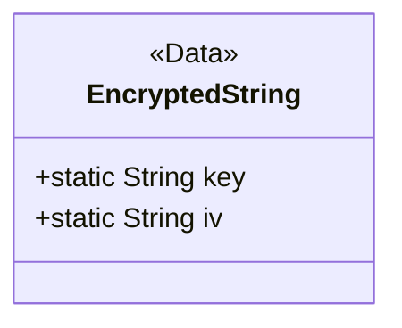
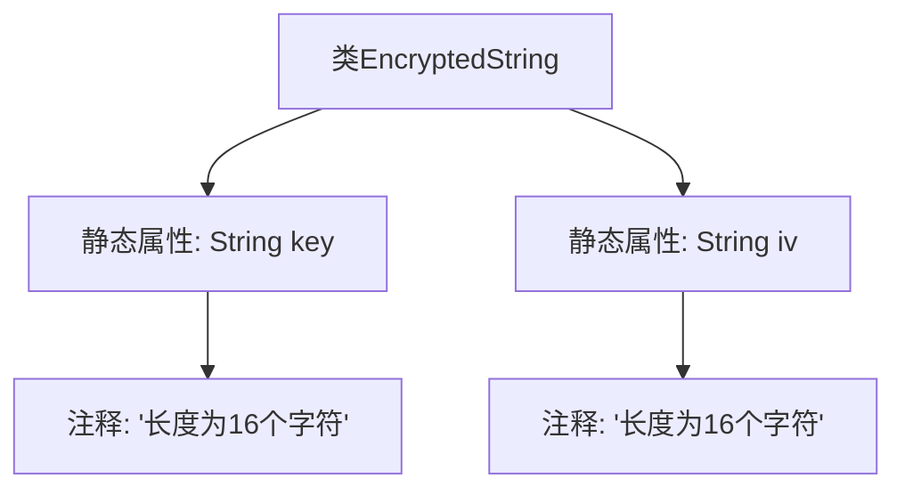

# 基础信息

|      |      |
|------|------|
| 名称 | EncryptedString |
| 编码语言 | .java |
| 代码路径 | JeecgBoot/jeecg-boot/jeecg-boot-base-core/src/main/java/org/jeecg/common/util/encryption/EncryptedString.java |
| 包名 | org.jeecg.common.util.encryption |
| 依赖项 | ['lombok.Data'] |
| 概述说明 | EncryptedString类包含16字符的key和iv静态变量。 |

# 说明

EncryptedString类定义了两个静态变量，分别是key和iv，它们的长度均为16个字符。这些变量用于加密和解密操作，提供了必要的密钥和初始化向量。静态变量的设计意味着它们在类的所有实例中共享，确保了加密过程的一致性和安全性。

# 类列表 Class Summary

| 名称   | 类型  | 说明 |
|-------|------|-------------|
| EncryptedString | class | EncryptedString类包含16字符的key和iv静态变量。 |

## 类 EncryptedString

|      |      |
|------|------|
| 访问范围 | @Data;public |
| 类型 | class |
| 名称 | EncryptedString |
| 说明 | EncryptedString类包含16字符的key和iv静态变量。 |

### UML类图

这段代码定义了一个名为 `EncryptedString` 的类，该类使用了 `@Data` 注解，通常用于自动生成 `getter`、`setter`、`toString` 等方法。类中包含两个静态字符串常量 `key` 和 `iv`，分别用于加密和解密操作。`key` 和 `iv` 的长度均为16个字符，符合常见的加密算法（如AES）对密钥和初始向量的要求。这个类可能用于封装与加密相关的字符串操作，确保密钥和初始向量的安全性和一致性。

### 内部方法调用关系图

这段代码定义了一个名为`EncryptedString`的类，其中包含两个静态属性`key`和`iv`，分别用于存储加密所需的密钥和初始化向量。两个属性都被注释为“长度为16个字符”，表明它们的值必须是16个字符的字符串。代码的作用是提供一个简单的数据结构，用于存储加密过程中使用的密钥和初始化向量。

### 字段列表 Field List

| 名称  | 类型  | 说明 |
|-------|-------|------|
| key = "1234567890adbcde" | String | 静态字符串变量key赋值为"1234567890adbcde"。 |
| iv  = "1234567890hjlkew" | String | 定义静态字符串变量iv，值为"1234567890hjlkew"。 |

### 方法列表 Method List

| 名称  | 类型  | 说明 |
|-------|-------|------|

