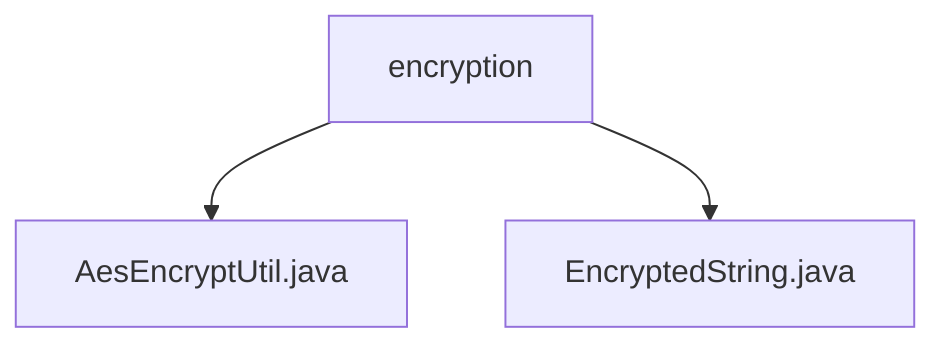

# 基础信息

|      |      |
|------|------|
| 名称 | encryption |
| 编码语言 | .java |
| 代码路径 | JeecgBoot/jeecg-boot/jeecg-boot-base-core/src/main/java/org/jeecg/common/util/encryption |
| 包名 | JeecgBoot.jeecg-boot.jeecg-boot-base-core.src.main.java.org.jeecg.common.util.encryption |
| 概述说明 | 提供AES加密功能，支持CBC模式，默认使用预定义密钥和初始化向量，确保数据安全性和一致性。 |

# 说明

## 概述
该代码模块主要提供了AES加密功能，支持CBC模式进行加密和解密操作。模块中包含两个核心类：`AesEncryptUtil`和`EncryptedString`。`AesEncryptUtil`类简化了AES加密的配置和使用过程，默认使用预定义的密钥（key）和初始化向量（iv）进行加密和解密，确保数据的安全性和一致性。`EncryptedString`类则定义了用于加密和解密操作的静态变量`key`和`iv`，这些变量在类的所有实例中共享，进一步保证了加密过程的一致性和安全性。

## 主要业务场景
该模块适用于需要高安全性的数据加密场景，特别是在以下情况下：
- 数据传输过程中的加密保护。
- 敏感信息的存储加密。
- 需要确保数据一致性和安全性的系统集成。

通过使用该模块，开发者可以轻松实现AES加密和解密功能，减少配置复杂性，提高开发效率。

### 包内部结构视图

该流程图展示了`encryption`文件夹下的两个文件：`AesEncryptUtil.java`和`EncryptedString.java`。`encryption`作为父节点，包含这两个文件，表示它们是该文件夹下的具体实现或工具类。这种层级关系清晰地反映了文件在项目中的组织结构。

# 文件列表 File List

| 名称   | 类型  | 说明 |
|-------|------|-------------|
| [AesEncryptUtil.java](AesEncryptUtil.md) | file | AES加密工具类，支持CBC模式，默认使用预定义key和iv。 |
| [EncryptedString.java](EncryptedString.md) | file | EncryptedString类包含16字符的key和iv静态变量。 |

