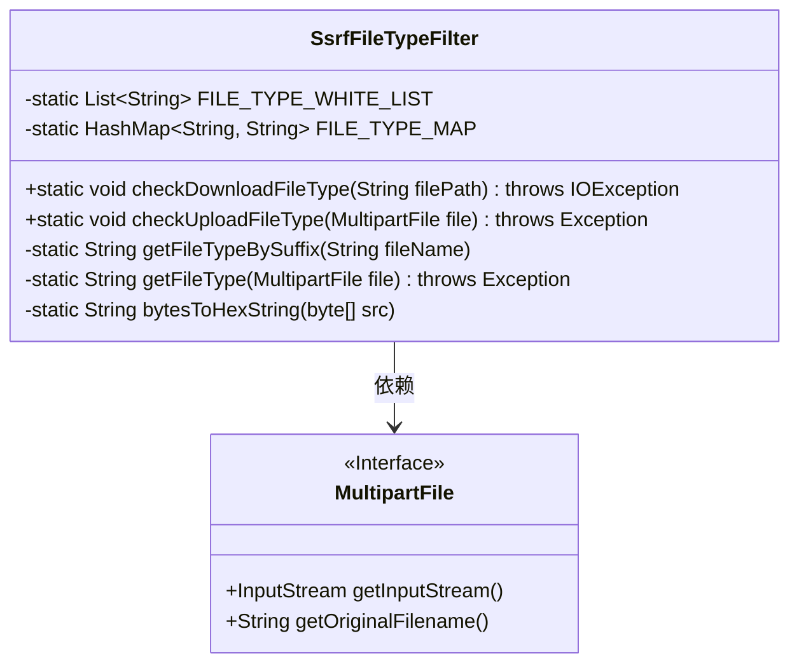
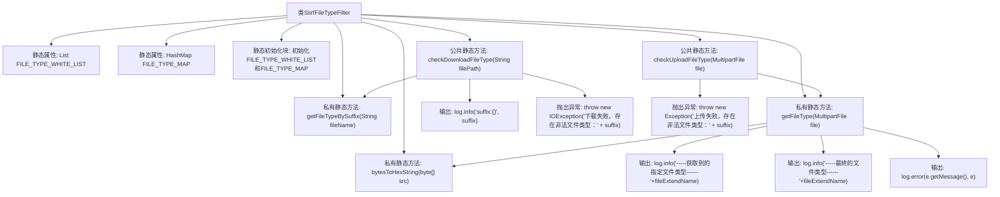

# 基础信息

|      |      |
|------|------|
| 名称 | SsrfFileTypeFilter |
| 编码语言 | .java |
| 代码路径 | JeecgBoot/jeecg-boot/jeecg-boot-base-core/src/main/java/org/jeecg/common/util/filter/SsrfFileTypeFilter.java |
| 包名 | org.jeecg.common.util.filter |
| 依赖项 | ['lombok.extern.slf4j.Slf4j', 'org.apache.commons.lang3.StringUtils', 'org.springframework.web.multipart.MultipartFile', 'java.io.IOException', 'java.io.InputStream', 'java.util.ArrayList', 'java.util.HashMap', 'java.util.Iterator', 'java.util.List'] |
| 概述说明 | SsrfFileTypeFilter类通过白名单和文件头验证确保文件上传下载安全。 |

# 说明

SsrfFileTypeFilter类专门用于文件类型过滤，支持文件的上传和下载操作。该类通过白名单机制和文件头验证两种方式确保文件的安全性。白名单机制限制了允许上传或下载的文件类型，而文件头验证则通过检查文件的头部信息来确认其真实类型，防止恶意文件绕过过滤。这种双重验证机制有效提升了系统的安全性，防止潜在的安全威胁。

# 类列表 Class Summary

| 名称   | 类型  | 说明 |
|-------|------|-------------|
| SsrfFileTypeFilter | class | SsrfFileTypeFilter类用于文件类型过滤，支持上传和下载，通过白名单和文件头验证确保安全性。 |

## 类 SsrfFileTypeFilter

|      |      |
|------|------|
| 访问范围 | @Slf4j;public |
| 类型 | class |
| 名称 | SsrfFileTypeFilter |
| 说明 | SsrfFileTypeFilter类用于文件类型过滤，支持上传和下载，通过白名单和文件头验证确保安全性。 |

### UML类图

### 描述
`SsrfFileTypeFilter` 类用于过滤文件的上传和下载类型，确保只允许白名单中的文件类型。它包含两个静态方法 `checkDownloadFileType` 和 `checkUploadFileType`，分别用于检查下载和上传文件的类型。`getFileTypeBySuffix` 方法通过文件后缀名获取文件类型，`getFileType` 方法通过读取文件头部信息获取文件类型，`bytesToHexString` 方法将字节数组转换为十六进制字符串。`MultipartFile` 是一个接口，提供了获取文件输入流和原始文件名的方法。

### 内部方法调用关系图

这段代码定义了一个名为`SsrfFileTypeFilter`的类，主要用于过滤下载和上传的文件类型。它通过文件后缀名和文件头部信息来判断文件类型，并检查是否在白名单中。如果文件类型不在白名单中，则会抛出异常。代码中使用了静态初始化块来初始化文件类型白名单和文件头部映射表，并通过多个私有和公共方法来执行具体的文件类型检查和获取操作。

### 字段列表 Field List

| 名称  | 类型  | 说明 |
|-------|-------|------|
| FILE_TYPE_MAP = new HashMap<>() | HashMap<String, String> | 定义静态常量哈希映射FILE_TYPE_MAP，键值均为字符串类型。 |
| FILE_TYPE_WHITE_LIST = new ArrayList<>() | List<String> | 定义私有静态最终字符串列表FILE_TYPE_WHITE_LIST。 |

### 方法列表 Method List

| 名称  | 类型  | 说明 |
|-------|-------|------|
| bytesToHexString | String | 将字节数组转换为十六进制字符串，空数组返回null。 |
| checkDownloadFileType | void | 检查文件类型是否允许下载，非法类型抛出异常。 |
| getFileTypeBySuffix | String | 通过文件名后缀获取文件类型。 |
| checkUploadFileType | void | 检查上传文件类型，若不在白名单中则抛出异常。 |
| getFileType | String | 该方法通过文件输入流读取文件头信息，判断文件类型，若无匹配则通过文件名后缀确定文件类型，确保文件流关闭。 |

