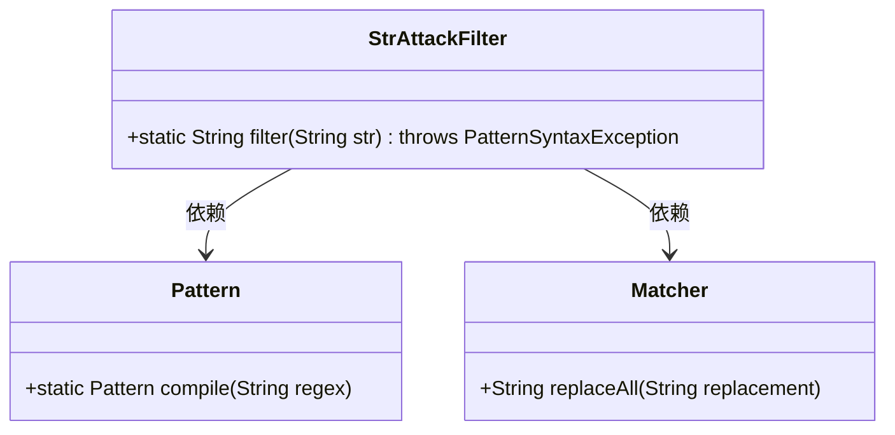
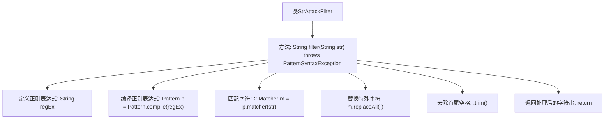

# 基础信息

|      |      |
|------|------|
| 名称 | StrAttackFilter |
| 编码语言 | .java |
| 代码路径 | JeecgBoot/jeecg-boot/jeecg-boot-base-core/src/main/java/org/jeecg/common/util/filter/StrAttackFilter.java |
| 包名 | org.jeecg.common.util.filter |
| 依赖项 | ['java.util.regex.Matcher', 'java.util.regex.Pattern', 'java.util.regex.PatternSyntaxException'] |
| 概述说明 | StrAttackFilter类用于过滤字符串中的特殊字符并返回清理后的结果。 |

# 说明

StrAttackFilter类的主要功能是过滤字符串中的特殊字符，并返回清理后的结果。该类通过识别和处理字符串中的特殊字符，确保输出的字符串是安全且无潜在风险的。这一过程有助于防止字符串注入攻击或其他与特殊字符相关的安全问题，从而提高应用程序的安全性。

# 类列表 Class Summary

| 名称   | 类型  | 说明 |
|-------|------|-------------|
| StrAttackFilter | class | StrAttackFilter类过滤字符串中的特殊字符并返回清理后的结果。 |

## 类 StrAttackFilter

|      |      |
|------|------|
| 访问范围 | public |
| 类型 | class |
| 名称 | StrAttackFilter |
| 说明 | StrAttackFilter类过滤字符串中的特殊字符并返回清理后的结果。 |

### UML类图

这段代码定义了一个名为 `StrAttackFilter` 的类，其中包含一个静态方法 `filter`，用于过滤掉字符串中的所有特殊字符。该方法使用了 `Pattern` 和 `Matcher` 类来编译正则表达式并执行替换操作。代码通过正则表达式匹配并移除字符串中的特殊字符，最终返回处理后的字符串。

### 内部方法调用关系图

这段代码定义了一个名为 `StrAttackFilter` 的类，其中包含一个静态方法 `filter`，用于过滤掉字符串中的所有特殊字符。方法首先定义了一个正则表达式，用于匹配各种特殊字符，然后通过 `Pattern` 和 `Matcher` 类进行编译和匹配，最后使用 `replaceAll` 方法将匹配到的特殊字符替换为空字符串，并通过 `trim` 方法去除首尾空格，最终返回处理后的字符串。

### 字段列表 Field List

| 名称  | 类型  | 说明 |
|-------|-------|------|

### 方法列表 Method List

| 名称  | 类型  | 说明 |
|-------|-------|------|
| filter | String | 该方法清除字符串中所有特殊字符并返回结果。 |

