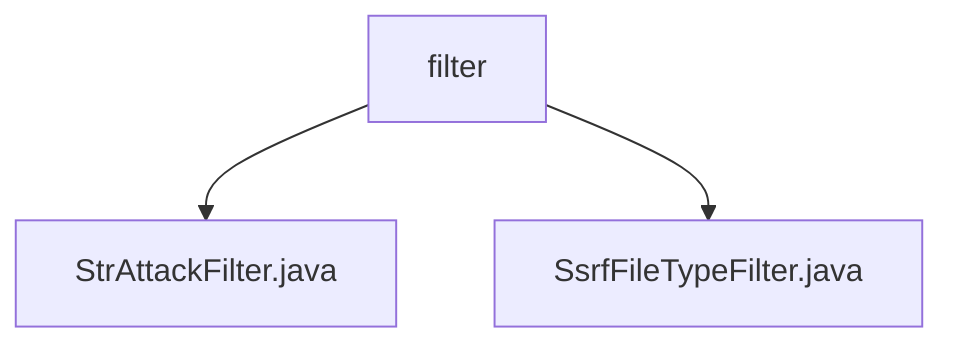

# 基础信息

|      |      |
|------|------|
| 名称 | filter |
| 编码语言 | .java |
| 代码路径 | JeecgBoot/jeecg-boot/jeecg-boot-base-core/src/main/java/org/jeecg/common/util/filter |
| 包名 | JeecgBoot.jeecg-boot.jeecg-boot-base-core.src.main.java.org.jeecg.common.util.filter |
| 概述说明 | StrAttackFilter类过滤特殊字符，确保字符串安全。SsrfFileTypeFilter类通过白名单和文件头验证确保文件安全。 |

# 说明

## 概述

该代码模块主要专注于字符串和文件的安全过滤，旨在防止潜在的安全威胁，如字符串注入攻击和恶意文件上传。模块通过多种过滤机制，确保应用程序在处理用户输入或文件时能够有效地识别和清除不安全的内容，从而提升系统的整体安全性。

## 主要业务场景

1. **字符串安全过滤**：
   - **功能**：`StrAttackFilter`类负责过滤字符串中的特殊字符，确保输出的字符串是安全且无潜在风险的。
   - **应用场景**：在处理用户输入时，如表单提交、API请求等，防止字符串注入攻击或其他与特殊字符相关的安全问题。

2. **文件类型安全过滤**：
   - **功能**：`SsrfFileTypeFilter`类通过白名单机制和文件头验证两种方式，确保上传或下载的文件类型是安全的。
   - **应用场景**：在文件上传和下载操作中，防止恶意文件绕过过滤，确保系统只处理允许的文件类型，从而避免潜在的安全威胁。

### 包内部结构视图

该流程图展示了路径中的层级关系，`filter` 是根节点，包含两个子节点 `StrAttackFilter.java` 和 `SsrfFileTypeFilter.java`。这些节点代表了路径中的文件夹和文件，清晰地展示了它们之间的从属关系。

# 文件列表 File List

| 名称   | 类型  | 说明 |
|-------|------|-------------|
| [StrAttackFilter.java](StrAttackFilter.md) | file | StrAttackFilter类用于过滤字符串中的特殊字符并返回清理后的结果。 |
| [SsrfFileTypeFilter.java](SsrfFileTypeFilter.md) | file | SsrfFileTypeFilter类通过白名单和文件头验证确保文件上传下载安全。 |

