# 基础信息

|      |      |
|------|------|
| 名称 | oConvertUtils |
| 编码语言 | .java |
| 代码路径 | JeecgBoot/jeecg-boot/jeecg-boot-base-core/src/main/java/org/jeecg/common/util/oConvertUtils.java |
| 包名 | org.jeecg.common.util |
| 依赖项 | ['com.alibaba.fastjson.JSONArray', 'lombok.extern.slf4j.Slf4j', 'org.apache.commons.codec.binary.Base64', 'org.apache.commons.io.IOUtils', 'org.apache.commons.lang3.StringUtils', 'org.jeecg.common.constant.CommonConstant', 'org.jeecg.common.constant.SymbolConstant', 'org.springframework.beans.BeanUtils', 'javax.servlet.http.HttpServletRequest', 'java.io.IOException', 'java.io.InputStream', 'java.io.UnsupportedEncodingException', 'java.lang.reflect.Array', 'java.lang.reflect.Field', 'java.math.BigDecimal', 'java.math.BigInteger', 'java.net', 'java.sql.Date', 'java.util', 'java.util.regex.Matcher', 'java.util.regex.Pattern'] |
| 概述说明 | oConvertUtils类提供对象判空、字符串解码、数字转换等工具方法。 |

# 说明

oConvertUtils类是一个多功能工具类，提供了多种实用方法。它包含对象判空功能，用于检查对象是否为空；字符串解码功能，用于处理字符串编码问题；数字转换功能，支持不同类型数字之间的转换；IP获取功能，用于获取设备或用户的IP地址；数组判断功能，用于检查数组是否为空或符合特定条件；驼峰命名转换功能，用于将字符串转换为驼峰命名格式。这些方法为开发人员提供了便捷的工具，简化了常见操作。

# 类列表 Class Summary

| 名称   | 类型  | 说明 |
|-------|------|-------------|
| oConvertUtils | class | oConvertUtils类提供多种工具方法，包括对象判空、字符串解码、数字转换、IP获取、数组判断、驼峰命名转换等。 |

## 类 oConvertUtils

|      |      |
|------|------|
| 访问范围 | @Slf4j;public |
| 类型 | class |
| 名称 | oConvertUtils |
| 说明 | oConvertUtils类提供多种工具方法，包括对象判空、字符串解码、数字转换、IP获取、数组判断、驼峰命名转换等。 |

### UML类图

```mermaid
classDiagram
    class oConvertUtils {
        <<Utility>>
        +boolean isEmpty(Object object)
        +boolean isNotEmpty(Object object)
        +String decodeString(String inStr)
        +String decode(String strIn, String sourceCode, String targetCode)
        +String StrToUTF(String strIn, String sourceCode, String targetCode)
        -String code2code(String strIn, String sourceCode, String targetCode)
        +int getInt(String s, int defval)
        +int getInt(String s)
        +int getInt(String s, Integer df)
        +Integer[] getInts(String[] s)
        +double getDouble(String s, double defval)
        +double getDou(Double s, double defval)
        +int getInt(Object object, int defval)
        +Integer getInteger(Object object, Integer defval)
        +Integer getInt(Object object)
        +int getInt(BigDecimal s, int defval)
        +Integer[] getIntegerArry(String[] object)
        +String getString(String s)
        +String getString(Object object)
        +String getString(int i)
        +String getString(float i)
        +String getNormalString(String input)
        +String getString(String s, String defval)
        +String getString(Object s, String defval)
        +long stringToLong(String str)
        +String getIp()
        -boolean isBaseDataType(Class clazz)
        +String decodeBase64Str(String base64Str)
        +String getIpAddrByRequest(HttpServletRequest request)
        +String getRealIp()
        +String replaceBlank(String str)
        +boolean isIn(String child, String[] all)
        +boolean isArrayIn(String[] childArray, String[] all)
        +boolean isJsonArrayIn(JSONArray childArray, String[] all)
        +Map<Object, Object> getHashMap()
        +Map<Object, Object> setToMap(Set<Object> setobj)
        +boolean isInnerIp(String ipAddress)
        -long getIpNum(String ipAddress)
        -boolean isInner(long userIp, long begin, long end)
        +String camelName(String name)
        +String camelNames(String names)
        +String camelNameCapFirst(String name)
        +String camelToUnderline(String para)
        +String randomGen(int place)
        +Field[] getAllFields(Object object)
        +List<Map<String, Object>> toLowerCasePageList(List<Map<String, Object>> list)
        +<F,T> List<T> entityListToModelList(List<F> fromList, Class<T> tClass)
        +<F,T> T entityToModel(F entity, Class<T> modelClass)
        +boolean listIsEmpty(Collection list)
        +boolean isEqual(Object oldVal, Object newVal)
        +boolean isArray(Object obj)
        +int getCollectionSize(Collection<?> collection)
        +boolean equalityOfJSONArray(JSONArray oldVal, JSONArray newVal)
        +boolean equalityOfStringArrays(String oldVal, String newVal)
        +boolean equalityOfArrays(Object[] oldVal, Object[] newVal)
        +boolean listIsNotEmpty(Collection list)
        +String readStatic(String url)
        +JSONArray list2JSONArray(List<String> list)
        +boolean isEqList(List<String> list1, List<String> list2)
        +boolean isInList(List<String> list1, List<String> list2)
        +Double calculateFileSizeToMb(Long uploadCount)
        +String mapToString(Map<String, String[]> map)
        +boolean isObjectEmpty(Object obj)
        +boolean isEmptyIterator(Iterator<?> iterator)
        +boolean isObjectNotEmpty(Object object)
        +boolean isGt(Number src, Number des)
        +boolean isGe(Number src, Number des)
        +<T> boolean isIn(T obj, T... objs)
    }
```

**描述：**  
`oConvertUtils` 是一个工具类，提供了多种静态方法用于处理字符串、数字、集合、IP地址、编码转换等常见操作。它包含的方法可以判断对象是否为空、进行字符串解码、获取IP地址、转换数据类型、比较数组和集合等。该类设计为无状态，所有方法均为静态方法，适用于各种场景下的工具需求。

### 内部方法调用关系图

这段代码定义了一个名为 `oConvertUtils` 的工具类，包含了多种静态方法，用于处理字符串、数字、IP地址、编码转换、集合操作等常见任务。代码中的方法涵盖了从简单的空值检查到复杂的编码转换和集合操作，展示了如何通过工具类简化常见的编程任务。流程图展示了类 `oConvertUtils` 及其内部方法之间的调用关系，帮助理解代码的结构和功能。

### 字段列表 Field List

| 名称  | 类型  | 说明 |
|-------|-------|------|

### 方法列表 Method List

| 名称  | 类型  | 说明 |
|-------|-------|------|
| isIn | boolean | 静态方法检查字符串是否在数组中，返回布尔值。 |
| isNotEmpty | boolean | 检查对象非空且不为空字符串或特定空值。 |
| isEmpty | boolean | 方法检查对象是否为空或等于空字符串。 |
| getString | String | 静态方法将浮点数转换为字符串并返回。 |
| listIsEmpty | boolean | 检查集合是否为空或null。 |
| getInts | Integer[] | 将字符串数组转换为整数数组，若输入为空则返回空。 |
| getIpNum | long | 将IP地址转换为数值的静态方法。 |
| decodeString | String | 解码URL字符串，处理异常并返回结果。 |
| isInner | boolean | 判断用户IP是否在指定范围内。 |
| getAllFields | Field[] | 获取对象及其父类的所有字段。 |
| getIp | String | 获取本地IP地址的Java方法。 |
| replaceBlank | String | 静态方法替换字符串中的空白字符并返回结果。 |
| decode | String | 静态方法decode将输入字符串从源编码转换为目标编码并返回结果。 |
| isObjectNotEmpty | boolean | 检查对象是否非空。 |
| getString | String | 静态方法getString将整数转换为字符串并返回。 |
| getInt | int | 方法获取对象整数值，空或异常返回默认值。 |
| getHashMap | Map<Object, Object> | 静态方法返回容量为5的HashMap实例。 |
| StrToUTF | String | 将字符串从ISO-8859-1编码转换为GBK编码。 |
| isArray | boolean | 该方法判断对象是否为数组，空对象返回false。 |
| isBaseDataType | boolean | 判断类是否为基本数据类型或常用包装类。 |
| setToMap | Map<Object, Object> | 将Set转换为Map，键值转为字符串并去空格。 |
| isInnerIp | boolean | 判断IP地址是否为内网地址。 |
| listIsNotEmpty | boolean | 判断集合非空的静态方法。 |
| isObjectEmpty | boolean | 检查对象是否为空，支持多种类型判断。 |
| getInt | Integer | 静态方法getInt将对象转换为整数，若为空或格式错误则返回null。 |
| getString | String | 静态方法getString返回输入字符串s或空字符串。 |
| isJsonArrayIn | boolean | 检查JSON数组元素是否全部存在于指定字符串数组中。 |
| camelNames | String | 将逗号分隔的字符串转换为驼峰命名并重新拼接。 |
| getInteger | Integer | 静态方法获取对象整数值，若空或异常返回默认值。 |
| getInt | int | 静态方法getInt将字符串转为整数，空值或异常时返回0。 |
| camelNameCapFirst | String | 将带下划线的字符串转换为首字母大写的驼峰命名。 |
| toLowerCasePageList | List<Map<String, Object>> | 将列表中的Map键转换为小写并返回新列表。 |
| getDouble | double | 方法getDouble解析字符串为双精度数，失败返回默认值。 |
| isEmptyIterator | boolean | 方法isEmptyIterator检查迭代器是否为空或没有下一个元素。 |
| getInt | int | 方法getInt将BigDecimal转为int，若为空返回默认值defval。 |
| randomGen | String | 生成指定长度的随机字符串，包含字母和数字。 |
| isArrayIn | boolean | 检查子数组是否全部包含于父数组，返回布尔值。 |
| equalityOfStringArrays | boolean | 比较两个字符串数组是否相等，支持逗号分隔。 |
| getString | String | 该方法检查对象是否为空，为空返回默认值，否则返回对象字符串并去除空格。 |
| getCollectionSize | int | 静态方法getCollectionSize返回集合大小，若集合为空则返回0。 |
| calculateFileSizeToMb | Double | 将文件大小从字节转换为MB，保留两位小数。 |
| getString | String | 方法检查字符串是否为空，若空返回默认值，否则返回去除空格的字符串。 |
| entityListToModelList | List<T> | 将实体列表转换为模型列表，若输入为空则返回null。 |
| isEqList | boolean | 比较两个字符串列表是否相等，元素顺序无关。 |
| equalityOfJSONArray | boolean | 比较两个JSON数组是否相等，空数组或null视为相等。 |
| getDou | double | 方法getDou返回Double值，若s为空则返回默认值defval。 |
| entityToModel | T | 将实体属性赋值到模型类，处理异常并返回模型实例。 |
| code2code | String | 将字符串从源编码转换为目标编码，若输入为空则直接返回。 |
| isIn | boolean | 静态方法isIn检查对象是否在可变参数数组中。 |
| getInt | int | 方法将字符串转为整数，若为空或异常返回默认值或0。 |
| isGe | boolean | 判断src是否大于等于des，空参数抛出异常。 |
| stringToLong | long | 将字符串转换为长整型，异常时返回0。 |
| camelName | String | 将字符串转换为驼峰命名，处理下划线和首字母大小写。 |
| camelToUnderline | String | 将驼峰字符串转换为下划线格式，从第三字符开始插入下划线并转为小写。 |
| getString | String | 该方法检查对象是否为空，若为空返回空字符串，否则返回对象去除空格的字符串表示。 |
| readStatic | String | 读取JAR包中文件的静态方法，解决SpringBoot文件读取问题。 |
| equalityOfArrays | boolean | 比较两个数组是否相等，先排序再比较，空数组视为相等。 |
| getIntegerArry | Integer[] | 将字符串数组转换为整数数组，若转换失败返回空。 |
| getInt | int | 静态方法getInt将字符串转换为整数，失败时返回默认值。 |
| getNormalString | String | 该方法过滤输入字符串，仅保留数字、字母和汉字，若输入为空则返回null。 |
| isInList | boolean | 检查list1中是否有元素存在于list2中，存在返回true，否则返回false。 |
| getIpAddrByRequest | String | 通过HTTP请求获取客户端IP地址，依次检查多个请求头。 |
| isGt | boolean | 方法isGt比较两个数值，若src大于des返回true，否则返回false，参数不能为空。 |
| mapToString | String | 将Map转为字符串，键值对用等号连接，多个值用逗号分隔，最后用&连接。 |
| getRealIp | String | 获取本地或外网IP地址，优先返回外网IP。 |
| list2JSONArray | JSONArray | 将字符串列表转换为JSON数组，若列表为空则返回null。 |
| decodeBase64Str | String | 解码Base64字符串并返回解码后的内容。 |
| isEqual | boolean | 方法比较两个对象是否相等，处理数组、JSONArray及普通对象。 |

