# 基础信息

|      |      |
|------|------|
| 名称 | OssBootUtil |
| 编码语言 | .java |
| 代码路径 | JeecgBoot/jeecg-boot/jeecg-boot-base-core/src/main/java/org/jeecg/common/util/oss/OssBootUtil.java |
| 包名 | org.jeecg.common.util.oss |
| 依赖项 | ['com.aliyun.oss.ClientConfiguration', 'com.aliyun.oss.OSSClient', 'com.aliyun.oss.common.auth.DefaultCredentialProvider', 'com.aliyun.oss.model.CannedAccessControlList', 'com.aliyun.oss.model.OSSObject', 'com.aliyun.oss.model.PutObjectResult', 'lombok.extern.slf4j.Slf4j', 'org.apache.commons.fileupload.FileItemStream', 'org.jeecg.common.constant.CommonConstant', 'org.jeecg.common.constant.SymbolConstant', 'org.jeecg.common.util.CommonUtils', 'org.jeecg.common.util.filter.SsrfFileTypeFilter', 'org.jeecg.common.util.filter.StrAttackFilter', 'org.jeecg.common.util.oConvertUtils', 'org.springframework.web.multipart.MultipartFile', 'java.io.BufferedInputStream', 'java.io.IOException', 'java.io.InputStream', 'java.net.URL', 'java.net.URLDecoder', 'java.util.Date', 'java.util.UUID'] |
| 概述说明 | OssBootUtil类管理阿里云OSS文件操作，支持自定义桶和路径过滤。 |

# 说明

OssBootUtil类是一个用于管理阿里云OSS文件操作的工具类，主要功能包括文件上传、删除以及获取文件流等。该类支持用户自定义存储桶名称，并允许通过文件路径进行过滤，以便更灵活地处理OSS中的文件。通过OssBootUtil，用户可以方便地执行与OSS相关的各种操作，提升文件管理的效率和便捷性。

# 类列表 Class Summary

| 名称   | 类型  | 说明 |
|-------|------|-------------|
| OssBootUtil | class | OssBootUtil类用于管理阿里云OSS文件上传、删除、获取文件流等操作，支持自定义桶和文件路径过滤。 |

## 类 OssBootUtil

|      |      |
|------|------|
| 访问范围 | @Slf4j;public |
| 类型 | class |
| 名称 | OssBootUtil |
| 说明 | OssBootUtil类用于管理阿里云OSS文件上传、删除、获取文件流等操作，支持自定义桶和文件路径过滤。 |

### UML类图

```mermaid
classDiagram
    class OssBootUtil {
        -static String endPoint
        -static String accessKeyId
        -static String accessKeySecret
        -static String bucketName
        -static String staticDomain
        -static OSSClient ossClient
        +static void setEndPoint(String endPoint)
        +static void setAccessKeyId(String accessKeyId)
        +static void setAccessKeySecret(String accessKeySecret)
        +static void setBucketName(String bucketName)
        +static void setStaticDomain(String staticDomain)
        +static String getStaticDomain()
        +static String getEndPoint()
        +static String getAccessKeyId()
        +static String getAccessKeySecret()
        +static String getBucketName()
        +static OSSClient getOssClient()
        +static String upload(MultipartFile file, String fileDir, String customBucket) throws Exception
        +static String upload(MultipartFile file, String fileDir) throws Exception
        +static String upload(FileItemStream file, String fileDir)
        +static void deleteUrl(String url)
        +static void deleteUrl(String url, String bucket)
        +static void delete(String fileName)
        +static InputStream getOssFile(String objectName, String bucket)
        +static String getObjectUrl(String bucketName, String objectName, Date expires)
        -static OSSClient initOss(String endpoint, String accessKeyId, String accessKeySecret)
        +static String upload(InputStream stream, String relativePath)
        -static String replacePrefix(String objectName, String customBucket)
    }

    class OSSClient {
        +boolean doesBucketExist(String bucketName)
        +void createBucket(String bucketName)
        +PutObjectResult putObject(String bucketName, String key, InputStream input)
        +void setBucketAcl(String bucketName, CannedAccessControlList acl)
        +boolean doesObjectExist(String bucketName, String key)
        +URL generatePresignedUrl(String bucketName, String key, Date expiration)
        +void deleteObject(String bucketName, String key)
        +OSSObject getObject(String bucketName, String key)
    }

    class MultipartFile {
        +String getOriginalFilename()
        +String getName()
        +InputStream getInputStream()
    }

    class FileItemStream {
        +String getName()
        +InputStream openStream()
    }

    class InputStream {
        // InputStream methods
    }

    class PutObjectResult {
        // PutObjectResult methods
    }

    class OSSObject {
        +InputStream getObjectContent()
    }

    class URL {
        +String toString()
    }

    class Date {
        // Date methods
    }

    class DefaultCredentialProvider {
        +DefaultCredentialProvider(String accessKeyId, String accessKeySecret)
    }

    class ClientConfiguration {
        // ClientConfiguration methods
    }

    class CannedAccessControlList {
        // CannedAccessControlList methods
    }

    OssBootUtil --> OSSClient : 依赖
    OssBootUtil --> MultipartFile : 依赖
    OssBootUtil --> FileItemStream : 依赖
    OssBootUtil --> InputStream : 依赖
    OssBootUtil --> PutObjectResult : 依赖
    OssBootUtil --> OSSObject : 依赖
    OssBootUtil --> URL : 依赖
    OssBootUtil --> Date : 依赖
    OssBootUtil --> DefaultCredentialProvider : 依赖
    OssBootUtil --> ClientConfiguration : 依赖
    OssBootUtil --> CannedAccessControlList : 依赖
```

### 描述
`OssBootUtil` 是一个用于与阿里云 OSS 进行交互的工具类，提供了文件上传、删除、获取文件流、生成外链等功能。它依赖于 `OSSClient` 来执行具体的 OSS 操作，并且可以处理 `MultipartFile` 和 `FileItemStream` 类型的文件。通过 `initOss` 方法初始化 OSS 客户端，并提供了多种上传和删除文件的接口。此外，`OssBootUtil` 还支持自定义桶名和文件路径的前缀替换，以确保文件操作的准确性。

### 内部方法调用关系图

**描述：**
该流程图展示了`OssBootUtil`类的结构和主要方法。`OssBootUtil`类主要用于管理阿里云OSS（对象存储服务）的上传、删除、获取文件等操作。类中包含多个静态属性用于存储OSS的配置信息，如`endPoint`、`accessKeyId`等，以及多个静态方法用于执行具体的OSS操作，如`upload`、`deleteUrl`、`getOssFile`等。每个方法都与OSS客户端进行交互，完成文件的上传、删除、获取等操作。

### 字段列表 Field List

| 名称  | 类型  | 说明 |
|-------|-------|------|
| accessKeyId | String | 声明一个私有静态字符串变量accessKeyId。 |
| accessKeySecret | String | 声明了一个私有的静态字符串变量accessKeySecret。 |
| bucketName | String | 私有静态字符串变量存储桶名称。 |
| ossClient = null | OSSClient | 私有静态OSSClient对象初始化为空。 |
| endPoint | String | 定义私有静态字符串变量endPoint。 |
| staticDomain | String | 定义了一个私有的静态字符串变量staticDomain。 |

### 方法列表 Method List

| 名称  | 类型  | 说明 |
|-------|-------|------|
| getBucketName | String | 该方法返回存储桶名称。 |
| getOssClient | OSSClient | 静态方法返回OSSClient实例。 |
| getStaticDomain | String | 静态方法返回静态域的值。 |
| setAccessKeyId | void | 设置OssBootUtil类的accessKeyId属性值。 |
| getAccessKeySecret | String | 获取访问密钥的静态方法。 |
| delete | void | 该方法用于删除指定文件名的OSS对象。 |
| getOriginalUrl | String | 该方法将指定URL中的静态域名替换为原始域名并返回。 |
| setEndPoint | void | 设置OssBootUtil类的endPoint属性值为指定字符串。 |
| getAccessKeyId | String | 获取accessKeyId的静态方法。 |
| setBucketName | void | 设置OssBootUtil类的bucketName静态变量为指定值。 |
| initOss | OSSClient | 初始化OSS客户端，使用端点、访问密钥和配置参数。 |
| getEndPoint | String | 获取端点字符串的静态方法。 |
| deleteUrl | void | 静态方法deleteUrl根据输入URL和bucket删除云存储文件。 |
| setStaticDomain | void | 该方法用于设置静态域名，将传入的staticDomain赋值给OssBootUtil的staticDomain属性。 |
| upload | String | 上传文件至OSS并设置公开读权限，返回文件路径。 |
| getOssFile | InputStream | 获取OSS文件流，替换前缀防止key不一致，返回输入流。 |
| setAccessKeySecret | void | 设置OssBootUtil的accessKeySecret属性。 |
| deleteUrl | void | 静态方法deleteUrl用于删除指定URL，可调用带null参数的deleteUrl方法。 |
| getObjectUrl | String | 获取OSS对象URL，替换前缀检查存在后生成并返回签名URL。 |
| upload | String | 上传文件至OSS并返回文件路径，设置公开读权限。 |
| replacePrefix | String | 替换对象名前缀，支持自定义域名和桶名，返回处理后的对象名。 |
| upload | String | 上传文件方法，支持指定目录，可抛出异常。 |
| upload | String | 上传文件至OSS，过滤文件类型和文件夹名，生成文件路径并设置权限。 |

