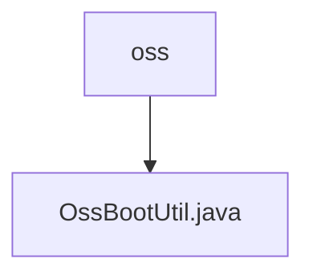

# 基础信息

|      |      |
|------|------|
| 名称 | oss |
| 编码语言 | .java |
| 代码路径 | JeecgBoot/jeecg-boot/jeecg-boot-base-core/src/main/java/org/jeecg/common/util/oss |
| 包名 | JeecgBoot.jeecg-boot.jeecg-boot-base-core.src.main.java.org.jeecg.common.util.oss |
| 概述说明 | OssBootUtil类管理阿里云OSS文件操作，支持自定义桶和路径过滤。 |

# 说明

OssBootUtil类是一个用于管理阿里云OSS文件操作的工具类，主要功能包括文件上传、删除以及获取文件流等。该类支持用户自定义存储桶名称，并允许通过文件路径进行过滤，以便更灵活地处理OSS中的文件。通过OssBootUtil，用户可以方便地执行与OSS相关的各种操作，提升文件管理的效率和便捷性。

### 包内部结构视图

该流程图展示了路径的层级关系，其中`oss`文件夹包含一个文件`OssBootUtil.java`。路径结构简洁明了，反映了文件在项目中的具体位置和层级关系。

# 文件列表 File List

| 名称   | 类型  | 说明 |
|-------|------|-------------|
| [OssBootUtil.java](OssBootUtil.md) | file | OssBootUtil类管理阿里云OSS文件操作，支持自定义桶和路径过滤。 |

