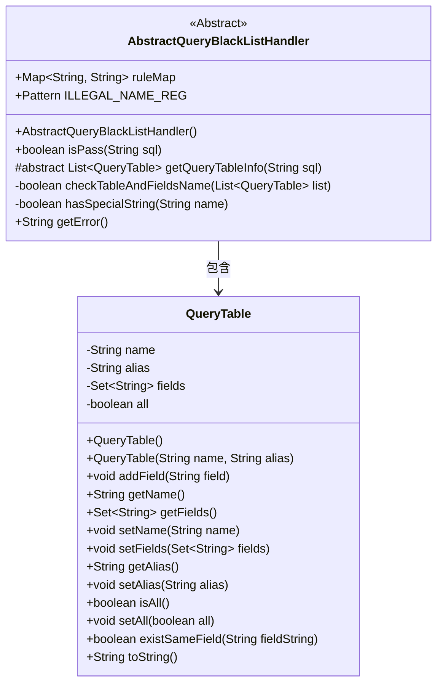
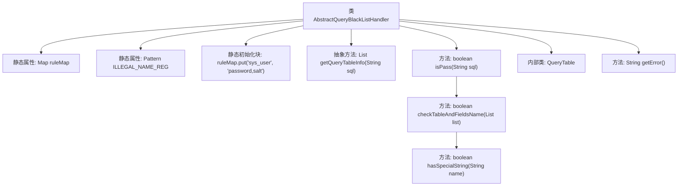
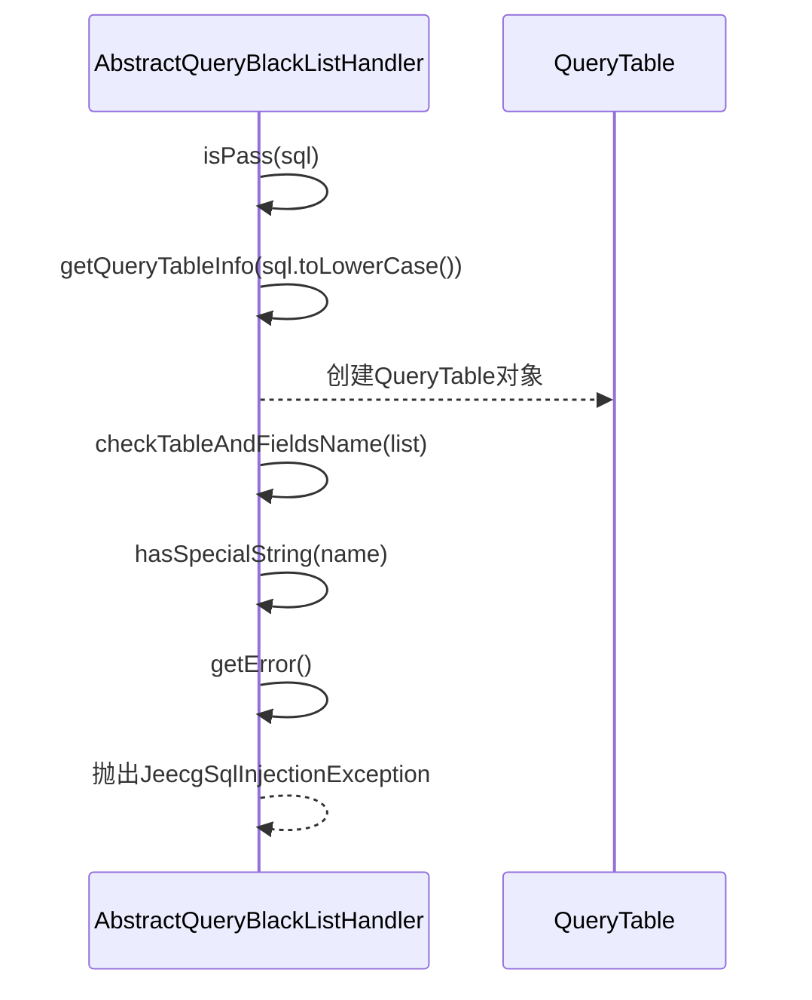

# 基础信息

|      |      |
|------|------|
| 名称 | AbstractQueryBlackListHandler |
| 编码语言 | .java |
| 代码路径 | JeecgBoot/jeecg-boot/jeecg-boot-base-core/src/main/java/org/jeecg/common/util/security/AbstractQueryBlackListHandler.java |
| 包名 | org.jeecg.common.util.security |
| 依赖项 | ['lombok.extern.slf4j.Slf4j', 'org.apache.commons.lang.StringUtils', 'org.jeecg.common.exception.JeecgSqlInjectionException', 'java.util', 'java.util.regex.Matcher', 'java.util.regex.Pattern'] |
| 概述说明 | 抽象类实现SQL黑名单校验，防止查询敏感表和字段。 |

# 说明

该内容描述了一个抽象类的实现，其核心功能是进行SQL黑名单校验，旨在防止对敏感表和字段的查询操作。通过这一机制，系统能够有效识别并拦截可能涉及敏感数据的SQL查询，从而增强数据安全性和隐私保护。此设计适用于需要严格控制数据访问权限的场景，确保只有授权的查询能够被执行，减少数据泄露风险。

# 类列表 Class Summary

| 名称   | 类型  | 说明 |
|-------|------|-------------|
| AbstractQueryBlackListHandler | class | 抽象类实现SQL黑名单校验，防止敏感表和字段查询。 |

## 类 AbstractQueryBlackListHandler

|      |      |
|------|------|
| 访问范围 | @Slf4j;public abstract |
| 类型 | class |
| 名称 | AbstractQueryBlackListHandler |
| 说明 | 抽象类实现SQL黑名单校验，防止敏感表和字段查询。 |

### UML类图

这段代码定义了一个抽象类 `AbstractQueryBlackListHandler`，用于处理SQL查询的黑名单校验。该类包含一个静态的 `ruleMap` 用于存储表名和字段名的黑名单规则，以及一个正则表达式 `ILLEGAL_NAME_REG` 用于检测非法字符。`isPass` 方法用于校验SQL语句是否合法，`checkTableAndFieldsName` 方法用于校验表名和字段名是否包含非法字符。`QueryTable` 是一个内部类，用于存储查询的表信息和字段信息，并提供了一些方法用于操作这些信息。整体设计通过抽象类和内部类的结合，实现了SQL查询的安全校验功能。

### 内部方法调用关系图

这段代码定义了一个抽象类 `AbstractQueryBlackListHandler`，用于校验SQL语句是否符合安全规则。类中包含一个静态的 `ruleMap` 用于存储禁止查询的表和字段，以及一个正则表达式 `ILLEGAL_NAME_REG` 用于检测非法字符。`isPass` 方法负责校验SQL语句，调用 `getQueryTableInfo` 获取表信息，并通过 `checkTableAndFieldsName` 和 `hasSpecialString` 方法进一步校验表名和字段名是否合法。如果校验失败，抛出 `JeecgSqlInjectionException` 异常。内部类 `QueryTable` 用于封装表信息，并提供字段校验功能。

### 字段列表 Field List

| 名称  | 类型  | 说明 |
|-------|-------|------|
| ILLEGAL_NAME_REG = Pattern.compile("[-]{2,}") | Pattern | 定义正则表达式，匹配连续两个及以上短横线的非法名称。 |
| ruleMap = new HashMap<>() | Map<String, String> | 定义静态Map变量ruleMap并初始化为HashMap。 |

### 方法列表 Method List

| 名称  | 类型  | 说明 |
|-------|-------|------|
| getQueryTableInfo | List<QueryTable> | 获取SQL查询表信息的抽象方法。 |
| getError | String | 系统禁止查询敏感表和字段，需联系管理员授权。 |
| hasSpecialString | boolean | 检查字符串是否包含非法字符。 |
| checkTableAndFieldsName | boolean | 检查表名和字段名是否包含特殊字符，包含则返回false并记录警告。 |
| isPass | boolean | 方法校验SQL语句，解析表信息并检查黑名单，异常时抛出错误。 |

