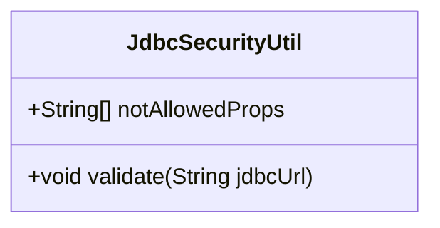
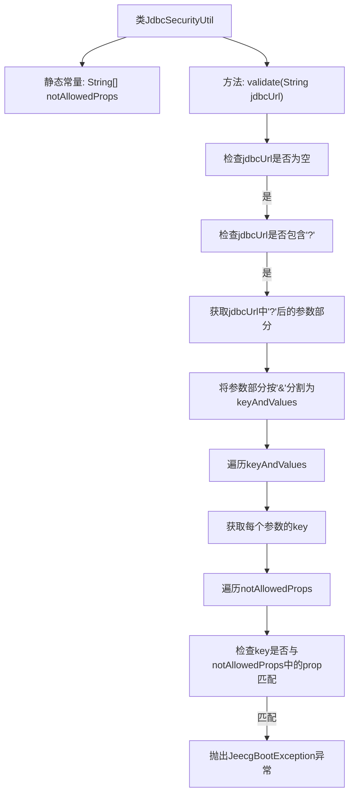

# 基础信息

|      |      |
|------|------|
| 名称 | JdbcSecurityUtil |
| 编码语言 | .java |
| 代码路径 | JeecgBoot/jeecg-boot/jeecg-boot-base-core/src/main/java/org/jeecg/common/util/security/JdbcSecurityUtil.java |
| 包名 | org.jeecg.common.util.security |
| 依赖项 | ['org.jeecg.common.exception.JeecgBootException', 'org.jeecg.common.util.oConvertUtils'] |
| 概述说明 | JdbcSecurityUtil类用于检查JDBC连接地址的安全属性。 |

# 说明

JdbcSecurityUtil类的主要功能是检查JDBC连接地址中是否包含不安全属性。该工具类通过分析连接地址，确保其中不包含可能引发安全风险的属性，从而提升系统的安全性。其核心作用在于防范潜在的数据库连接安全问题，确保应用程序与数据库的交互过程中不会因为不安全的连接配置而受到威胁。

# 类列表 Class Summary

| 名称   | 类型  | 说明 |
|-------|------|-------------|
| JdbcSecurityUtil | class | JdbcSecurityUtil类用于校验JDBC连接地址中是否存在不安全属性。 |

## 类 JdbcSecurityUtil

|      |      |
|------|------|
| 访问范围 | public |
| 类型 | class |
| 名称 | JdbcSecurityUtil |
| 说明 | JdbcSecurityUtil类用于校验JDBC连接地址中是否存在不安全属性。 |

### UML类图

**描述：**
`JdbcSecurityUtil` 类主要用于验证 JDBC 连接字符串中是否包含不允许的属性。该类包含一个静态字符串数组 `notAllowedProps`，用于存储不允许的属性名称。`validate` 方法接收一个 JDBC 连接字符串作为参数，检查该字符串中是否包含 `notAllowedProps` 中的属性。如果发现不允许的属性，则抛出 `JeecgBootException` 异常，提示连接地址存在安全风险。该类的作用是确保 JDBC 连接的安全性，防止潜在的安全漏洞。

### 内部方法调用关系图

这段代码定义了一个名为`JdbcSecurityUtil`的类，其中包含一个静态常量`notAllowedProps`和一个方法`validate`。`validate`方法用于检查传入的JDBC连接URL是否包含特定的不安全参数。如果发现这些参数，方法会抛出`JeecgBootException`异常，提示连接地址存在安全风险。流程图展示了从检查URL是否为空到最终抛出异常的完整流程。

### 字段列表 Field List

| 名称  | 类型  | 说明 |
|-------|-------|------|
| notAllowedProps = new String[]{"authenticationPluginClassName", "sslhostnameverifier", "socketFactory", "sslfactory", "sslpasswordcallback"} | String[] | 定义了不可用属性数组，包含五个字符串元素。 |

### 方法列表 Method List

| 名称  | 类型  | 说明 |
|-------|-------|------|
| validate | void | 验证JDBC连接地址，检查非法参数并抛出异常。 |

