# 基础信息

|      |      |
|------|------|
| 名称 | SecurityTools |
| 编码语言 | .java |
| 代码路径 | JeecgBoot/jeecg-boot/jeecg-boot-base-core/src/main/java/org/jeecg/common/util/security/SecurityTools.java |
| 包名 | org.jeecg.common.util.security |
| 依赖项 | ['cn.hutool.core.codec.Base64Decoder', 'cn.hutool.core.codec.Base64Encoder', 'cn.hutool.crypto.SecureUtil', 'cn.hutool.crypto.asymmetric.KeyType', 'cn.hutool.crypto.asymmetric.RSA', 'cn.hutool.crypto.asymmetric.Sign', 'cn.hutool.crypto.asymmetric.SignAlgorithm', 'cn.hutool.crypto.symmetric.AES', 'org.jeecg.common.util.security.entity', 'com.alibaba.fastjson.JSONObject', 'javax.crypto.SecretKey', 'java.security.KeyPair'] |
| 概述说明 | SecurityTools类支持AES加密、RSA签名、密钥生成及数据验证。 |

# 说明

SecurityTools类提供了一系列安全功能，包括AES加密、RSA签名和密钥生成。这些功能支持对数据进行加密和签名操作，确保数据的完整性和安全性。AES加密用于保护数据的机密性，RSA签名用于验证数据的来源和完整性，密钥生成功能则为加密和签名操作提供必要的密钥。通过这些功能，SecurityTools类能够有效地进行数据验证和签名操作，保障信息的安全传输和存储。

# 类列表 Class Summary

| 名称   | 类型  | 说明 |
|-------|------|-------------|
| SecurityTools | class | SecurityTools类提供AES加密、RSA签名和密钥生成功能，支持数据验证和签名操作。 |

## 类 SecurityTools

|      |      |
|------|------|
| 访问范围 | public |
| 类型 | class |
| 名称 | SecurityTools |
| 说明 | SecurityTools类提供AES加密、RSA签名和密钥生成功能，支持数据验证和签名操作。 |

### UML类图

```mermaid
classDiagram
    class SecurityTools {
        <<static>>
        +String ALGORITHM
        +SecurityResp valid(SecurityReq req)
        +SecuritySignResp sign(SecuritySignReq req)
        +MyKeyPair generateKeyPair()
    }

    class SecurityReq {
        +String getPubKey()
        +String getAesKey()
        +String getData()
        +String getSignData()
    }

    class SecurityResp {
        +void setData(JSONObject data)
        +void setSuccess(boolean success)
    }

    class SecuritySignReq {
        +String getPrikey()
        +String getData()
    }

    class SecuritySignResp {
        +void setAesKey(String aesKey)
        +void setData(String data)
        +void setSignData(String signData)
    }

    class MyKeyPair {
        +void setPriKey(String priKey)
        +void setPubKey(String pubKey)
    }

    class RSA {
        +RSA(String priKey, byte[] pubKey)
        +byte[] decrypt(String data, KeyType keyType)
        +byte[] encrypt(byte[] data, KeyType keyType)
    }

    class Sign {
        +Sign(SignAlgorithm algorithm, String priKey, String pubKey)
        +boolean verify(byte[] data, byte[] signData)
        +byte[] sign(byte[] data)
    }

    class AES {
        +AES(byte[] key)
        +String decryptStr(String data)
        +String encryptBase64(String data)
        +SecretKey getSecretKey()
    }

    class SecureUtil {
        <<static>>
        +AES aes(byte[] key)
        +SecretKey generateKey(String algorithm)
        +KeyPair generateKeyPair(String algorithm, int keySize)
    }

    class Base64Decoder {
        <<static>>
        +byte[] decode(String data)
    }

    class Base64Encoder {
        <<static>>
        +String encode(byte[] data)
    }

    class JSONObject {
        <<static>>
        +JSONObject parseObject(String data)
    }

    class KeyType {
        <<enum>>
        +PublicKey
        +PrivateKey
    }

    class SignAlgorithm {
        <<enum>>
        +SHA1withRSA
        +String getValue()
    }

    class SecretKey {
        +byte[] getEncoded()
    }

    class KeyPair {
        +PrivateKey getPrivate()
        +PublicKey getPublic()
    }

    SecurityTools --> SecurityReq : 依赖
    SecurityTools --> SecurityResp : 依赖
    SecurityTools --> SecuritySignReq : 依赖
    SecurityTools --> SecuritySignResp : 依赖
    SecurityTools --> MyKeyPair : 依赖
    SecurityTools --> RSA : 依赖
    SecurityTools --> Sign : 依赖
    SecurityTools --> AES : 依赖
    SecurityTools --> SecureUtil : 依赖
    SecurityTools --> Base64Decoder : 依赖
    SecurityTools --> Base64Encoder : 依赖
    SecurityTools --> JSONObject : 依赖
    SecurityTools --> KeyType : 依赖
    SecurityTools --> SignAlgorithm : 依赖
    SecurityTools --> SecretKey : 依赖
    SecurityTools --> KeyPair : 依赖
```

### 描述
`SecurityTools` 类提供了三个静态方法：`valid`、`sign` 和 `generateKeyPair`，分别用于验证请求、生成签名和生成密钥对。`valid` 方法通过 `RSA` 和 `AES` 解密数据并验证签名；`sign` 方法使用 `AES` 加密数据并使用 `RSA` 加密密钥；`generateKeyPair` 方法生成并返回一个密钥对。该类依赖于多个辅助类，如 `RSA`、`Sign`、`AES` 等，用于实现加密、解密和签名功能。

### 内部方法调用关系图

该流程图展示了`SecurityTools`类的三个主要方法：`valid`、`sign`和`generateKeyPair`。`valid`方法用于验证请求的安全性，包括解密AES密钥、解密数据、验证签名等步骤。`sign`方法用于生成签名，包括生成密钥、加密数据、签名数据等步骤。`generateKeyPair`方法用于生成密钥对，包括生成密钥对、编码密钥、返回结果等步骤。每个方法的详细步骤通过流程图清晰地展示出来。

### 字段列表 Field List

| 名称  | 类型  | 说明 |
|-------|-------|------|
| ALGORITHM = "AES/ECB/PKCS5Padding" | String | 定义了一个常量字符串，表示AES算法的ECB模式和PKCS5填充方式。 |

### 方法列表 Method List

| 名称  | 类型  | 说明 |
|-------|-------|------|
| generateKeyPair | MyKeyPair | 生成2048位RSA密钥对并返回Base64编码的公私钥。 |
| valid | SecurityResp | 验证请求数据，解密AES密钥，解密报文并验证签名，返回验证结果。 |
| sign | SecuritySignResp | 生成AES密钥，加密数据，RSA加密AES密钥，签名数据并返回结果。 |

