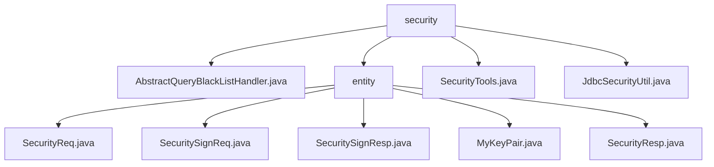

# 基础信息

|      |      |
|------|------|
| 名称 | security |
| 编码语言 | .java |
| 代码路径 | JeecgBoot/jeecg-boot/jeecg-boot-base-core/src/main/java/org/jeecg/common/util/security |
| 包名 | JeecgBoot.jeecg-boot.jeecg-boot-base-core.src.main.java.org.jeecg.common.util.security |
| 概述说明 | 抽象类实现SQL黑名单校验，拦截敏感查询，增强数据安全。 |

# 说明

## 概述
该代码模块主要围绕数据安全和隐私保护展开，提供了多种安全机制来确保数据在传输、存储和访问过程中的安全性。模块的核心功能包括SQL黑名单校验、数据加密与解密、签名与验证、密钥管理以及JDBC连接安全检查。通过这些功能，模块能够有效防止未经授权的数据访问、确保数据的完整性和真实性，并防范潜在的安全风险。

## 主要业务场景
1. **SQL黑名单校验**：通过`AbstractQueryBlackListHandler`类，模块能够识别并拦截涉及敏感表和字段的SQL查询，防止未经授权的数据访问，减少数据泄露风险。这一功能适用于需要严格控制数据访问权限的场景。
2. **数据加密与解密**：`SecurityReq`类支持AES对称加密和解密操作，确保数据在传输或存储时的机密性。这一功能适用于需要保护敏感数据的场景，如用户信息、交易数据等。
3. **签名与验证**：`SecuritySignReq`和`SecuritySignResp`类用于处理数据的签名和验证，确保数据的完整性和真实性。签名功能适用于需要验证数据来源和完整性的场景，如API请求、文件传输等。
4. **密钥管理**：`MyKeyPair`类用于存储和管理密钥对中的私钥和公钥，确保密钥对的安全性和完整性。这一功能适用于需要安全生成、存储和使用密钥的场景。
5. **安全工具**：`SecurityTools`类提供了AES加密、RSA签名和密钥生成等功能，支持数据加密、签名和验证操作，保障信息的安全传输和存储。
6. **JDBC连接安全检查**：`JdbcSecurityUtil`类通过检查JDBC连接地址中的不安全属性，防范潜在的数据库连接安全问题，确保应用程序与数据库的交互过程中的安全性。这一功能适用于需要确保数据库连接配置安全的场景。

通过这些功能，该模块能够为系统提供全面的安全保护，确保数据在各个环节中的安全性、完整性和真实性。

### 包内部结构视图

该流程图展示了`security`目录下的层级关系。`security`包含多个文件和`entity`子目录，`entity`子目录下又包含多个与安全相关的实体类文件。整体结构清晰，展示了文件与目录之间的从属关系。

# 文件列表 File List

| 名称   | 类型  | 说明 |
|-------|------|-------------|
| [JdbcSecurityUtil.java](JdbcSecurityUtil.md) | file | JdbcSecurityUtil类用于检查JDBC连接地址的安全属性。 |
| [SecurityTools.java](SecurityTools.md) | file | SecurityTools类支持AES加密、RSA签名、密钥生成及数据验证。 |
| [AbstractQueryBlackListHandler.java](AbstractQueryBlackListHandler.md) | file | 抽象类实现SQL黑名单校验，防止查询敏感表和字段。 |
| [entity](entity/_module.md) | package | SecurityReq类管理安全需求，包含数据、公钥、签名和AES密钥。SecuritySignReq类存储签名数据和私钥。SecuritySignResp类包含数据、签名和AES密钥。MyKeyPair类管理私钥和公钥。SecurityResp类标识操作结果和传递数据。 |

