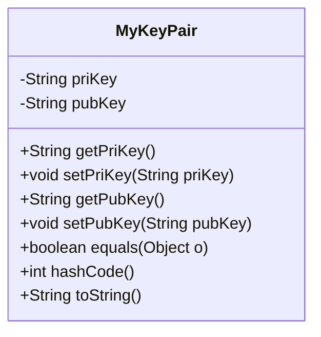
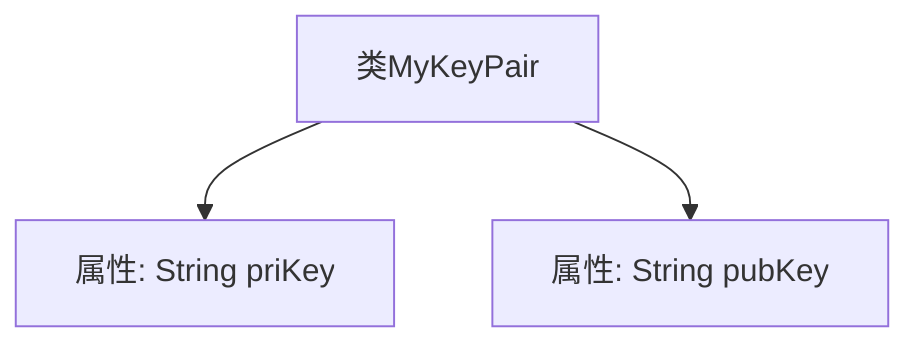

# 基础信息

|      |      |
|------|------|
| 名称 | MyKeyPair |
| 编码语言 | .java |
| 代码路径 | JeecgBoot/jeecg-boot/jeecg-boot-base-core/src/main/java/org/jeecg/common/util/security/entity/MyKeyPair.java |
| 包名 | org.jeecg.common.util.security.entity |
| 依赖项 | ['lombok.Data'] |
| 概述说明 | MyKeyPair类包含私钥priKey和公钥pubKey两个字符串属性。 |

# 说明

MyKeyPair类是一个包含两个字符串属性的类，分别是私钥priKey和公钥pubKey。这两个属性用于存储和管理密钥对中的私钥和公钥信息，确保密钥对的安全性和完整性。

# 类列表 Class Summary

| 名称   | 类型  | 说明 |
|-------|------|-------------|
| MyKeyPair | class | MyKeyPair类包含私钥priKey和公钥pubKey两个字符串属性。 |

## 类 MyKeyPair

|      |      |
|------|------|
| 访问范围 | @Data;public |
| 类型 | class |
| 名称 | MyKeyPair |
| 说明 | MyKeyPair类包含私钥priKey和公钥pubKey两个字符串属性。 |

### UML类图

这段代码定义了一个名为 `MyKeyPair` 的类，用于存储一对公钥和私钥。类中包含两个私有成员变量 `priKey` 和 `pubKey`，分别表示私钥和公钥。通过 `@Data` 注解，Lombok 自动生成了这些字段的 getter 和 setter 方法，以及 `equals`、`hashCode` 和 `toString` 方法。这个类的主要作用是封装和管理密钥对数据，提供对这些数据的访问和修改接口。

### 内部方法调用关系图

这段代码定义了一个名为 `MyKeyPair` 的类，该类包含两个私有属性：`priKey` 和 `pubKey`，分别用于存储私钥和公钥。代码使用了 Lombok 的 `@Data` 注解，自动生成了 getter、setter、toString、equals 和 hashCode 方法，简化了代码的编写。流程图展示了类与属性之间的层级关系，清晰地反映了类的结构。

### 字段列表 Field List

| 名称  | 类型  | 说明 |
|-------|-------|------|
| pubKey | String | 定义了一个私有字符串变量pubKey。 |
| priKey | String | 定义了一个私有的字符串变量priKey。 |

### 方法列表 Method List

| 名称  | 类型  | 说明 |
|-------|-------|------|

