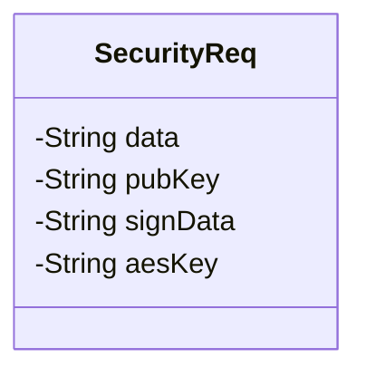
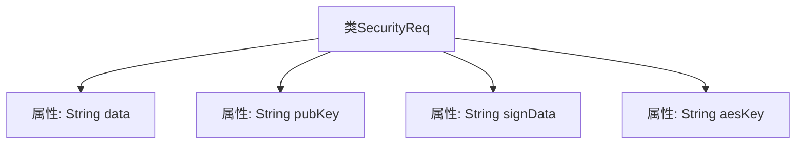

# 基础信息

|      |      |
|------|------|
| 名称 | SecurityReq |
| 编码语言 | .java |
| 代码路径 | JeecgBoot/jeecg-boot/jeecg-boot-base-core/src/main/java/org/jeecg/common/util/security/entity/SecurityReq.java |
| 包名 | org.jeecg.common.util.security.entity |
| 依赖项 | ['lombok.Data'] |
| 概述说明 | SecurityReq类包含数据、公钥、签名数据及AES密钥。 |

# 说明

SecurityReq类是一个用于安全需求管理的类，主要包含四个关键组件：数据、公钥、签名数据以及AES密钥。数据部分用于存储需要保护或处理的信息；公钥用于加密或验证操作；签名数据用于确保数据的完整性和真实性；AES密钥则用于对称加密和解密过程，确保数据在传输或存储时的安全性。这些组件共同构成了一个完整的安全需求管理框架。

# 类列表 Class Summary

| 名称   | 类型  | 说明 |
|-------|------|-------------|
| SecurityReq | class | SecurityReq类包含数据、公钥、签名数据及AES密钥。 |

## 类 SecurityReq

|      |      |
|------|------|
| 访问范围 | @Data;public |
| 类型 | class |
| 名称 | SecurityReq |
| 说明 | SecurityReq类包含数据、公钥、签名数据及AES密钥。 |

### UML类图

这段代码定义了一个名为 `SecurityReq` 的类，用于表示安全请求的相关数据。类中包含四个私有成员变量：`data` 用于存储数据，`pubKey` 用于存储公钥，`signData` 用于存储签名数据，`aesKey` 用于存储 AES 密钥。该类没有定义任何公有方法，仅通过 `@Data` 注解自动生成了 getter 和 setter 方法。这个类通常用于在安全通信中封装请求数据，确保数据的完整性和机密性。

### 内部方法调用关系图

这段代码定义了一个名为`SecurityReq`的类，该类包含四个私有属性：`data`、`pubKey`、`signData`和`aesKey`。这些属性分别用于存储数据、公钥、签名数据和AES密钥。该类使用了Lombok库的`@Data`注解，自动生成了getter、setter、toString、equals和hashCode方法，简化了代码的编写。流程图展示了类与其属性之间的层级关系，清晰地反映了类的结构。

### 字段列表 Field List

| 名称  | 类型  | 说明 |
|-------|-------|------|
| data | String | 定义了一个私有字符串变量data。 |
| aesKey | String | 定义了一个私有的字符串变量aesKey。 |
| signData | String | 声明一个私有的字符串变量signData。 |
| pubKey | String | 定义了一个私有字符串变量pubKey。 |

### 方法列表 Method List

| 名称  | 类型  | 说明 |
|-------|-------|------|

