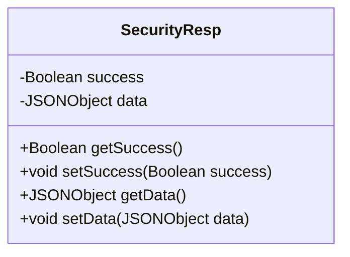
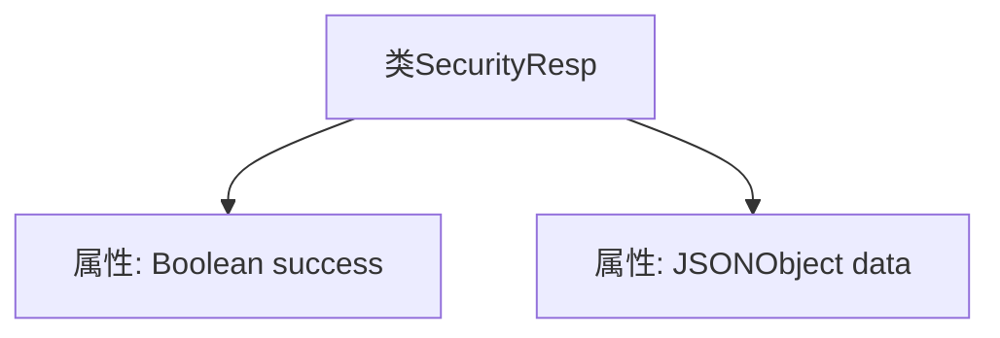

# 基础信息

|      |      |
|------|------|
| 名称 | SecurityResp |
| 编码语言 | .java |
| 代码路径 | JeecgBoot/jeecg-boot/jeecg-boot-base-core/src/main/java/org/jeecg/common/util/security/entity/SecurityResp.java |
| 包名 | org.jeecg.common.util.security.entity |
| 依赖项 | ['com.alibaba.fastjson.JSONObject', 'lombok.Data'] |
| 概述说明 | SecurityResp类包含success布尔字段和data JSONObject字段。 |

# 说明

SecurityResp类包含两个主要字段：success和data。其中，success是一个布尔型字段，用于表示操作是否成功；data是一个JSONObject型字段，用于存储相关的数据信息。这两个字段共同构成了SecurityResp类的基本结构，分别用于标识操作结果和传递具体数据。

# 类列表 Class Summary

| 名称   | 类型  | 说明 |
|-------|------|-------------|
| SecurityResp | class | SecurityResp类包含布尔型success和JSONObject型data字段。 |

## 类 SecurityResp

|      |      |
|------|------|
| 访问范围 | @Data;public |
| 类型 | class |
| 名称 | SecurityResp |
| 说明 | SecurityResp类包含布尔型success和JSONObject型data字段。 |

### UML类图

这段代码定义了一个名为 `SecurityResp` 的类，它包含两个私有属性：`success` 和 `data`，分别表示操作是否成功和返回的数据。类中提供了这两个属性的 getter 和 setter 方法，用于访问和修改这些属性。`@Data` 注解通常用于自动生成这些方法，简化代码。这个类通常用于封装安全相关的响应数据，便于在系统中传递和处理。

### 内部方法调用关系图

这段代码定义了一个名为 `SecurityResp` 的类，其中包含两个属性：`success` 和 `data`。`success` 是一个布尔类型的变量，用于表示操作是否成功；`data` 是一个 `JSONObject` 类型的变量，用于存储返回的数据。该类的结构简单，主要用于封装安全相关的响应数据，便于在系统中传递和处理。

### 字段列表 Field List

| 名称  | 类型  | 说明 |
|-------|-------|------|
| success | Boolean | 定义一个私有布尔变量success。 |
| data | JSONObject | 私有JSON对象数据。 |

### 方法列表 Method List

| 名称  | 类型  | 说明 |
|-------|-------|------|

