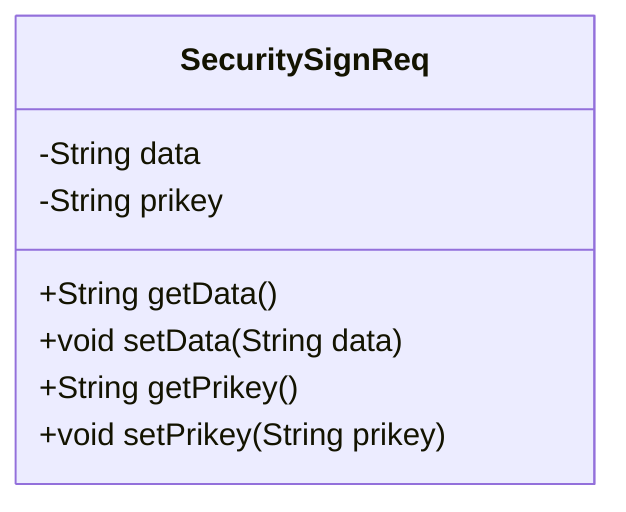
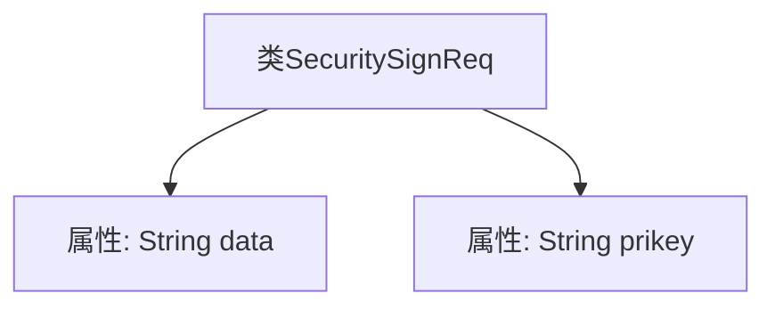

# 基础信息

|      |      |
|------|------|
| 名称 | SecuritySignReq |
| 编码语言 | .java |
| 代码路径 | JeecgBoot/jeecg-boot/jeecg-boot-base-core/src/main/java/org/jeecg/common/util/security/entity/SecuritySignReq.java |
| 包名 | org.jeecg.common.util.security.entity |
| 依赖项 | ['lombok.Data'] |
| 概述说明 | SecuritySignReq类包含data和prikey两个私有字符串属性。 |

# 说明

SecuritySignReq类定义了两个私有字符串属性，分别是data和prikey。这些属性用于存储与安全签名相关的数据信息，其中data可能代表需要签名的数据内容，而prikey则可能代表用于签名的私钥。通过将这些属性设为私有，确保了数据的安全性和封装性，防止外部直接访问或修改。

# 类列表 Class Summary

| 名称   | 类型  | 说明 |
|-------|------|-------------|
| SecuritySignReq | class | SecuritySignReq类包含data和prikey两个私有字符串属性。 |

## 类 SecuritySignReq

|      |      |
|------|------|
| 访问范围 | @Data;public |
| 类型 | class |
| 名称 | SecuritySignReq |
| 说明 | SecuritySignReq类包含data和prikey两个私有字符串属性。 |

### UML类图

这段代码定义了一个名为 `SecuritySignReq` 的类，该类包含两个私有属性 `data` 和 `prikey`，并提供了对应的 `getter` 和 `setter` 方法。通过 `@Data` 注解，Lombok 自动生成了这些方法，简化了代码的编写。这个类通常用于封装安全签名请求的相关数据。

### 内部方法调用关系图

这段代码定义了一个名为 `SecuritySignReq` 的类，该类包含两个私有属性：`data` 和 `prikey`，分别用于存储数据和私钥信息。该类的结构简单，仅包含属性的定义，没有定义任何方法或构造函数。

### 字段列表 Field List

| 名称  | 类型  | 说明 |
|-------|-------|------|
| data | String | 定义了一个私有字符串变量data。 |
| prikey | String | 定义了一个私有字符串变量prikey。 |

### 方法列表 Method List

| 名称  | 类型  | 说明 |
|-------|-------|------|

