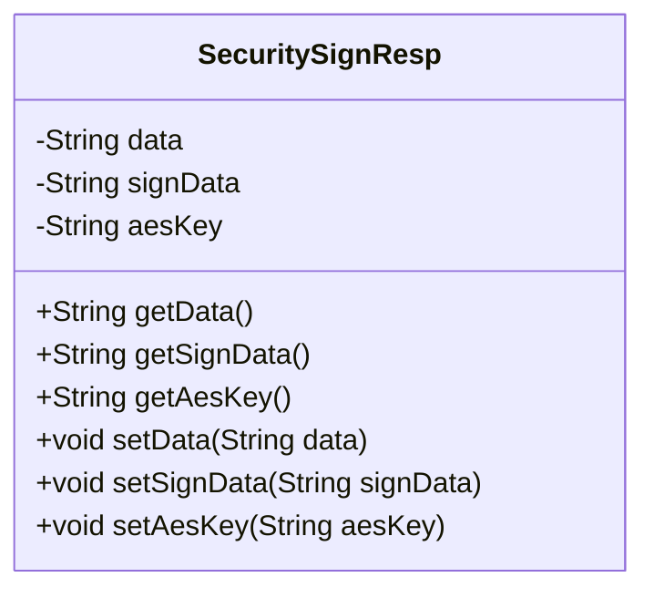
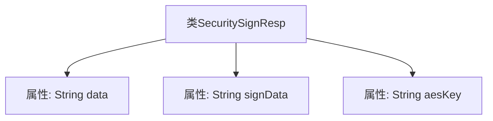

# 基础信息

|      |      |
|------|------|
| 名称 | SecuritySignResp |
| 编码语言 | .java |
| 代码路径 | JeecgBoot/jeecg-boot/jeecg-boot-base-core/src/main/java/org/jeecg/common/util/security/entity/SecuritySignResp.java |
| 包名 | org.jeecg.common.util.security.entity |
| 依赖项 | ['lombok.Data'] |
| 概述说明 | SecuritySignResp类含数据、签名数据及AES密钥字段。 |

# 说明

SecuritySignResp类是一个包含三个关键字段的数据结构。第一个字段是数据，用于存储主要的信息内容。第二个字段是签名数据，用于验证数据的完整性和真实性。第三个字段是AES密钥，用于加密和解密操作，确保数据的安全性。这三个字段共同构成了一个完整的安全响应机制，适用于需要数据保护和验证的场景。

# 类列表 Class Summary

| 名称   | 类型  | 说明 |
|-------|------|-------------|
| SecuritySignResp | class | SecuritySignResp类包含数据、签名数据和AES密钥三个字段。 |

## 类 SecuritySignResp

|      |      |
|------|------|
| 访问范围 | @Data;public |
| 类型 | class |
| 名称 | SecuritySignResp |
| 说明 | SecuritySignResp类包含数据、签名数据和AES密钥三个字段。 |

### UML类图

### 描述
`SecuritySignResp` 类是一个简单的数据模型类，用于封装安全签名响应的相关数据。它包含三个私有字段：`data`、`signData` 和 `aesKey`，分别表示原始数据、签名数据以及AES加密密钥。类中提供了这些字段的getter和setter方法，以便外部代码可以访问和修改这些数据。这个类通常用于在安全通信中传递和存储签名响应信息。

### 内部方法调用关系图

这段代码定义了一个名为 `SecuritySignResp` 的类，该类包含三个私有属性：`data`、`signData` 和 `aesKey`。这些属性分别用于存储数据、签名数据和AES密钥。由于使用了 `@Data` 注解，该类会自动生成 `getter` 和 `setter` 方法，以及 `toString`、`equals` 和 `hashCode` 方法。代码的主要作用是封装与安全签名相关的数据，便于在程序中进行传递和处理。

### 字段列表 Field List

| 名称  | 类型  | 说明 |
|-------|-------|------|
| data | String | 定义私有字符串变量data。 |
| aesKey | String | 定义一个私有字符串变量aesKey。 |
| signData | String | 定义了一个私有的字符串变量signData。 |

### 方法列表 Method List

| 名称  | 类型  | 说明 |
|-------|-------|------|

