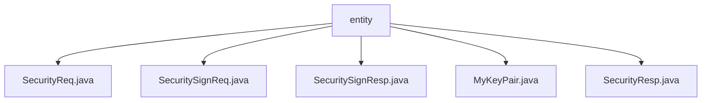

# 基础信息

|      |      |
|------|------|
| 名称 | entity |
| 编码语言 | .java |
| 代码路径 | JeecgBoot/jeecg-boot/jeecg-boot-base-core/src/main/java/org/jeecg/common/util/security/entity |
| 包名 | JeecgBoot.jeecg-boot.jeecg-boot-base-core.src.main.java.org.jeecg.common.util.security.entity |
| 概述说明 | SecurityReq类管理安全需求，包含数据、公钥、签名和AES密钥。SecuritySignReq类存储签名数据和私钥。SecuritySignResp类包含数据、签名和AES密钥。MyKeyPair类管理私钥和公钥。SecurityResp类标识操作结果和传递数据。 |

# 说明

## 概述
该代码模块主要涉及安全需求管理，提供了多个类来处理与安全相关的数据、密钥、签名和加密操作。这些类共同构成了一个完整的安全需求管理框架，确保数据在传输或存储过程中的安全性、完整性和真实性。模块中的类包括`SecurityReq`、`SecuritySignReq`、`SecuritySignResp`、`MyKeyPair`和`SecurityResp`，它们分别用于管理安全需求、签名请求、签名响应、密钥对以及安全操作的结果。

## 主要业务场景
1. **数据加密与解密**：通过`SecurityReq`类中的AES密钥，模块支持对称加密和解密操作，确保数据在传输或存储时的安全性。
2. **签名与验证**：`SecuritySignReq`和`SecuritySignResp`类用于处理数据的签名和验证，确保数据的完整性和真实性。`SecuritySignReq`类存储需要签名的数据和私钥，而`SecuritySignResp`类则包含签名数据和AES密钥，用于验证和解密操作。
3. **密钥管理**：`MyKeyPair`类用于存储和管理密钥对中的私钥和公钥，确保密钥对的安全性和完整性。
4. **操作结果反馈**：`SecurityResp`类用于表示安全操作的结果，包含一个布尔型字段`success`表示操作是否成功，以及一个`JSONObject`型字段`data`用于传递具体的数据信息。

### 包内部结构视图

该流程图展示了`entity`文件夹下的五个文件：`SecurityReq.java`、`SecuritySignReq.java`、`SecuritySignResp.java`、`MyKeyPair.java`和`SecurityResp.java`。这些文件均位于`entity`目录下，没有进一步的子目录层级，因此所有文件直接与`entity`节点相连。流程图简洁明了，清晰地反映了文件与文件夹之间的层级关系。

# 文件列表 File List

| 名称   | 类型  | 说明 |
|-------|------|-------------|
| [SecurityResp.java](SecurityResp.md) | file | SecurityResp类包含success布尔字段和data JSONObject字段。 |
| [SecuritySignReq.java](SecuritySignReq.md) | file | SecuritySignReq类包含data和prikey两个私有字符串属性。 |
| [MyKeyPair.java](MyKeyPair.md) | file | MyKeyPair类包含私钥priKey和公钥pubKey两个字符串属性。 |
| [SecuritySignResp.java](SecuritySignResp.md) | file | SecuritySignResp类含数据、签名数据及AES密钥字段。 |
| [SecurityReq.java](SecurityReq.md) | file | SecurityReq类包含数据、公钥、签名数据及AES密钥。 |

