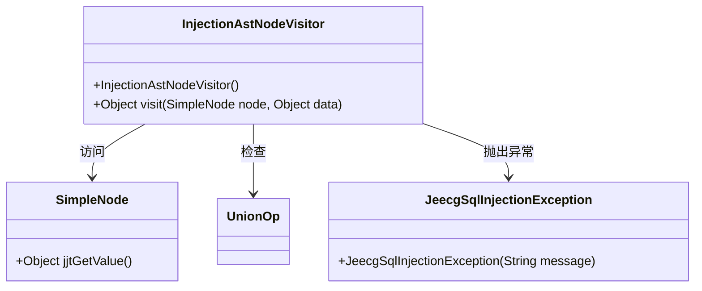
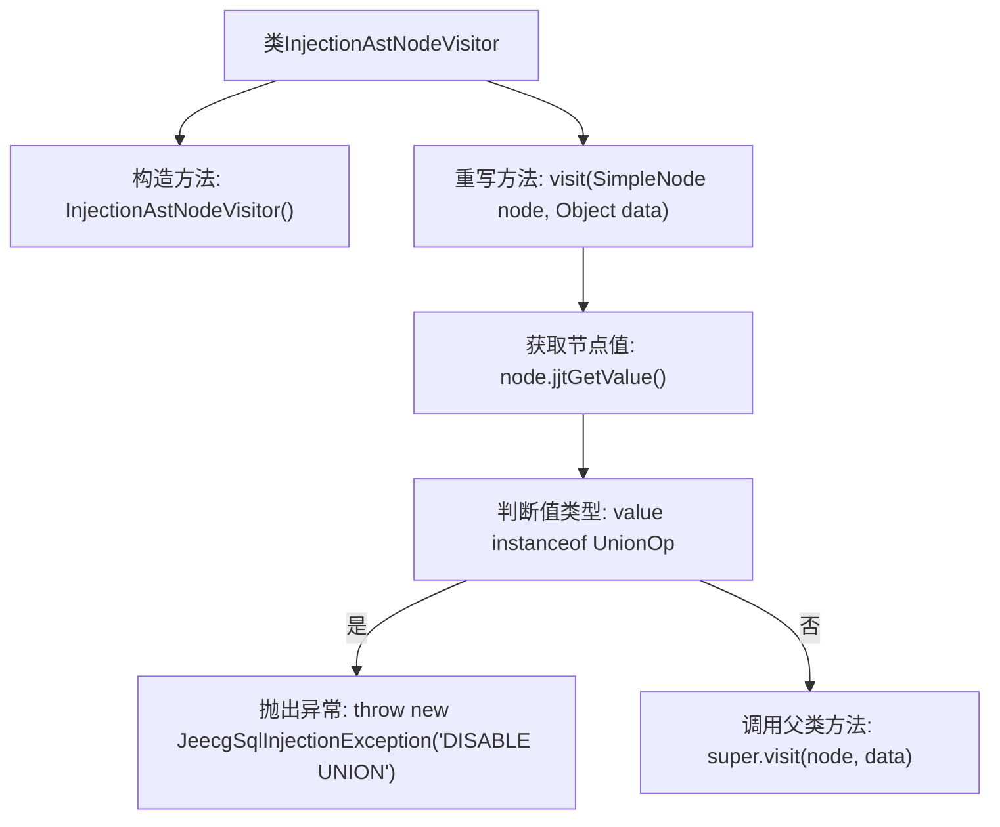

# 基础信息

|      |      |
|------|------|
| 名称 | InjectionAstNodeVisitor |
| 编码语言 | .java |
| 代码路径 | JeecgBoot/jeecg-boot/jeecg-boot-base-core/src/main/java/org/jeecg/common/util/sqlInjection/InjectionAstNodeVisitor.java |
| 包名 | org.jeecg.common.util.sqlInjection |
| 依赖项 | ['net.sf.jsqlparser.parser.CCJSqlParserDefaultVisitor', 'net.sf.jsqlparser.parser.SimpleNode', 'net.sf.jsqlparser.statement.select.UnionOp', 'org.jeecg.common.exception.JeecgSqlInjectionException'] |
| 概述说明 | InjectionAstNodeVisitor类处理SQL解析，禁止联合查询并抛出异常。 |

# 说明

InjectionAstNodeVisitor类负责处理SQL解析任务，其主要功能是检测并禁止联合查询操作。当检测到联合查询时，该类会抛出异常，以确保SQL语句的安全性，防止潜在的SQL注入攻击。这种机制有助于维护数据库操作的规范性和安全性，避免非法或恶意查询的执行。

# 类列表 Class Summary

| 名称   | 类型  | 说明 |
|-------|------|-------------|
| InjectionAstNodeVisitor | class | InjectionAstNodeVisitor类处理SQL解析，禁止联合查询并抛出异常。 |

## 类 InjectionAstNodeVisitor

|      |      |
|------|------|
| 访问范围 | public |
| 类型 | class |
| 名称 | InjectionAstNodeVisitor |
| 说明 | InjectionAstNodeVisitor类处理SQL解析，禁止联合查询并抛出异常。 |

### UML类图

这段代码定义了一个 `InjectionAstNodeVisitor` 类，继承自 `CCJSqlParserDefaultVisitor`。该类的主要作用是检查 SQL 解析树中的节点，特别是 `SimpleNode` 节点。如果节点的值是 `UnionOp` 类型，则抛出 `JeecgSqlInjectionException` 异常，提示禁止联合查询。代码通过访问节点并检查其值来实现这一功能，确保在发现联合查询时能够及时抛出异常。

### 内部方法调用关系图

这段代码定义了一个`InjectionAstNodeVisitor`类，继承自`CCJSqlParserDefaultVisitor`。该类的主要功能是处理禁止联合查询的逻辑。在`visit`方法中，首先获取节点的值，然后判断该值是否为`UnionOp`类型。如果是，则抛出`JeecgSqlInjectionException`异常，否则调用父类的`visit`方法继续处理。

### 字段列表 Field List

| 名称  | 类型  | 说明 |
|-------|-------|------|

### 方法列表 Method List

| 名称  | 类型  | 说明 |
|-------|-------|------|
| visit | Object | 重写visit方法，检测UnionOp并抛出JeecgSqlInjectionException。 |

