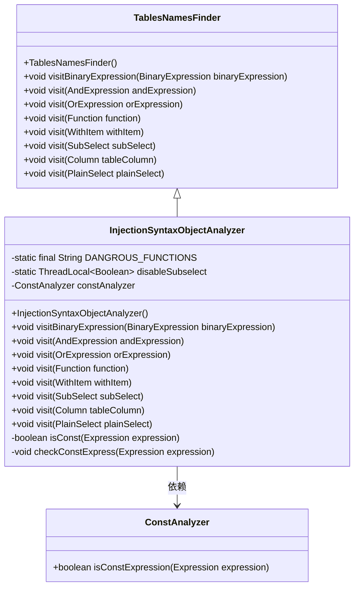

# 基础信息

|      |      |
|------|------|
| 名称 | InjectionSyntaxObjectAnalyzer |
| 编码语言 | .java |
| 代码路径 | JeecgBoot/jeecg-boot/jeecg-boot-base-core/src/main/java/org/jeecg/common/util/sqlInjection/InjectionSyntaxObjectAnalyzer.java |
| 包名 | org.jeecg.common.util.sqlInjection |
| 依赖项 | ['net.sf.jsqlparser.expression.BinaryExpression', 'net.sf.jsqlparser.expression.Expression', 'net.sf.jsqlparser.expression.Function', 'net.sf.jsqlparser.expression.operators.conditional.AndExpression', 'net.sf.jsqlparser.expression.operators.conditional.OrExpression', 'net.sf.jsqlparser.expression.operators.relational.ComparisonOperator', 'net.sf.jsqlparser.schema.Column', 'net.sf.jsqlparser.statement.select.Join', 'net.sf.jsqlparser.statement.select.OrderByElement', 'net.sf.jsqlparser.statement.select.PlainSelect', 'net.sf.jsqlparser.statement.select.SelectItem', 'net.sf.jsqlparser.statement.select.SubSelect', 'net.sf.jsqlparser.statement.select.WithItem', 'net.sf.jsqlparser.util.TablesNamesFinder', 'org.jeecg.common.exception.JeecgSqlInjectionException', 'org.jeecg.common.util.sqlInjection.parse.ConstAnalyzer', 'org.jeecg.common.util.sqlInjection.parse.ParserSupport'] |
| 概述说明 | InjectionSyntaxObjectAnalyzer类检测SQL注入，禁用危险函数、常量表达式和子查询。 |

# 说明

InjectionSyntaxObjectAnalyzer类的主要功能是检测SQL注入漏洞。它通过禁用危险函数、常量表达式和子查询来增强安全性，从而防止潜在的SQL注入攻击。该类的设计旨在全面识别和阻止可能导致安全风险的结构，确保代码的安全性和可靠性。

# 类列表 Class Summary

| 名称   | 类型  | 说明 |
|-------|------|-------------|
| InjectionSyntaxObjectAnalyzer | class | InjectionSyntaxObjectAnalyzer类用于检测SQL注入，禁用危险函数、常量表达式和子查询。 |

## 类 InjectionSyntaxObjectAnalyzer

|      |      |
|------|------|
| 访问范围 | public |
| 类型 | class |
| 名称 | InjectionSyntaxObjectAnalyzer |
| 说明 | InjectionSyntaxObjectAnalyzer类用于检测SQL注入，禁用危险函数、常量表达式和子查询。 |

### UML类图

**描述**：`InjectionSyntaxObjectAnalyzer` 类继承自 `TablesNamesFinder`，用于分析SQL语句中的潜在注入风险。它通过重写多个 `visit` 方法来检查SQL表达式，特别是常量表达式和危险函数。`ConstAnalyzer` 类用于判断表达式是否为常量。该类通过抛出 `JeecgSqlInjectionException` 来禁用不安全的SQL表达式，确保SQL语句的安全性。

### 内部方法调用关系图

```mermaid
graph TD
    A["类InjectionSyntaxObjectAnalyzer"]
    B["属性: String DANGROUS_FUNCTIONS"]
    C["属性: ThreadLocal<Boolean> disableSubselect"]
    D["属性: ConstAnalyzer constAnalyzer"]
    E["构造方法: InjectionSyntaxObjectAnalyzer()"]
    F["方法: visitBinaryExpression(BinaryExpression binaryExpression)"]
    G["方法: visit(AndExpression andExpression)"]
    H["方法: visit(OrExpression orExpression)"]
    I["方法: visit(Function function)"]
    J["方法: visit(WithItem withItem)"]
    K["方法: visit(SubSelect subSelect)"]
    L["方法: visit(Column tableColumn)"]
    M["方法: visit(PlainSelect plainSelect)"]
    N["方法: isConst(Expression expression)"]
    O["方法: checkConstExpress(Expression expression)"]

    A --> B
    A --> C
    A --> D
    A --> E
    A --> F
    A --> G
    A --> H
    A --> I
    A --> J
    A --> K
    A --> L
    A --> M
    A --> N
    A --> O
```

这段代码定义了一个名为`InjectionSyntaxObjectAnalyzer`的类，继承自`TablesNamesFinder`，主要用于分析SQL语句中的潜在注入风险。类中包含多个重写的`visit`方法，用于检查不同类型的SQL表达式，如二元表达式、逻辑表达式、函数调用等，并抛出异常以阻止危险的SQL操作。此外，类中还定义了一些辅助方法，如`isConst`和`checkConstExpress`，用于判断表达式是否为常量并检查常量表达式的合法性。

### 字段列表 Field List

| 名称  | 类型  | 说明 |
|-------|-------|------|
| constAnalyzer = new ConstAnalyzer() | ConstAnalyzer | 创建并初始化一个ConstAnalyzer实例。 |
| disableSubselect = new ThreadLocal<Boolean>() {        @Override        protected Boolean initialValue() {            return true;        }    } | ThreadLocal<Boolean> | 线程局部变量禁用子查询初始值为真。 |
| DANGROUS_FUNCTIONS = "(sleep|benchmark|extractvalue|updatexml|ST_LatFromGeoHash|ST_LongFromGeoHash|GTID_SUBSET|GTID_SUBTRACT|floor|ST_Pointfromgeohash"            + "|geometrycollection|multipoint|polygon|multipolygon|linestring|multilinestring)" | String | 定义危险函数列表，包括sleep、benchmark等。 |

### 方法列表 Method List

| 名称  | 类型  | 说明 |
|-------|-------|------|
| visit | void | 检测到危险函数时抛出异常，否则继续执行父类方法。 |
| visit | void | 重写visit方法，检查OrExpression左右表达式的常量性。 |
| checkConstExpress | void | 检查表达式是否为常量，若是则抛出禁用常量表达式异常。 |
| isConst | boolean | 方法isConst检查表达式是否为常量。 |
| visit | void | 该方法允许子查询并确保执行后禁用子查询。 |
| visit | void | 该方法允许WITH语句中的子查询，并在执行后恢复设置。 |
| visit | void | 重写visit方法，检查AndExpression左右表达式的常量性。 |
| visit | void | 重写visit方法，检查列是否为布尔类型，是则抛出异常，否则调用父类方法。 |
| visitBinaryExpression | void | 方法检查二元表达式，若为比较操作且两侧为常量，则抛出SQL注入异常。 |
| visit | void | 该方法遍历SQL查询的各个部分，包括选择项、表、连接、条件、分组和排序，并对每个部分进行处理。 |

