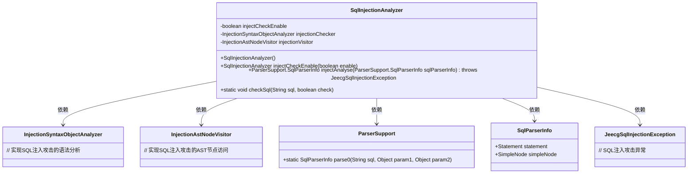
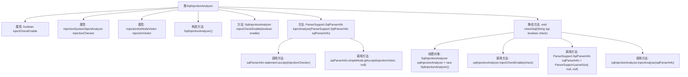

# 基础信息

|      |      |
|------|------|
| 名称 | SqlInjectionAnalyzer |
| 编码语言 | .java |
| 代码路径 | JeecgBoot/jeecg-boot/jeecg-boot-base-core/src/main/java/org/jeecg/common/util/sqlInjection/SqlInjectionAnalyzer.java |
| 包名 | org.jeecg.common.util.sqlInjection |
| 依赖项 | ['org.jeecg.common.exception.JeecgSqlInjectionException', 'org.jeecg.common.util.sqlInjection.parse.ParserSupport'] |
| 概述说明 | SqlInjectionAnalyzer类检测SQL注入，支持开关检查，解析SQL对象分析。 |

# 说明

SqlInjectionAnalyzer类主要用于检测SQL注入攻击，具备启用和关闭检查的功能。该类通过解析SQL对象来进行详细分析，确保能够有效识别潜在的SQL注入风险。

# 类列表 Class Summary

| 名称   | 类型  | 说明 |
|-------|------|-------------|
| SqlInjectionAnalyzer | class | SqlInjectionAnalyzer类用于检测SQL注入攻击，支持启用/关闭检查，并通过解析SQL对象进行分析。 |

## 类 SqlInjectionAnalyzer

|      |      |
|------|------|
| 访问范围 | public |
| 类型 | class |
| 名称 | SqlInjectionAnalyzer |
| 说明 | SqlInjectionAnalyzer类用于检测SQL注入攻击，支持启用/关闭检查，并通过解析SQL对象进行分析。 |

### UML类图

### 描述
`SqlInjectionAnalyzer` 类用于检测和防止SQL注入攻击。它包含两个核心成员 `InjectionSyntaxObjectAnalyzer` 和 `InjectionAstNodeVisitor`，分别用于语法分析和AST节点访问。通过 `injectAnalyse` 方法，可以对解析后的SQL对象进行注入攻击分析，并在检测到危险时抛出 `JeecgSqlInjectionException` 异常。`checkSql` 方法提供了静态的SQL校验功能，方便直接调用。

### 内部方法调用关系图

这段代码描述了一个用于检测SQL注入攻击的类`SqlInjectionAnalyzer`。它包含一个构造函数、一个用于启用或禁用注入检查的方法、一个用于执行注入分析的方法以及一个静态方法用于SQL校验。流程图展示了类的主要属性和方法调用关系，以及各个方法之间的执行顺序。通过调用`injectAnalyse`方法，代码会对解析后的SQL对象进行注入攻击分析，并在检测到危险时抛出异常。

### 字段列表 Field List

| 名称  | 类型  | 说明 |
|-------|-------|------|
| injectCheckEnable = true | boolean | 私有布尔变量injectCheckEnable默认值为true。 |
| injectionChecker | InjectionSyntaxObjectAnalyzer | 私有注入语法对象分析器用于检查注入语法。 |
| injectionVisitor | InjectionAstNodeVisitor | 私有注入访问器注入Ast节点访问者。 |

### 方法列表 Method List

| 名称  | 类型  | 说明 |
|-------|-------|------|
| checkSql | void | 静态方法检查SQL注入，启用分析并解析SQL语句。 |
| injectCheckEnable | SqlInjectionAnalyzer | 启用SQL注入检查功能，返回当前对象。 |
| injectAnalyse | ParserSupport.SqlParserInfo | 方法检查SQL注入，若启用则验证SQL解析信息并返回。 |

