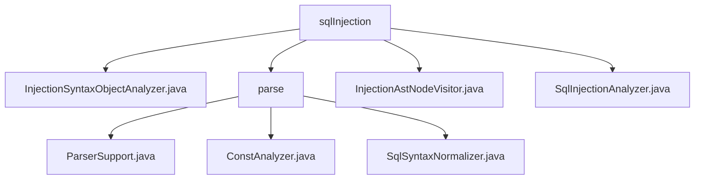

# 基础信息

|      |      |
|------|------|
| 名称 | sqlInjection |
| 编码语言 | .java |
| 代码路径 | JeecgBoot/jeecg-boot/jeecg-boot-base-core/src/main/java/org/jeecg/common/util/sqlInjection |
| 包名 | JeecgBoot.jeecg-boot.jeecg-boot-base-core.src.main.java.org.jeecg.common.util.sqlInjection |
| 概述说明 | InjectionSyntaxObjectAnalyzer类检测SQL注入漏洞，禁用危险函数和子查询。ParserSupport解析SQL语句，ConstAnalyzer分析常量表达式。SqlSyntaxNormalizer管理线程局部变量，InjectionAstNodeVisitor禁止联合查询。SqlInjectionAnalyzer检测并控制SQL注入检查。 |

# 说明

## 概述
该代码模块主要专注于SQL解析与语法分析，旨在提供对SQL查询语句的解析、语法检查、表达式分析以及线程局部变量状态管理等功能。模块中的各个类协同工作，确保SQL语句的正确性和高效性，同时优化代码的性能和可读性。此外，模块还特别关注SQL注入漏洞的检测与防范，通过禁用危险函数、常量表达式和子查询等手段，增强系统的安全性。

## 主要业务场景
1. **SQL解析与语法检查**：
   - `ParserSupport`类负责解析SQL查询语句，特别是`SELECT`语句，并提供简单的语法检查功能。它确保SQL语句的语法正确性，为后续的SQL操作提供基础支持。

2. **表达式常量分析**：
   - `ConstAnalyzer`类用于分析表达式是否为常量。它通过识别和标记非常量表达式，帮助开发人员快速判断表达式的常量性质，从而优化代码或进行相关处理。该功能有助于提升代码的可读性和性能。

3. **SQL语句变化检测与线程局部变量管理**：
   - `SqlSyntaxNormalizer`类继承自`TablesNamesFinder`，主要用于检测SQL语句的变化，并管理线程局部变量的状态。它在多线程环境下确保有效地管理和维护线程局部变量的状态，增强了系统的稳定性和可靠性。

4. **SQL注入漏洞检测与防范**：
   - `InjectionSyntaxObjectAnalyzer`类通过禁用危险函数、常量表达式和子查询来检测和防止SQL注入攻击，确保代码的安全性和可靠性。
   - `InjectionAstNodeVisitor`类负责处理SQL解析任务，检测并禁止联合查询操作，当检测到联合查询时抛出异常，以维护数据库操作的规范性和安全性。
   - `SqlInjectionAnalyzer`类主要用于检测SQL注入攻击，具备启用和关闭检查的功能，通过解析SQL对象进行详细分析，确保能够有效识别潜在的SQL注入风险。

该模块通过以上功能，全面保障SQL语句的正确性、安全性以及系统的高效运行。

### 包内部结构视图

该流程图展示了`sqlInjection`目录下的文件与子目录的层级关系。`sqlInjection`包含四个直接子节点：`InjectionSyntaxObjectAnalyzer.java`、`parse`、`InjectionAstNodeVisitor.java`和`SqlInjectionAnalyzer.java`。其中，`parse`目录下又包含三个文件：`ParserSupport.java`、`ConstAnalyzer.java`和`SqlSyntaxNormalizer.java`。

# 文件列表 File List

| 名称   | 类型  | 说明 |
|-------|------|-------------|
| [SqlInjectionAnalyzer.java](SqlInjectionAnalyzer.md) | file | SqlInjectionAnalyzer类检测SQL注入，支持开关检查，解析SQL对象分析。 |
| [InjectionSyntaxObjectAnalyzer.java](InjectionSyntaxObjectAnalyzer.md) | file | InjectionSyntaxObjectAnalyzer类检测SQL注入，禁用危险函数、常量表达式和子查询。 |
| [InjectionAstNodeVisitor.java](InjectionAstNodeVisitor.md) | file | InjectionAstNodeVisitor类处理SQL解析，禁止联合查询并抛出异常。 |
| [parse](parse/_module.md) | package | ParserSupport类解析SQL，ConstAnalyzer分析常量，SqlSyntaxNormalizer监控SQL变化。 |

