# 基础信息

|      |      |
|------|------|
| 名称 | ConstAnalyzer |
| 编码语言 | .java |
| 代码路径 | JeecgBoot/jeecg-boot/jeecg-boot-base-core/src/main/java/org/jeecg/common/util/sqlInjection/parse/ConstAnalyzer.java |
| 包名 | org.jeecg.common.util.sqlInjection.parse |
| 依赖项 | ['net.sf.jsqlparser.expression', 'net.sf.jsqlparser.expression.operators.arithmetic.Addition', 'net.sf.jsqlparser.expression.operators.arithmetic.BitwiseAnd', 'net.sf.jsqlparser.expression.operators.arithmetic.BitwiseLeftShift', 'net.sf.jsqlparser.expression.operators.arithmetic.BitwiseOr', 'net.sf.jsqlparser.expression.operators.arithmetic.BitwiseRightShift', 'net.sf.jsqlparser.expression.operators.arithmetic.BitwiseXor', 'net.sf.jsqlparser.expression.operators.arithmetic.Concat', 'net.sf.jsqlparser.expression.operators.arithmetic.Division', 'net.sf.jsqlparser.expression.operators.arithmetic.IntegerDivision', 'net.sf.jsqlparser.expression.operators.arithmetic.Modulo', 'net.sf.jsqlparser.expression.operators.arithmetic.Multiplication', 'net.sf.jsqlparser.expression.operators.arithmetic.Subtraction', 'net.sf.jsqlparser.expression.operators.conditional.AndExpression', 'net.sf.jsqlparser.expression.operators.conditional.OrExpression', 'net.sf.jsqlparser.expression.operators.conditional.XorExpression', 'net.sf.jsqlparser.expression.operators.relational.Between', 'net.sf.jsqlparser.expression.operators.relational.EqualsTo', 'net.sf.jsqlparser.expression.operators.relational.ExistsExpression', 'net.sf.jsqlparser.expression.operators.relational.ExpressionList', 'net.sf.jsqlparser.expression.operators.relational.FullTextSearch', 'net.sf.jsqlparser.expression.operators.relational.GeometryDistance', 'net.sf.jsqlparser.expression.operators.relational.GreaterThan', 'net.sf.jsqlparser.expression.operators.relational.GreaterThanEquals', 'net.sf.jsqlparser.expression.operators.relational.InExpression', 'net.sf.jsqlparser.expression.operators.relational.IsBooleanExpression', 'net.sf.jsqlparser.expression.operators.relational.IsDistinctExpression', 'net.sf.jsqlparser.expression.operators.relational.IsNullExpression', 'net.sf.jsqlparser.expression.operators.relational.ItemsListVisitor', 'net.sf.jsqlparser.expression.operators.relational.JsonOperator', 'net.sf.jsqlparser.expression.operators.relational.LikeExpression', 'net.sf.jsqlparser.expression.operators.relational.Matches', 'net.sf.jsqlparser.expression.operators.relational.MinorThan', 'net.sf.jsqlparser.expression.operators.relational.MinorThanEquals', 'net.sf.jsqlparser.expression.operators.relational.MultiExpressionList', 'net.sf.jsqlparser.expression.operators.relational.NamedExpressionList', 'net.sf.jsqlparser.expression.operators.relational.NotEqualsTo', 'net.sf.jsqlparser.expression.operators.relational.RegExpMatchOperator', 'net.sf.jsqlparser.expression.operators.relational.RegExpMySQLOperator', 'net.sf.jsqlparser.expression.operators.relational.SimilarToExpression', 'net.sf.jsqlparser.schema.Column', 'net.sf.jsqlparser.statement.select.AllColumns', 'net.sf.jsqlparser.statement.select.AllTableColumns', 'net.sf.jsqlparser.statement.select.OrderByElement', 'net.sf.jsqlparser.statement.select.SubSelect'] |
| 概述说明 | ConstAnalyzer类用于标记非常量表达式。 |

# 说明

ConstAnalyzer类的主要功能是分析表达式是否为常量。它通过识别和标记非常量表达式来实现这一目的。该类旨在帮助开发人员快速判断表达式的常量性质，从而优化代码或进行相关处理。通过精确的表达式分析，ConstAnalyzer能够有效区分常量与非常量，提升代码的可读性和性能。

# 类列表 Class Summary

| 名称   | 类型  | 说明 |
|-------|------|-------------|
| ConstAnalyzer | class | ConstAnalyzer类用于分析表达式是否为常量，通过标记非常量表达式。 |

## 类 ConstAnalyzer

|      |      |
|------|------|
| 访问范围 | public |
| 类型 | class |
| 名称 | ConstAnalyzer |
| 说明 | ConstAnalyzer类用于分析表达式是否为常量，通过标记非常量表达式。 |

### UML类图

```mermaid
classDiagram
    class ConstAnalyzer {
        -ThreadLocal~Boolean~ constFlag
        +void visit(NullValue value)
        +void visit(Function function)
        +void visit(SignedExpression expr)
        +void visit(JdbcParameter parameter)
        +void visit(JdbcNamedParameter parameter)
        +void visit(DoubleValue value)
        +void visit(LongValue value)
        +void visit(DateValue value)
        +void visit(TimeValue value)
        +void visit(TimestampValue value)
        +void visit(Parenthesis parenthesis)
        +void visit(StringValue value)
        +void visit(Addition expr)
        +void visit(Division expr)
        +void visit(IntegerDivision expr)
        +void visit(Multiplication expr)
        +void visit(Subtraction expr)
        +void visit(AndExpression expr)
        +void visit(OrExpression expr)
        +void visit(XorExpression expr)
        +void visit(Between expr)
        +void visit(OverlapsCondition overlapsCondition)
        +void visit(SafeCastExpression safeCastExpression)
        +void visit(EqualsTo expr)
        +void visit(GreaterThan expr)
        +void visit(GreaterThanEquals expr)
        +void visit(InExpression expr)
        +void visit(IsNullExpression expr)
        +void visit(FullTextSearch expr)
        +void visit(IsBooleanExpression expr)
        +void visit(LikeExpression expr)
        +void visit(MinorThan expr)
        +void visit(MinorThanEquals expr)
        +void visit(NotEqualsTo expr)
        +void visit(Column column)
        +void visit(SubSelect subSelect)
        +void visit(CaseExpression expr)
        +void visit(WhenClause expr)
        +void visit(ExistsExpression expr)
        +void visit(AnyComparisonExpression expr)
        +void visit(Concat expr)
        +void visit(Matches expr)
        +void visit(BitwiseAnd expr)
        +void visit(BitwiseOr expr)
        +void visit(BitwiseXor expr)
        +void visit(CastExpression expr)
        +void visit(TryCastExpression expr)
        +void visit(Modulo expr)
        +void visit(AnalyticExpression expr)
        +void visit(ExtractExpression expr)
        +void visit(IntervalExpression expr)
        +void visit(OracleHierarchicalExpression expr)
        +void visit(RegExpMatchOperator expr)
        +void visit(ExpressionList expressionList)
        +void visit(NamedExpressionList namedExpressionList)
        +void visit(MultiExpressionList multiExprList)
        +void visit(NotExpression notExpr)
        +void visit(BitwiseRightShift expr)
        +void visit(BitwiseLeftShift expr)
        +void visit(JsonExpression jsonExpr)
        +void visit(JsonOperator expr)
        +void visit(RegExpMySQLOperator expr)
        +void visit(UserVariable var)
        +void visit(NumericBind bind)
        +void visit(KeepExpression expr)
        +void visit(MySQLGroupConcat groupConcat)
        +void visit(ValueListExpression valueListExpression)
        +void visit(AllColumns allColumns)
        +void visit(AllTableColumns allTableColumns)
        +void visit(AllValue allValue)
        +void visit(IsDistinctExpression isDistinctExpression)
        +void visit(RowGetExpression rowGetExpression)
        +void visit(HexValue hexValue)
        +void visit(OracleHint hint)
        +void visit(TimeKeyExpression timeKeyExpression)
        +void visit(DateTimeLiteralExpression literal)
        +void visit(NextValExpression nextVal)
        +void visit(CollateExpression col)
        +void visit(SimilarToExpression expr)
        +void visit(ArrayExpression array)
        +void visit(ArrayConstructor aThis)
        +void visit(VariableAssignment var)
        +void visit(XMLSerializeExpr expr)
        +void visit(TimezoneExpression expr)
        +void visit(JsonAggregateFunction expression)
        +void visit(JsonFunction expression)
        +void visit(ConnectByRootOperator connectByRootOperator)
        +void visit(OracleNamedFunctionParameter oracleNamedFunctionParameter)
        +void visit(GeometryDistance geometryDistance)
        +void visit(RowConstructor rowConstructor)
        +boolean isConstExpression(Expression expression)
    }

    class ExpressionVisitor {
        <<Interface>>
        +void visit(NullValue value)
        +void visit(Function function)
        +void visit(SignedExpression expr)
        +void visit(JdbcParameter parameter)
        +void visit(JdbcNamedParameter parameter)
        +void visit(DoubleValue value)
        +void visit(LongValue value)
        +void visit(DateValue value)
        +void visit(TimeValue value)
        +void visit(TimestampValue value)
        +void visit(Parenthesis parenthesis)
        +void visit(StringValue value)
        +void visit(Addition expr)
        +void visit(Division expr)
        +void visit(IntegerDivision expr)
        +void visit(Multiplication expr)
        +void visit(Subtraction expr)
        +void visit(AndExpression expr)
        +void visit(OrExpression expr)
        +void visit(XorExpression expr)
        +void visit(Between expr)
        +void visit(OverlapsCondition overlapsCondition)
        +void visit(SafeCastExpression safeCastExpression)
        +void visit(EqualsTo expr)
        +void visit(GreaterThan expr)
        +void visit(GreaterThanEquals expr)
        +void visit(InExpression expr)
        +void visit(IsNullExpression expr)
        +void visit(FullTextSearch expr)
        +void visit(IsBooleanExpression expr)
        +void visit(LikeExpression expr)
        +void visit(MinorThan expr)
        +void visit(MinorThanEquals expr)
        +void visit(NotEqualsTo expr)
        +void visit(Column column)
        +void visit(SubSelect subSelect)
        +void visit(CaseExpression expr)
        +void visit(WhenClause expr)
        +void visit(ExistsExpression expr)
        +void visit(AnyComparisonExpression expr)
        +void visit(Concat expr)
        +void visit(Matches expr)
        +void visit(BitwiseAnd expr)
        +void visit(BitwiseOr expr)
        +void visit(BitwiseXor expr)
        +void visit(CastExpression expr)
        +void visit(TryCastExpression expr)
        +void visit(Modulo expr)
        +void visit(AnalyticExpression expr)
        +void visit(ExtractExpression expr)
        +void visit(IntervalExpression expr)
        +void visit(OracleHierarchicalExpression expr)
        +void visit(RegExpMatchOperator expr)
        +void visit(ExpressionList expressionList)
        +void visit(NamedExpressionList namedExpressionList)
        +void visit(MultiExpressionList multiExprList)
        +void visit(NotExpression notExpr)
        +void visit(BitwiseRightShift expr)
        +void visit(BitwiseLeftShift expr)
        +void visit(JsonExpression jsonExpr)
        +void visit(JsonOperator expr)
        +void visit(RegExpMySQLOperator expr)
        +void visit(UserVariable var)
        +void visit(NumericBind bind)
        +void visit(KeepExpression expr)
        +void visit(MySQLGroupConcat groupConcat)
        +void visit(ValueListExpression valueListExpression)
        +void visit(AllColumns allColumns)
        +void visit(AllTableColumns allTableColumns)
        +void visit(AllValue allValue)
        +void visit(IsDistinctExpression isDistinctExpression)
        +void visit(RowGetExpression rowGetExpression)
        +void visit(HexValue hexValue)
        +void visit(OracleHint hint)
        +void visit(TimeKeyExpression timeKeyExpression)
        +void visit(DateTimeLiteralExpression literal)
        +void visit(NextValExpression nextVal)
        +void visit(CollateExpression col)
        +void visit(SimilarToExpression expr)
        +void visit(ArrayExpression array)
        +void visit(ArrayConstructor aThis)
        +void visit(VariableAssignment var)
        +void visit(XMLSerializeExpr expr)
        +void visit(TimezoneExpression expr)
        +void visit(JsonAggregateFunction expression)
        +void visit(JsonFunction expression)
        +void visit(ConnectByRootOperator connectByRootOperator)
        +void visit(OracleNamedFunctionParameter oracleNamedFunctionParameter)
        +void visit(GeometryDistance geometryDistance)
        +void visit(RowConstructor rowConstructor)
    }

    class ItemsListVisitor {
        <<Interface>>
        +void visit(ExpressionList expressionList)
        +void visit(NamedExpressionList namedExpressionList)
        +void visit(MultiExpressionList multiExprList)
    }

    ConstAnalyzer --> ExpressionVisitor : 实现
    ConstAnalyzer --> ItemsListVisitor : 实现
```

这段代码定义了一个`ConstAnalyzer`类，该类实现了`ExpressionVisitor`和`ItemsListVisitor`接口。`ConstAnalyzer`的主要功能是分析表达式是否为常量表达式。它通过`visit`方法遍历不同类型的表达式，并根据表达式的类型设置`constFlag`的值。`isConstExpression`方法用于判断给定的表达式是否为常量表达式。

### 内部方法调用关系图

```mermaid
graph TD
    A["类ConstAnalyzer"]
    B["属性: ThreadLocal<Boolean> constFlag"]
    C["方法: visit(NullValue value)"]
    D["方法: visit(Function function)"]
    E["方法: visit(SignedExpression expr)"]
    F["方法: visit(JdbcParameter parameter)"]
    G["方法: visit(JdbcNamedParameter parameter)"]
    H["方法: visit(DoubleValue value)"]
    I["方法: visit(LongValue value)"]
    J["方法: visit(DateValue value)"]
    K["方法: visit(TimeValue value)"]
    L["方法: visit(TimestampValue value)"]
    M["方法: visit(Parenthesis parenthesis)"]
    N["方法: visit(StringValue value)"]
    O["方法: visit(Addition expr)"]
    P["方法: visit(Division expr)"]
    Q["方法: visit(IntegerDivision expr)"]
    R["方法: visit(Multiplication expr)"]
    S["方法: visit(Subtraction expr)"]
    T["方法: visit(AndExpression expr)"]
    U["方法: visit(OrExpression expr)"]
    V["方法: visit(XorExpression expr)"]
    W["方法: visit(Between expr)"]
    X["方法: visit(OverlapsCondition overlapsCondition)"]
    Y["方法: visit(SafeCastExpression safeCastExpression)"]
    Z["方法: visit(EqualsTo expr)"]
    AA["方法: visit(GreaterThan expr)"]
    AB["方法: visit(GreaterThanEquals expr)"]
    AC["方法: visit(InExpression expr)"]
    AD["方法: visit(IsNullExpression expr)"]
    AE["方法: visit(FullTextSearch expr)"]
    AF["方法: visit(IsBooleanExpression expr)"]
    AG["方法: visit(LikeExpression expr)"]
    AH["方法: visit(MinorThan expr)"]
    AI["方法: visit(MinorThanEquals expr)"]
    AJ["方法: visit(NotEqualsTo expr)"]
    AK["方法: visit(Column column)"]
    AL["方法: visit(SubSelect subSelect)"]
    AM["方法: visit(CaseExpression expr)"]
    AN["方法: visit(WhenClause expr)"]
    AO["方法: visit(ExistsExpression expr)"]
    AP["方法: visit(AnyComparisonExpression expr)"]
    AQ["方法: visit(Concat expr)"]
    AR["方法: visit(Matches expr)"]
    AS["方法: visit(BitwiseAnd expr)"]
    AT["方法: visit(BitwiseOr expr)"]
    AU["方法: visit(BitwiseXor expr)"]
    AV["方法: visit(CastExpression expr)"]
    AW["方法: visit(TryCastExpression expr)"]
    AX["方法: visit(Modulo expr)"]
    AY["方法: visit(AnalyticExpression expr)"]
    AZ["方法: visit(ExtractExpression expr)"]
    BA["方法: visit(IntervalExpression expr)"]
    BB["方法: visit(OracleHierarchicalExpression expr)"]
    BC["方法: visit(RegExpMatchOperator expr)"]
    BD["方法: visit(ExpressionList expressionList)"]
    BE["方法: visit(NamedExpressionList namedExpressionList)"]
    BF["方法: visit(MultiExpressionList multiExprList)"]
    BG["方法: visit(NotExpression notExpr)"]
    BH["方法: visit(BitwiseRightShift expr)"]
    BI["方法: visit(BitwiseLeftShift expr)"]
    BJ["方法: visitBinaryExpression(BinaryExpression expr)"]
    BK["方法: visit(JsonExpression jsonExpr)"]
    BL["方法: visit(JsonOperator expr)"]
    BM["方法: visit(RegExpMySQLOperator expr)"]
    BN["方法: visit(UserVariable var)"]
    BO["方法: visit(NumericBind bind)"]
    BP["方法: visit(KeepExpression expr)"]
    BQ["方法: visit(MySQLGroupConcat groupConcat)"]
    BR["方法: visit(ValueListExpression valueListExpression)"]
    BS["方法: visit(AllColumns allColumns)"]
    BT["方法: visit(AllTableColumns allTableColumns)"]
    BU["方法: visit(AllValue allValue)"]
    BV["方法: visit(IsDistinctExpression isDistinctExpression)"]
    BW["方法: visit(RowGetExpression rowGetExpression)"]
    BX["方法: visit(HexValue hexValue)"]
    BY["方法: visit(OracleHint hint)"]
    BZ["方法: visit(TimeKeyExpression timeKeyExpression)"]
    CA["方法: visit(DateTimeLiteralExpression literal)"]
    CB["方法: visit(NextValExpression nextVal)"]
    CC["方法: visit(CollateExpression col)"]
    CD["方法: visit(SimilarToExpression expr)"]
    CE["方法: visit(ArrayExpression array)"]
    CF["方法: visit(ArrayConstructor aThis)"]
    CG["方法: visit(VariableAssignment var)"]
    CH["方法: visit(XMLSerializeExpr expr)"]
    CI["方法: visit(TimezoneExpression expr)"]
    CJ["方法: visit(JsonAggregateFunction expression)"]
    CK["方法: visit(JsonFunction expression)"]
    CL["方法: visit(ConnectByRootOperator connectByRootOperator)"]
    CM["方法: visit(OracleNamedFunctionParameter oracleNamedFunctionParameter)"]
    CN["方法: visit(GeometryDistance geometryDistance)"]
    CO["方法: visit(RowConstructor rowConstructor)"]
    CP["方法: isConstExpression(Expression expression)"]

    A --> B
    A --> C
    A --> D
    A --> E
    A --> F
    A --> G
    A --> H
    A --> I
    A --> J
    A --> K
    A --> L
    A --> M
    A --> N
    A --> O
    A --> P
    A --> Q
    A --> R
    A --> S
    A --> T
    A --> U
    A --> V
    A --> W
    A --> X
    A --> Y
    A --> Z
    A --> AA
    A --> AB
    A --> AC
    A --> AD
    A --> AE
    A --> AF
    A --> AG
    A --> AH
    A --> AI
    A --> AJ
    A --> AK
    A --> AL
    A --> AM
    A --> AN
    A --> AO
    A --> AP
    A --> AQ
    A --> AR
    A --> AS
    A --> AT
    A --> AU
    A --> AV
    A --> AW
    A --> AX
    A --> AY
    A --> AZ
    A --> BA
    A --> BB
    A --> BC
    A --> BD
    A --> BE
    A --> BF
    A --> BG
    A --> BH
    A --> BI
    A --> BJ
    A --> BK
    A --> BL
    A --> BM
    A --> BN
    A --> BO
    A --> BP
    A --> BQ
    A --> BR
    A --> BS
    A --> BT
    A --> BU
    A --> BV
    A --> BW
    A --> BX
    A --> BY
    A --> BZ
    A --> CA
    A --> CB
    A --> CC
    A --> CD
    A --> CE
    A --> CF
    A --> CG
    A --> CH
    A --> CI
    A --> CJ
    A --> CK
    A --> CL
    A --> CM
    A --> CN
    A --> CO
    A --> CP
```

这段代码定义了一个名为 `ConstAnalyzer` 的类，该类实现了 `ExpressionVisitor` 和 `ItemsListVisitor` 接口。`ConstAnalyzer` 类的主要作用是分析表达式是否为常量表达式。它通过 `visit` 方法遍历各种类型的表达式，并根据表达式的类型设置 `constFlag` 的值。`isConstExpression` 方法用于判断给定的表达式是否为常量表达式。

### 字段列表 Field List

| 名称  | 类型  | 说明 |
|-------|-------|------|
| constFlag = new ThreadLocal<Boolean>() {        @Override        protected Boolean initialValue() {            return true;        }    } | ThreadLocal<Boolean> | 使用ThreadLocal创建线程局部变量constFlag，初始值为true。 |

### 方法列表 Method List

| 名称  | 类型  | 说明 |
|-------|-------|------|
| visit | void | 该方法重写visit，处理NullValue参数，无具体实现。 |
| visit | void | visit方法重写，用于设置constFlag为false。 |
| visit | void | 重写visit方法，处理Addition表达式，调用visitBinaryExpression。 |
| visit | void | 重写visit方法处理StringValue类型参数。 |
| visit | void | 重写visit方法以处理LongValue类型参数。 |
| visit | void | 该方法重写visit函数，将constFlag设为false。 |
| visit | void | 重写方法，处理AndExpression并调用visitBinaryExpression。 |
| visit | void | 重写visit方法处理TimestampValue类型。 |
| visit | void | 覆盖方法，设置constFlag为false。 |
| visit | void | 重写visit方法处理TimeValue类型参数。 |
| visit | void | 该方法重写visit函数，将constFlag设置为false。 |
| visit | void | 重写visit方法，处理InExpression左表达式。 |
| visit | void | 重写visit方法以处理位与表达式。 |
| visit | void | 重写visit方法，处理Division表达式并调用visitBinaryExpression。 |
| visit | void | 重写visit方法，处理LikeExpression，调用visitBinaryExpression。 |
| visit | void | 重写方法，处理位左移表达式。 |
| visit | void | 该方法在访问JdbcNamedParameter时，将constFlag设置为false。 |
| visit | void | 重写方法，处理大于等于表达式并调用二元表达式访问方法。 |
| visit | void | 重写visit方法，处理MinorThan表达式，调用visitBinaryExpression。 |
| visit | void | 重写visit方法，处理CaseExpression时将constFlag设为false。 |
| visitBinaryExpression | void | 访问二元表达式，分别处理左右子表达式。 |
| visit | void | 重写visit方法，处理ExtractExpression表达式。 |
| visit | void | 重写visit方法，处理GreaterThan表达式并调用visitBinaryExpression。 |
| visit | void | 重写visit方法，调用visitBinaryExpression处理Matches表达式。 |
| visit | void | 重写visit方法，处理OracleHint参数。 |
| visit | void | 检查列类型，若非布尔型则设置常量标志为假。 |
| visit | void | 重写visit方法，调用visitBinaryExpression处理Concat表达式。 |
| visit | void | 重写visit方法，处理DateTimeLiteralExpression。 |
| visit | void | 重写visit方法，调用visitBinaryExpression处理OrExpression。 |
| visit | void | 重写visit方法，处理IntervalExpression时设置constFlag为false。 |
| visit | void | 重写visit方法，处理ExistsExpression时设置constFlag为false。 |
| visit | void | 重写visit方法，遍历Between表达式的左、起始和结束子表达式。 |
| visit | void | 遍历并处理值列表表达式中的所有子表达式。 |
| visit | void | 重写visit方法以处理AllValue类型。 |
| visit | void | 重写方法以访问MySQL正则表达式操作符。 |
| visit | void | 重写visit方法以处理HexValue类型参数。 |
| visit | void | 该方法遍历并处理JsonFunction中的所有表达式。 |
| visit | void | 重写visit方法，处理TimeKeyExpression对象。 |
| visit | void | 重写visit方法，处理SubSelect时设置constFlag为false。 |
| visit | void | 重写visit方法，处理AllTableColumns对象。 |
| visit | void | 重写visit方法，处理BitwiseOr表达式，调用visitBinaryExpression。 |
| visit | void | 重写visit方法，调用jsonExpr表达式的accept方法。 |
| visit | void | 重写visit方法，处理BitwiseXor表达式，调用visitBinaryExpression。 |
| visit | void | 重写visit方法，处理CastExpression，调用左表达式的accept。 |
| visit | void | 重写visit方法，处理NotEqualsTo表达式，调用visitBinaryExpression。 |
| visit | void | 重写visit方法，处理括号表达式。 |
| visit | void | 重写visit方法，调用visitBinaryExpression处理JsonOperator表达式。 |
| visit | void | 重写visit方法以处理DoubleValue类型参数。 |
| visit | void | 重写visit方法，遍历并处理NamedExpressionList中的每个表达式。 |
| visit | void | 重写visit方法，处理MinorThanEquals表达式，调用visitBinaryExpression。 |
| visit | void | 重写visit方法，处理IsNullExpression，调用左表达式的accept。 |
| visit | void | 重写visit方法，处理EqualsTo表达式，调用visitBinaryExpression。 |
| visit | void | 重写visit方法，处理整数除法表达式，调用visitBinaryExpression。 |
| visit | void | 重写visit方法，处理AnalyticExpression时设置constFlag为false。 |
| isConstExpression | boolean | 方法检查表达式是否为常量，返回布尔值。 |
| visit | void | 重写visit方法，处理XorExpression，调用visitBinaryExpression。 |
| visit | void | 该方法重写并处理SignedExpression对象，调用其内部表达式的accept方法。 |
| visit | void | 重写visit方法，遍历并处理KeepExpression中的OrderByElement表达式。 |
| visit | void | 重写visit方法，处理NotExpression，调用表达式accept。 |
| visit | void | 方法visit重写，用于处理AnyComparisonExpression，设置constFlag为false。 |
| visit | void | 该方法在访问变量赋值时，将常量标志设置为false。 |
| visit | void | 重写visit方法，设置constFlag为false。 |
| visit | void | 重写visit方法，调用表达式接受当前访问者。 |
| visit | void | 该方法在访问Oracle命名函数参数时，将常量标志设置为false。 |
| visit | void | 重写visit方法，处理NextValExpression时设置constFlag为false。 |
| visit | void | 重写visit方法，处理Json聚合函数表达式及其过滤表达式。 |
| visit | void | 重写visit方法，处理WhenClause时设置constFlag为false。 |
| visit | void | 重写visit方法，处理CollateExpression时设置constFlag为false。 |
| visit | void | 重写visit方法，处理减法表达式并调用visitBinaryExpression。 |
| visit | void | 重写visit方法，处理FullTextSearch表达式时，将constFlag设为false。 |
| visit | void | 该方法重写visit函数，处理MySQLGroupConcat时设置constFlag为false。 |
| visit | void | 重写visit方法，处理IsBooleanExpression时访问其左表达式。 |
| visit | void | 重写visit方法，处理TimezoneExpression，调用左表达式的accept。 |
| visit | void | 遍历多重表达式列表并访问每个表达式列表。 |
| visit | void | 重写visit方法，处理AllColumns参数。 |
| visit | void | 重写visit方法，处理Modulo表达式并调用visitBinaryExpression。 |
| visit | void | 重写方法，访问右移位表达式并调用二元表达式处理方法。 |
| visit | void | 重写visit方法，遍历数组构造器中的所有表达式并调用accept。 |
| visit | void | 重写visit方法，调用visitBinaryExpression处理RegExpMatchOperator表达式。 |
| visit | void | 重写visit方法，处理OverlapsCondition时设置constFlag为false。 |
| visit | void | 重写visit方法以处理乘法表达式。 |
| visit | void | 重写visit方法，处理IsDistinctExpression，调用visitBinaryExpression。 |
| visit | void | 方法visit处理数组表达式，递归访问对象、索引、起始和结束索引表达式。 |
| visit | void | 重写visit方法，处理DateValue类型参数。 |
| visit | void | 重写visit方法，当访问UserVariable时将constFlag设置为false。 |
| visit | void | 重写visit方法，处理RowConstructor时将constFlag设为false。 |
| visit | void | 重写visit方法，处理ConnectByRootOperator时设置constFlag为false。 |
| visit | void | 重写visit方法，处理TryCastExpression时将constFlag设为false。 |
| visit | void | 重写visit方法，处理SimilarToExpression表达式。 |
| visit | void | 遍历表达式列表并逐个访问表达式。 |
| visit | void | 重写visit方法，调用visitBinaryExpression处理geometryDistance。 |
| visit | void | 重写visit方法，处理OracleHierarchicalExpression时设置constFlag为false。 |

