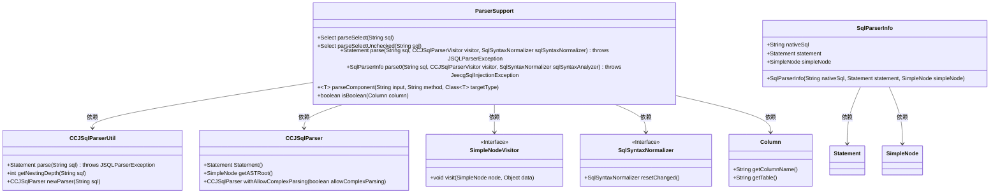
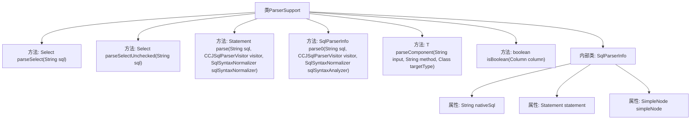

# 基础信息

|      |      |
|------|------|
| 名称 | ParserSupport |
| 编码语言 | .java |
| 代码路径 | JeecgBoot/jeecg-boot/jeecg-boot-base-core/src/main/java/org/jeecg/common/util/sqlInjection/parse/ParserSupport.java |
| 包名 | org.jeecg.common.util.sqlInjection.parse |
| 依赖项 | ['lombok.extern.slf4j.Slf4j', 'net.sf.jsqlparser.JSQLParserException', 'net.sf.jsqlparser.parser', 'net.sf.jsqlparser.schema.Column', 'net.sf.jsqlparser.statement.Statement', 'net.sf.jsqlparser.statement.select.PlainSelect', 'net.sf.jsqlparser.statement.select.Select', 'net.sf.jsqlparser.statement.select.SelectBody', 'com.google.common.base.Preconditions.checkArgument', 'com.google.common.base.Preconditions.checkNotNull', 'java.lang.reflect.InvocationTargetException', 'java.util.regex.Matcher', 'java.util.regex.Pattern', 'com.google.common.base.Throwables', 'org.jeecg.common.exception.JeecgBootException', 'org.jeecg.common.exception.JeecgSqlInjectionException'] |
| 概述说明 | ParserSupport类支持SQL解析和SELECT语句的语法检查。 |

# 说明

ParserSupport类专门用于提供SQL解析功能，主要支持SELECT语句的解析，并具备简单的语法检查能力。该类能够有效处理SQL查询语句，确保其语法正确性，从而为后续的SQL操作提供基础支持。

# 类列表 Class Summary

| 名称   | 类型  | 说明 |
|-------|------|-------------|
| ParserSupport | class | ParserSupport类提供SQL解析功能，支持SELECT语句解析和简单语法检查。 |

## 类 ParserSupport

|      |      |
|------|------|
| 访问范围 | @Slf4j;public |
| 类型 | class |
| 名称 | ParserSupport |
| 说明 | ParserSupport类提供SQL解析功能，支持SELECT语句解析和简单语法检查。 |

### UML类图

### 类图描述
该代码实现了一个SQL解析器，主要功能包括解析SELECT语句、解析SQL语句并返回解析后的`Statement`对象、解析SQL语句部件以及判断`Column`是否为布尔常量。`ParserSupport`类依赖`CCJSqlParserUtil`和`CCJSqlParser`进行SQL解析，并通过`SimpleNodeVisitor`和`SqlSyntaxNormalizer`接口提供AST遍历和语法转换功能。`SqlParserInfo`类用于封装解析后的SQL信息，包含原始SQL、`Statement`对象和`SimpleNode`节点。

### 内部方法调用关系图

这段代码定义了一个名为`ParserSupport`的类，主要用于解析SQL语句。类中包含了多个方法，如`parseSelect`用于解析SELECT语句，`parse`用于解析SQL语句并返回`Statement`对象，`parse0`用于解析SQL语句并返回`SqlParserInfo`对象，`parseComponent`用于解析SQL语句的组件，`isBoolean`用于判断列是否为布尔类型。内部类`SqlParserInfo`用于存储解析后的SQL信息。流程图展示了类及其方法之间的关系，帮助理解代码结构和功能。

### 字段列表 Field List

| 名称  | 类型  | 说明 |
|-------|-------|------|

### 方法列表 Method List

| 名称  | 类型  | 说明 |
|-------|-------|------|
| parseSelectUnchecked | Select | 解析SQL选择语句，失败返回空。 |
| parseSelect | Select | 解析SQL为简单SELECT语句，不支持复杂语句。 |
| isBoolean | boolean | 判断列名是否为布尔值的静态方法。 |
| parse | Statement | 静态方法parse解析SQL语句，返回Statement对象，可能抛出JSQLParserException异常。 |
| parseComponent | T | 解析输入字符串并调用指定方法，返回目标类型结果，处理异常。 |
| parse0 | SqlParserInfo | 解析SQL语句，检查非SELECT开头、存储过程和特殊字符，处理语法错误并返回解析结果。 |

