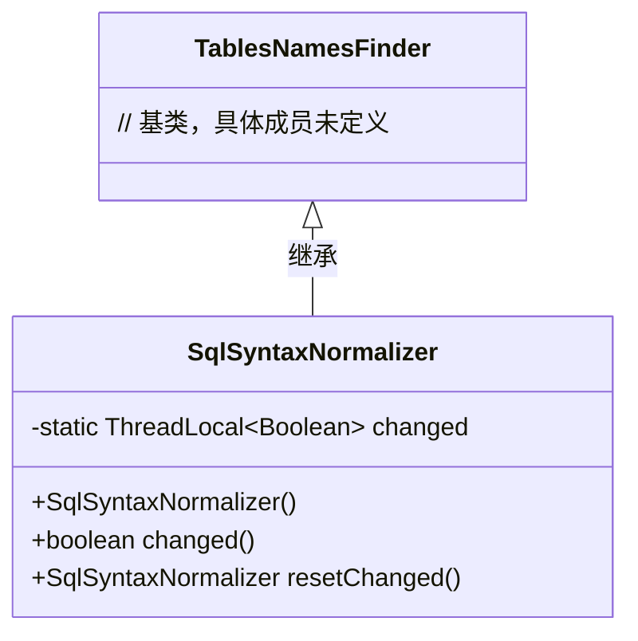
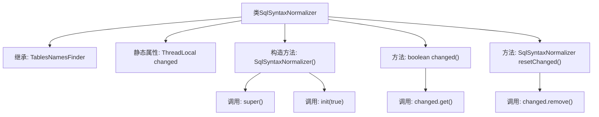

# 基础信息

|      |      |
|------|------|
| 名称 | SqlSyntaxNormalizer |
| 编码语言 | .java |
| 代码路径 | JeecgBoot/jeecg-boot/jeecg-boot-base-core/src/main/java/org/jeecg/common/util/sqlInjection/parse/SqlSyntaxNormalizer.java |
| 包名 | org.jeecg.common.util.sqlInjection.parse |
| 依赖项 | ['net.sf.jsqlparser.util.TablesNamesFinder'] |
| 概述说明 | SqlSyntaxNormalizer继承TablesNamesFinder，检测SQL变化并管理线程变量状态。 |

# 说明

SqlSyntaxNormalizer类继承自TablesNamesFinder，主要用于检测SQL语句的变化，并管理线程局部变量的状态。通过继承关系，它继承了TablesNamesFinder的功能，同时增加了对SQL语句变化的监控能力，确保在多线程环境下能够有效地管理和维护线程局部变量的状态。

# 类列表 Class Summary

| 名称   | 类型  | 说明 |
|-------|------|-------------|
| SqlSyntaxNormalizer | class | SqlSyntaxNormalizer类继承TablesNamesFinder，用于检测SQL语句变化并管理线程局部变量状态。 |

## 类 SqlSyntaxNormalizer

|      |      |
|------|------|
| 访问范围 | public |
| 类型 | class |
| 名称 | SqlSyntaxNormalizer |
| 说明 | SqlSyntaxNormalizer类继承TablesNamesFinder，用于检测SQL语句变化并管理线程局部变量状态。 |

### UML类图

类图描述：
`SqlSyntaxNormalizer` 类继承自 `TablesNamesFinder` 类，包含一个静态的 `ThreadLocal<Boolean>` 类型的私有成员 `changed`，用于在多线程环境下跟踪状态变化。`SqlSyntaxNormalizer` 提供了构造方法、检查状态变化的 `changed()` 方法以及复位状态的 `resetChanged()` 方法。该类主要用于 SQL 语句的语法规范化处理，并通过线程局部变量管理状态变化。

### 内部方法调用关系图

这段代码定义了一个名为 `SqlSyntaxNormalizer` 的类，它继承自 `TablesNamesFinder`。类中包含一个静态的 `ThreadLocal<Boolean>` 属性 `changed`，用于在多线程环境中存储布尔值。构造方法 `SqlSyntaxNormalizer()` 调用了父类的构造方法 `super()` 并初始化了 `init(true)`。方法 `changed()` 用于检查 `changed` 的值是否为 `true`，而 `resetChanged()` 方法则用于重置 `changed` 的状态。

### 字段列表 Field List

| 名称  | 类型  | 说明 |
|-------|-------|------|
| changed = new ThreadLocal<>() | ThreadLocal<Boolean> | 定义了一个线程局部变量changed，用于存储布尔值。 |

### 方法列表 Method List

| 名称  | 类型  | 说明 |
|-------|-------|------|
| changed | boolean | 该方法返回changed变量的布尔值。 |
| resetChanged | SqlSyntaxNormalizer | 重置更改状态并返回当前实例。 |

