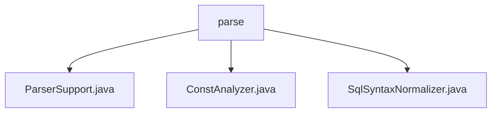

# 基础信息

|      |      |
|------|------|
| 名称 | parse |
| 编码语言 | .java |
| 代码路径 | JeecgBoot/jeecg-boot/jeecg-boot-base-core/src/main/java/org/jeecg/common/util/sqlInjection/parse |
| 包名 | JeecgBoot.jeecg-boot.jeecg-boot-base-core.src.main.java.org.jeecg.common.util.sqlInjection.parse |
| 概述说明 | ParserSupport类解析SQL，ConstAnalyzer分析常量，SqlSyntaxNormalizer监控SQL变化。 |

# 说明

## 概述
该代码模块主要专注于SQL解析与语法分析，旨在提供对SQL查询语句的解析、语法检查、表达式分析以及线程局部变量状态管理等功能。模块中的各个类协同工作，确保SQL语句的正确性和高效性，同时优化代码的性能和可读性。

## 主要业务场景
1. **SQL解析与语法检查**：
   - `ParserSupport`类负责解析SQL查询语句，特别是`SELECT`语句，并提供简单的语法检查功能。它确保SQL语句的语法正确性，为后续的SQL操作提供基础支持。

2. **表达式常量分析**：
   - `ConstAnalyzer`类用于分析表达式是否为常量。它通过识别和标记非常量表达式，帮助开发人员快速判断表达式的常量性质，从而优化代码或进行相关处理。该功能有助于提升代码的可读性和性能。

3. **SQL语句变化检测与线程局部变量管理**：
   - `SqlSyntaxNormalizer`类继承自`TablesNamesFinder`，主要用于检测SQL语句的变化，并管理线程局部变量的状态。它在多线程环境下确保有效地管理和维护线程局部变量的状态，增强了系统的稳定性和可靠性。

### 包内部结构视图

该流程图展示了`parse`文件夹与其内部文件的层级关系。`parse`文件夹下包含三个文件：`ParserSupport.java`、`ConstAnalyzer.java`和`SqlSyntaxNormalizer.java`。这些文件都属于SQL注入解析工具的一部分，用于分析和规范化SQL语法，确保代码的安全性。

# 文件列表 File List

| 名称   | 类型  | 说明 |
|-------|------|-------------|
| [ConstAnalyzer.java](ConstAnalyzer.md) | file | ConstAnalyzer类用于标记非常量表达式。 |
| [SqlSyntaxNormalizer.java](SqlSyntaxNormalizer.md) | file | SqlSyntaxNormalizer继承TablesNamesFinder，检测SQL变化并管理线程变量状态。 |
| [ParserSupport.java](ParserSupport.md) | file | ParserSupport类支持SQL解析和SELECT语句的语法检查。 |

