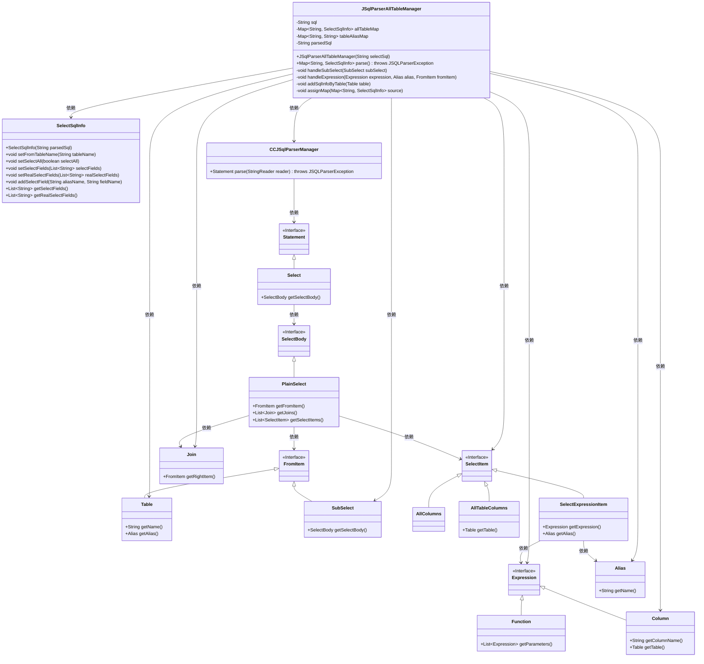
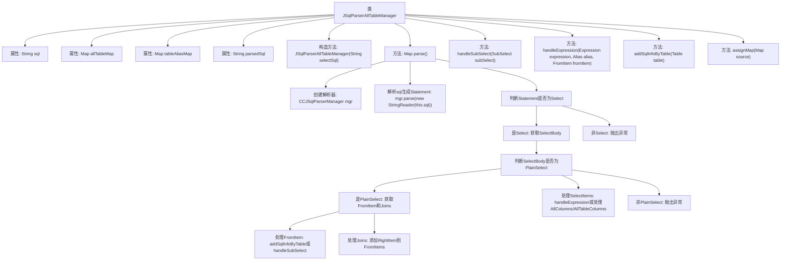

# 基础信息

|      |      |
|------|------|
| 名称 | JSqlParserAllTableManager |
| 编码语言 | .java |
| 代码路径 | JeecgBoot/jeecg-boot/jeecg-boot-base-core/src/main/java/org/jeecg/common/util/sqlparse/JSqlParserAllTableManager.java |
| 包名 | org.jeecg.common.util.sqlparse |
| 依赖项 | ['lombok.extern.slf4j.Slf4j', 'net.sf.jsqlparser.JSQLParserException', 'net.sf.jsqlparser.expression', 'net.sf.jsqlparser.parser.CCJSqlParserManager', 'net.sf.jsqlparser.schema.Column', 'net.sf.jsqlparser.schema.Table', 'net.sf.jsqlparser.statement.Statement', 'net.sf.jsqlparser.statement.select', 'org.jeecg.common.exception.JeecgBootException', 'org.jeecg.common.util.sqlparse.vo.SelectSqlInfo', 'java.io.StringReader', 'java.util.ArrayList', 'java.util.HashMap', 'java.util.List', 'java.util.Map'] |
| 概述说明 | JSqlParserAllTableManager类解析SQL，提取表信息并处理子查询和字段表达式。 |

# 说明

JSqlParserAllTableManager类主要用于解析SQL语句，提取其中的表信息，并处理子查询和字段表达式。该类通过解析SQL语句，能够识别出所有涉及的表，并对复杂的子查询和字段表达式进行深入分析，确保表信息的完整性和准确性。该类的功能对于SQL语句的解析和处理具有重要意义，特别是在涉及多表查询和嵌套查询的场景中，能够有效提取和管理表信息，为后续的SQL操作提供支持。

# 类列表 Class Summary

| 名称   | 类型  | 说明 |
|-------|------|-------------|
| JSqlParserAllTableManager | class | JSqlParserAllTableManager类解析SQL语句，提取表信息并处理子查询和字段表达式。 |

## 类 JSqlParserAllTableManager

|      |      |
|------|------|
| 访问范围 | @Slf4j;public |
| 类型 | class |
| 名称 | JSqlParserAllTableManager |
| 说明 | JSqlParserAllTableManager类解析SQL语句，提取表信息并处理子查询和字段表达式。 |

### UML类图

**描述：**
`JSqlParserAllTableManager` 类用于解析 SQL 查询语句，提取表信息并管理查询字段。它依赖于 `CCJSqlParserManager` 进行 SQL 解析，并通过 `SelectSqlInfo` 类存储解析结果。类图展示了 `JSqlParserAllTableManager` 与其他相关类的关系，包括 SQL 语句的解析、表信息的提取以及查询字段的处理。

### 内部方法调用关系图

**描述：**  
`JSqlParserAllTableManager` 类用于解析SQL查询语句，提取其中的表信息、别名及查询字段。通过 `parse()` 方法，首先创建解析器并生成SQL语句的抽象语法树（AST），然后根据 `SelectBody` 的类型进行处理。对于 `PlainSelect`，分别处理 `FromItem` 和 `Joins`，并解析 `SelectItems` 中的字段信息。对于子查询，递归调用解析方法。最终返回包含所有表信息的 `Map`。

### 字段列表 Field List

| 名称  | 类型  | 说明 |
|-------|-------|------|
| tableAliasMap = new HashMap<>() | Map<String, String> | 创建了一个私有不可变的字符串映射表别名集合。 |
| allTableMap = new HashMap<>() | Map<String, SelectSqlInfo> | 声明一个私有的HashMap，键为字符串，值为SelectSqlInfo对象。 |
| sql | String | 私有字符串变量sql声明为final。 |
| parsedSql = null | String | 私有字符串变量parsedSql初始化为null。 |

### 方法列表 Method List

| 名称  | 类型  | 说明 |
|-------|-------|------|
| addSqlInfoByTable | void | 方法根据表名和别名生成SQL信息并存储。 |
| parse | Map<String, SelectSqlInfo> | 解析SQL查询，提取表信息和字段信息，处理子查询和别名。 |
| handleSubSelect | void | 递归解析子查询SQL并处理异常。 |
| handleExpression | void | 方法处理表达式，包括函数、子查询和字段，忽略字面量，处理字段时获取表名和别名，更新SQL信息。 |
| assignMap | void | 将源Map中的SelectSqlInfo合并到目标Map，处理字段合并逻辑。 |

