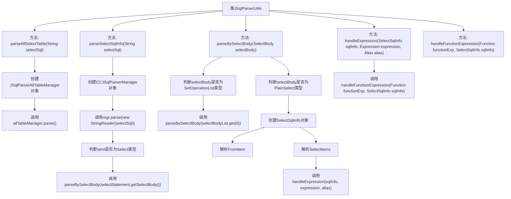

# 基础信息

|      |      |
|------|------|
| 名称 | JSqlParserUtils |
| 编码语言 | .java |
| 代码路径 | JeecgBoot/jeecg-boot/jeecg-boot-base-core/src/main/java/org/jeecg/common/util/sqlparse/JSqlParserUtils.java |
| 包名 | org.jeecg.common.util.sqlparse |
| 依赖项 | ['lombok.extern.slf4j.Slf4j', 'net.sf.jsqlparser.JSQLParserException', 'net.sf.jsqlparser.expression', 'net.sf.jsqlparser.parser.CCJSqlParserManager', 'net.sf.jsqlparser.schema.Column', 'net.sf.jsqlparser.schema.Table', 'net.sf.jsqlparser.statement.Statement', 'net.sf.jsqlparser.statement.select', 'org.jeecg.common.exception.JeecgBootException', 'org.jeecg.common.util.oConvertUtils', 'org.jeecg.common.util.sqlparse.vo.SelectSqlInfo', 'java.io.StringReader', 'java.util.List', 'java.util.Map'] |
| 概述说明 | JSqlParserUtils类解析SQL查询，提取表名和字段名，支持子查询和函数处理。 |

# 说明

JSqlParserUtils类是一个用于解析SQL查询的工具类，其主要功能包括提取SQL语句中的表名和字段名。该工具类支持处理复杂的SQL查询结构，如子查询和函数调用，能够全面解析SQL语句中的各个组成部分。通过使用JSqlParserUtils，开发者可以方便地获取SQL查询中涉及的表和字段信息，便于后续的数据处理和分析。

# 类列表 Class Summary

| 名称   | 类型  | 说明 |
|-------|------|-------------|
| JSqlParserUtils | class | JSqlParserUtils类提供解析SQL查询功能，提取表名和字段名，支持子查询和函数处理。 |

## 类 JSqlParserUtils

|      |      |
|------|------|
| 访问范围 | @Slf4j;public |
| 类型 | class |
| 名称 | JSqlParserUtils |
| 说明 | JSqlParserUtils类提供解析SQL查询功能，提取表名和字段名，支持子查询和函数处理。 |

### UML类图

```mermaid
classDiagram
    class JSqlParserUtils {
        +static Map~String, SelectSqlInfo~ parseAllSelectTable(String selectSql) throws JSQLParserException
        +static SelectSqlInfo parseSelectSqlInfo(String selectSql) throws JSQLParserException
        -static SelectSqlInfo parseBySelectBody(SelectBody selectBody)
        -static void handleExpression(SelectSqlInfo sqlInfo, Expression expression, Alias alias)
        -static void handleFunctionExpression(Function functionExp, SelectSqlInfo sqlInfo)
    }

    class SelectSqlInfo {
        +SelectSqlInfo(SelectBody selectBody)
        +void setFromTableAliasName(String aliasName)
        +void setFromTableName(String tableName)
        +void setFromSubSelect(SelectSqlInfo subSqlInfo)
        +void setSelectAll(boolean selectAll)
        +void setSelectFields(List~String~ selectFields)
        +void setRealSelectFields(List~String~ realSelectFields)
        +void addSelectField(String selectField, String realSelectField)
        +List~String~ getSelectFields()
        +List~String~ getRealSelectFields()
        +List~String~ getAllRealSelectFields()
    }

    class JSqlParserAllTableManager {
        +JSqlParserAllTableManager(String selectSql)
        +Map~String, SelectSqlInfo~ parse()
    }

    class CCJSqlParserManager {
        +Statement parse(StringReader reader) throws JSQLParserException
    }

    class Select {
        +SelectBody getSelectBody()
    }

    class SetOperationList {
        +List~SelectBody~ getSelects()
    }

    class PlainSelect {
        +FromItem getFromItem()
        +List~SelectItem~ getSelectItems()
    }

    class FromItem {
        +Alias getAlias()
    }

    class Table {
        +String getName()
    }

    class SubSelect {
        +SelectBody getSelectBody()
    }

    class SelectItem {
        // 抽象类，未列出具体方法
    }

    class AllColumns {
        // 具体实现类
    }

    class AllTableColumns {
        // 具体实现类
    }

    class SelectExpressionItem {
        +Expression getExpression()
        +Alias getAlias()
    }

    class Expression {
        // 抽象类，未列出具体方法
    }

    class Function {
        +List~Expression~ getParameters()
    }

    class Column {
        +String getColumnName()
    }

    class Alias {
        +String getName()
    }

    JSqlParserUtils --> JSqlParserAllTableManager : 依赖
    JSqlParserUtils --> CCJSqlParserManager : 依赖
    JSqlParserUtils --> SelectSqlInfo : 依赖
    JSqlParserUtils --> Select : 依赖
    JSqlParserUtils --> SetOperationList : 依赖
    JSqlParserUtils --> PlainSelect : 依赖
    JSqlParserUtils --> FromItem : 依赖
    JSqlParserUtils --> Table : 依赖
    JSqlParserUtils --> SubSelect : 依赖
    JSqlParserUtils --> SelectItem : 依赖
    JSqlParserUtils --> AllColumns : 依赖
    JSqlParserUtils --> AllTableColumns : 依赖
    JSqlParserUtils --> SelectExpressionItem : 依赖
    JSqlParserUtils --> Expression : 依赖
    JSqlParserUtils --> Function : 依赖
    JSqlParserUtils --> Column : 依赖
    JSqlParserUtils --> Alias : 依赖
```

这段代码定义了一个 `JSqlParserUtils` 类，用于解析 SQL 查询语句。它通过 `parseAllSelectTable` 方法解析查询 SQL 并返回一个包含表名和字段名的映射，`parseSelectSqlInfo` 方法用于解析查询 SQL 并返回 `SelectSqlInfo` 对象。`parseBySelectBody` 方法用于解析 `SelectBody` 对象，`handleExpression` 和 `handleFunctionExpression` 方法用于处理查询字段表达式。代码中涉及的类包括 `JSqlParserAllTableManager`、`CCJSqlParserManager`、`SelectSqlInfo` 等，这些类共同协作完成 SQL 解析任务。

### 内部方法调用关系图

**描述：**
该流程图展示了`JSqlParserUtils`类中的主要方法调用关系。`parseAllSelectTable`方法通过创建`JSqlParserAllTableManager`对象并调用其`parse`方法来解析SQL查询语句。`parseSelectSqlInfo`方法使用`CCJSqlParserManager`解析SQL语句，并根据语句类型调用`parseBySelectBody`方法进一步解析。`parseBySelectBody`方法根据`SelectBody`的类型进行不同的处理，包括解析`FromItem`和`SelectItems`，并调用`handleExpression`和`handleFunctionExpression`方法处理表达式和函数式字段。

### 字段列表 Field List

| 名称  | 类型  | 说明 |
|-------|-------|------|

### 方法列表 Method List

| 名称  | 类型  | 说明 |
|-------|-------|------|
| parseAllSelectTable | Map<String, SelectSqlInfo> | 解析SQL查询语句，返回表信息映射。 |
| handleFunctionExpression | void | 处理函数表达式，遍历参数并调用表达式处理方法。 |
| parseBySelectBody | SelectSqlInfo | 解析SQL查询，处理union和子查询，提取表名、别名和字段信息。 |
| handleExpression | void | 处理SQL表达式的函数，包括函数、子查询、字面量和字段名。 |
| parseSelectSqlInfo | SelectSqlInfo | 解析SQL查询，返回SelectSqlInfo对象，非select查询抛出异常。 |

