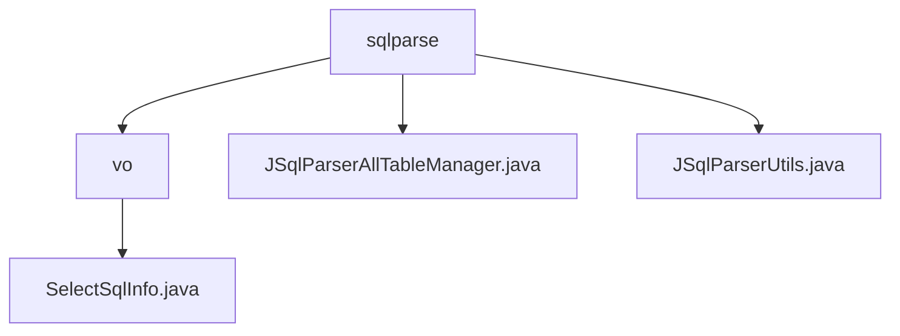

# 基础信息

|      |      |
|------|------|
| 名称 | sqlparse |
| 编码语言 | .java |
| 代码路径 | JeecgBoot/jeecg-boot/jeecg-boot-base-core/src/main/java/org/jeecg/common/util/sqlparse |
| 包名 | JeecgBoot.jeecg-boot.jeecg-boot-base-core.src.main.java.org.jeecg.common.util.sqlparse |
| 概述说明 | SelectSqlInfo类存储SQL查询信息，JSqlParserAllTableManager解析SQL表信息，JSqlParserUtils提取SQL表和字段名。 |

# 说明

## 概述
该代码模块主要围绕SQL查询的解析、管理和构建展开，提供了对SQL语句中表名、字段名、子查询等关键信息的提取和存储功能。通过多个类的协同工作，该模块能够有效处理复杂的SQL查询结构，支持多表查询和嵌套查询场景，为开发者提供了便捷的工具来解析和管理SQL语句。

## 主要业务场景
1. **SQL查询信息的存储与管理**：`SelectSqlInfo`类用于存储SQL查询的关键信息，如表名、别名、子查询和字段集合等，为SQL查询的构建和管理提供了数据结构支持。
2. **SQL语句的解析与表信息提取**：`JSqlParserAllTableManager`类负责解析SQL语句，提取其中涉及的表信息，并处理复杂的子查询和字段表达式，确保表信息的完整性和准确性。
3. **SQL查询的工具化解析**：`JSqlParserUtils`类提供了对SQL语句中表名和字段名的提取功能，支持处理复杂的查询结构，如子查询和函数调用，便于开发者获取和分析SQL查询的组成部分。

该模块适用于需要解析和处理SQL查询的应用场景，特别是在涉及多表查询、嵌套查询以及复杂字段表达式的场景中，能够有效提升SQL语句的解析效率和准确性。

### 包内部结构视图

该流程图展示了`sqlparse`目录下的层级结构，包含`vo`文件夹和两个Java文件`JSqlParserAllTableManager.java`与`JSqlParserUtils.java`。`vo`文件夹下进一步包含`SelectSqlInfo.java`文件。整体结构清晰，展示了文件与文件夹之间的层级关系。

# 文件列表 File List

| 名称   | 类型  | 说明 |
|-------|------|-------------|
| [JSqlParserUtils.java](JSqlParserUtils.md) | file | JSqlParserUtils类解析SQL查询，提取表名和字段名，支持子查询和函数处理。 |
| [JSqlParserAllTableManager.java](JSqlParserAllTableManager.md) | file | JSqlParserAllTableManager类解析SQL，提取表信息并处理子查询和字段表达式。 |
| [vo](vo/_module.md) | package | SelectSqlInfo类存储SQL查询信息，含表名、别名、子查询、字段集及解析SQL。 |

