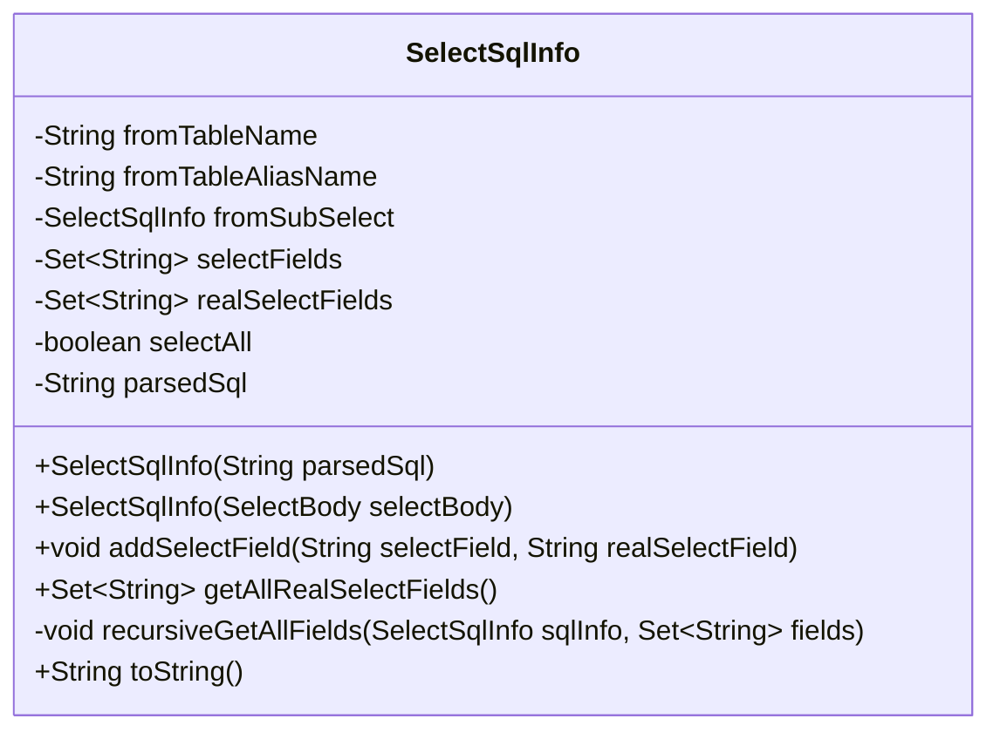
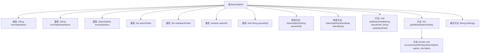

# 基础信息

|      |      |
|------|------|
| 名称 | SelectSqlInfo |
| 编码语言 | .java |
| 代码路径 | JeecgBoot/jeecg-boot/jeecg-boot-base-core/src/main/java/org/jeecg/common/util/sqlparse/vo/SelectSqlInfo.java |
| 包名 | org.jeecg.common.util.sqlparse.vo |
| 依赖项 | ['lombok.Data', 'net.sf.jsqlparser.statement.select.SelectBody', 'java.util.HashSet', 'java.util.Set'] |
| 概述说明 | SelectSqlInfo类存储SQL查询信息，含表名、别名、子查询、字段集及解析SQL。 |

# 说明

SelectSqlInfo类是一个用于存储SQL查询信息的类，其主要功能包括记录表名、别名、子查询以及字段集合等信息，并且能够存储解析后的SQL语句。该类通过整合这些关键元素，为SQL查询的构建和管理提供了便捷的数据结构支持。

# 类列表 Class Summary

| 名称   | 类型  | 说明 |
|-------|------|-------------|
| SelectSqlInfo | class | SelectSqlInfo类用于存储SQL查询信息，包含表名、别名、子查询、字段集合及解析后的SQL。 |

## 类 SelectSqlInfo

|      |      |
|------|------|
| 访问范围 | @Data;public |
| 类型 | class |
| 名称 | SelectSqlInfo |
| 说明 | SelectSqlInfo类用于存储SQL查询信息，包含表名、别名、子查询、字段集合及解析后的SQL。 |

### UML类图

**描述：**  
`SelectSqlInfo` 类用于表示 SQL 查询语句的详细信息，包括表名、表别名、子查询、查询字段等。该类提供了方法来添加查询字段、递归获取所有字段以及生成对象的字符串表示。通过递归方法 `recursiveGetAllFields`，可以获取包括子查询中的所有字段。该类主要用于解析和操作 SQL 查询语句的结构化信息。

### 内部方法调用关系图

这段代码定义了一个名为 `SelectSqlInfo` 的类，用于表示 SQL 查询的结构信息。类中包含多个属性，如表名、表别名、子查询信息、查询字段集合等。类提供了两个构造方法，分别用于初始化 `parsedSql` 属性。`addSelectField` 方法用于添加查询字段，`getAllRealSelectFields` 方法通过递归获取所有字段，包括子查询中的字段。`toString` 方法重写了对象的字符串表示形式。流程图展示了类的属性和方法之间的调用关系。

### 字段列表 Field List

| 名称  | 类型  | 说明 |
|-------|-------|------|
| fromTableName | String | 定义私有字符串变量fromTableName。 |
| realSelectFields | Set<String> | 私有字符串集合realSelectFields。 |
| selectFields | Set<String> | 私有字符串集合用于存储选择字段。 |
| parsedSql | String | 私有字符串变量parsedSql存储解析后的SQL语句。 |
| fromSubSelect | SelectSqlInfo | 私有属性fromSubSelect类型为SelectSqlInfo。 |
| fromTableAliasName | String | 私有字符串变量，用于存储表别名名称。 |
| selectAll | boolean | 私有布尔变量selectAll，用于选择状态。 |

### 方法列表 Method List

| 名称  | 类型  | 说明 |
|-------|-------|------|
| getAllRealSelectFields | Set<String> | 递归获取所有字段并返回集合。 |
| recursiveGetAllFields | void | 递归获取SQL查询中的所有字段。 |
| toString | String | 重写toString方法，返回SelectSqlInfo对象的关键字段信息。 |
| addSelectField | void | 方法将两个字段分别添加到selectFields和realSelectFields集合中。 |

