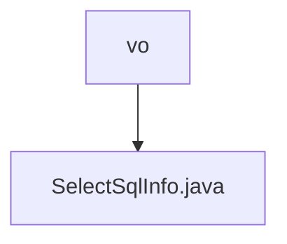

# 基础信息

|      |      |
|------|------|
| 名称 | vo |
| 编码语言 | .java |
| 代码路径 | JeecgBoot/jeecg-boot/jeecg-boot-base-core/src/main/java/org/jeecg/common/util/sqlparse/vo |
| 包名 | JeecgBoot.jeecg-boot.jeecg-boot-base-core.src.main.java.org.jeecg.common.util.sqlparse.vo |
| 概述说明 | SelectSqlInfo类存储SQL查询信息，含表名、别名、子查询、字段集及解析SQL。 |

# 说明

SelectSqlInfo类是一个用于存储SQL查询信息的类，其主要功能包括记录表名、别名、子查询以及字段集合等信息，并且能够存储解析后的SQL语句。该类通过整合这些关键元素，为SQL查询的构建和管理提供了便捷的数据结构支持。

### 包内部结构视图

该流程图展示了路径中的层级关系，`vo` 是父节点，`SelectSqlInfo.java` 是其子节点。路径表示在 `vo` 目录下存在一个名为 `SelectSqlInfo.java` 的文件。这种层级关系清晰地展示了文件在项目结构中的位置。

# 文件列表 File List

| 名称   | 类型  | 说明 |
|-------|------|-------------|
| [SelectSqlInfo.java](SelectSqlInfo.md) | file | SelectSqlInfo类存储SQL查询信息，含表名、别名、子查询、字段集及解析SQL。 |

