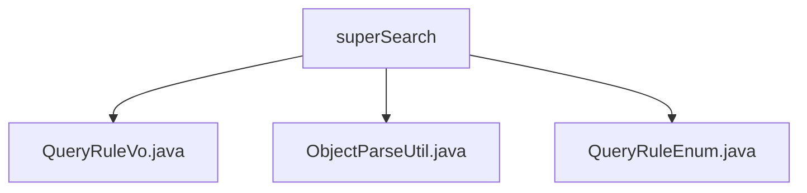

# 基础信息

|      |      |
|------|------|
| 名称 | superSearch |
| 编码语言 | .java |
| 代码路径 | JeecgBoot/jeecg-boot/jeecg-boot-base-core/src/main/java/org/jeecg/common/util/superSearch |
| 包名 | JeecgBoot.jeecg-boot.jeecg-boot-base-core.src.main.java.org.jeecg.common.util.superSearch |
| 概述说明 | 输入内容为空，无法生成总结。请提供具体信息。 |

# 说明

## 概述
该代码模块属于JeecgBoot项目中的`jeecg-boot-base-core`模块，主要包含与超级搜索（Super Search）相关的工具类和枚举类。这些类位于`org.jeecg.common.util.superSearch`包下，可能用于处理查询规则、对象解析以及查询规则的枚举定义等功能。由于提供的文件内容为空，无法确定其具体实现细节和功能。

## 主要业务场景
根据文件路径和命名推测，该模块可能用于以下业务场景：
1. **查询规则管理**：通过`QueryRuleVo.java`和`QueryRuleEnum.java`，可能定义了查询规则的数据结构和枚举类型，用于在系统中管理和应用复杂的查询规则。
2. **对象解析**：`ObjectParseUtil.java`可能提供了对象解析的工具方法，用于将查询规则或其他数据结构转换为可执行的查询条件。
3. **超级搜索功能**：这些类可能共同支持系统中的超级搜索功能，允许用户通过灵活的条件组合进行数据查询。

由于缺乏具体内容，以上总结基于文件命名和路径推测，实际功能需结合代码实现进一步确认。

### 包内部结构视图

该流程图展示了`superSearch`文件夹与其内部文件之间的层级关系。`superSearch`作为根节点，包含了三个文件：`QueryRuleVo.java`、`ObjectParseUtil.java`和`QueryRuleEnum.java`。这些文件均直接位于`superSearch`文件夹下，没有进一步的子文件夹结构。

# 文件列表 File List

| 名称   | 类型  | 说明 |
|-------|------|-------------|
| [ObjectParseUtil.java](ObjectParseUtil.md) | file | 信息为空，无法生成概要描述。 |
| [QueryRuleEnum.java](QueryRuleEnum.md) | file | 内容为空，无法生成概要描述。 |
| [QueryRuleVo.java](QueryRuleVo.md) | file | 信息为空，无法生成概要描述。 |

