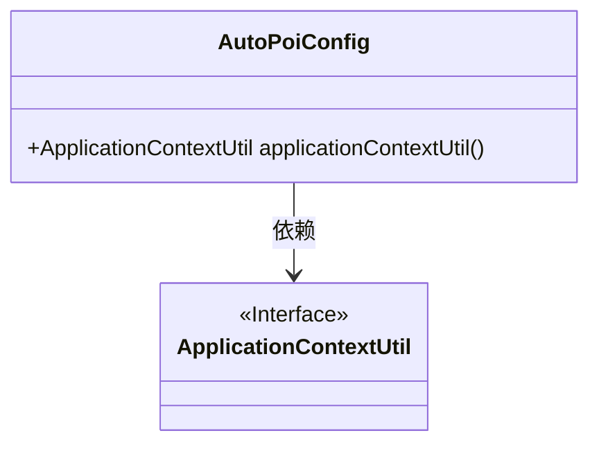
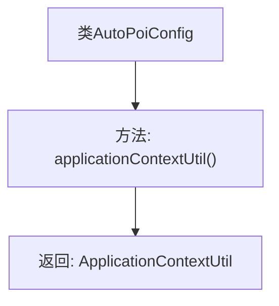

# 基础信息

|      |      |
|------|------|
| 名称 | AutoPoiConfig |
| 编码语言 | .java |
| 代码路径 | JeecgBoot/jeecg-boot/jeecg-boot-base-core/src/main/java/org/jeecg/config/AutoPoiConfig.java |
| 包名 | org.jeecg.config |
| 依赖项 | ['org.jeecgframework.core.util.ApplicationContextUtil', 'org.springframework.context.annotation.Bean', 'org.springframework.context.annotation.Configuration'] |
| 概述说明 | AutoPoiConfig类配置Excel注解字典参数，支持自动翻译字典值。 |

# 说明

AutoPoiConfig类提供了配置Excel注解字典参数的功能，支持在数据导入和导出过程中自动翻译字典值。该特性使得处理包含字典值的Excel文件更加高效和准确，确保数据在不同系统或语言环境中的一致性和可读性。通过这一配置，用户可以在不手动干预的情况下，实现字典值的自动转换，从而简化数据处理流程，提高工作效率。

# 类列表 Class Summary

| 名称   | 类型  | 说明 |
|-------|------|-------------|
| AutoPoiConfig | class | AutoPoiConfig类配置Excel注解字典参数，支持导入导出时自动翻译字典值。 |

## 类 AutoPoiConfig

|      |      |
|------|------|
| 访问范围 | @Configuration;public |
| 类型 | class |
| 名称 | AutoPoiConfig |
| 说明 | AutoPoiConfig类配置Excel注解字典参数，支持导入导出时自动翻译字典值。 |

### UML类图

这段代码定义了一个名为 `AutoPoiConfig` 的配置类，其中包含一个 `applicationContextUtil` 方法，该方法返回一个 `ApplicationContextUtil` 类型的实例。`ApplicationContextUtil` 是一个接口，用于处理Excel注解字典参数的导入和导出，支持字典值的自动翻译。`AutoPoiConfig` 类依赖于 `ApplicationContextUtil` 接口来实现其功能。

### 内部方法调用关系图

这段代码定义了一个名为 `AutoPoiConfig` 的配置类，其中包含一个方法 `applicationContextUtil()`，该方法通过 `@Bean` 注解返回一个 `ApplicationContextUtil` 实例。该配置类主要用于支持Excel注解字典参数的导入导出功能，能够根据字典配置自动翻译字典值，例如将“1,2”翻译为“男、女”，反之亦然。

### 字段列表 Field List

| 名称  | 类型  | 说明 |
|-------|-------|------|

### 方法列表 Method List

| 名称  | 类型  | 说明 |
|-------|-------|------|
| applicationContextUtil | ApplicationContextUtil | 创建ApplicationContextUtil实例的Spring Bean定义。 |

