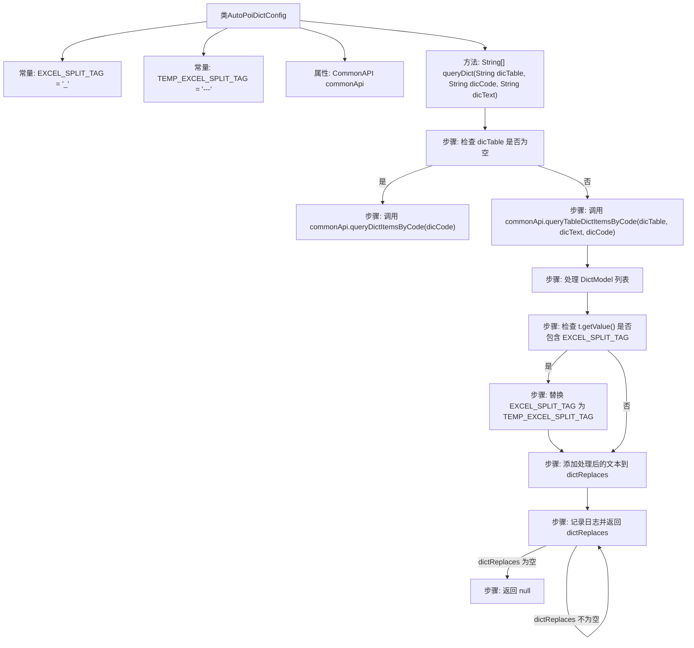

# 基础信息

|      |      |
|------|------|
| 名称 | AutoPoiDictConfig |
| 编码语言 | .java |
| 代码路径 | JeecgBoot/jeecg-boot/jeecg-boot-base-core/src/main/java/org/jeecg/config/AutoPoiDictConfig.java |
| 包名 | org.jeecg.config |
| 依赖项 | ['java.util.ArrayList', 'java.util.List', 'javax.annotation.Resource', 'org.jeecg.common.api.CommonAPI', 'org.jeecg.common.system.vo.DictModel', 'org.jeecg.common.util.oConvertUtils', 'org.jeecgframework.dict.service.AutoPoiDictServiceI', 'org.springframework.context.annotation.Lazy', 'org.springframework.stereotype.Service', 'lombok.extern.slf4j.Slf4j'] |
| 概述说明 | AutoPoiDictConfig类负责字典查询、Excel异常处理和解析问题。 |

# 说明

AutoPoiDictConfig类主要用于实现字典查询功能，并处理与Excel导出相关的异常和解析问题。该类通过优化字典查询逻辑，确保数据检索的准确性和效率。同时，它针对Excel导出过程中可能出现的异常情况进行了处理，避免导出失败或数据丢失。此外，该类还解决了Excel文件解析时可能遇到的数据格式或结构问题，确保解析过程的稳定性和数据完整性。通过整合这些功能，AutoPoiDictConfig类提升了系统的整体性能和用户体验。

# 类列表 Class Summary

| 名称   | 类型  | 说明 |
|-------|------|-------------|
| AutoPoiDictConfig | class | AutoPoiDictConfig类实现字典查询，处理Excel导出异常和解析问题。 |


## 类 AutoPoiDictConfig

|      |      |
|------|------|
| 访问范围 | @Slf4j;@Service;public |
| 类型 | class |
| 名称 | AutoPoiDictConfig |
| 说明 | AutoPoiDictConfig类实现字典查询，处理Excel导出异常和解析问题。 |


### UML类图

```mermaid
classDiagram
    class AutoPoiDictConfig {
        <<Service>>
        -final static String EXCEL_SPLIT_TAG
        -final static String TEMP_EXCEL_SPIT_TAG
        -CommonAPI commonApi
        +String[] queryDict(String dicTable, String dicCode, String dicText)
    }

    interface AutoPoiDictServiceI {
        <<Interface>>
        +String[] queryDict(String dicTable, String dicCode, String dicText)
    }

    class CommonAPI {
        +List~DictModel~ queryDictItemsByCode(String dicCode)
        +List~DictModel~ queryTableDictItemsByCode(String dicTable, String dicText, String dicCode)
    }

    class DictModel {
        +String getText()
        +String getValue()
    }

    AutoPoiDictConfig ..|> AutoPoiDictServiceI : 实现
    AutoPoiDictConfig --> CommonAPI : 依赖
    CommonAPI --> DictModel : 返回
```

类图描述：`AutoPoiDictConfig` 类实现了 `AutoPoiDictServiceI` 接口，并通过 `CommonAPI` 类查询字典数据。`CommonAPI` 类提供了两种查询字典的方法，返回 `DictModel` 对象的列表。`AutoPoiDictConfig` 类的主要功能是根据字典表、字典代码和字典文本查询字典数据，并处理返回结果，最终将处理后的字典数据以字符串数组的形式返回。


### 内部方法调用关系图



**描述：** 该代码定义了一个 `AutoPoiDictConfig` 类，用于处理字典查询和文本替换逻辑。`queryDict` 方法根据传入的字典表、字典代码和字典文本，通过 `commonApi` 查询字典项，并对查询结果进行处理，最终返回处理后的字符串数组。处理过程中，如果字典值包含特定分隔符，则进行替换操作，并将结果记录到日志中。

### 字段列表 Field List

| 名称  | 类型  | 说明 |
|-------|-------|------|
| commonApi | CommonAPI | 懒加载注入私有CommonAPI资源。 |
| EXCEL_SPLIT_TAG = "_" | String | 定义常量EXCEL_SPLIT_TAG为下划线。 |
| TEMP_EXCEL_SPLIT_TAG = "---" | String | 定义静态常量TEMP_EXCEL_SPLIT_TAG，值为"---"。 |

### 方法列表 Method List

| 名称  | 类型  | 说明 |
|-------|-------|------|
| queryDict | String[] | 方法queryDict根据字典表查询数据，处理异常并返回格式化结果。 |


