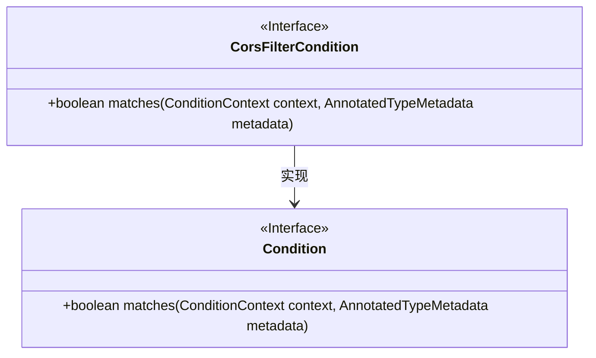
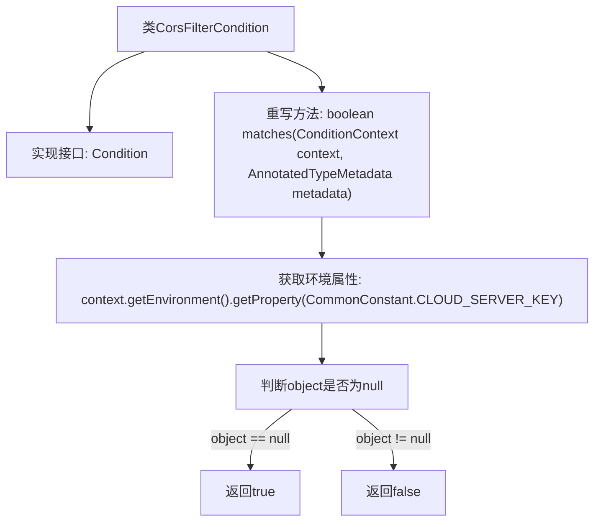

# 基础信息

|      |      |
|------|------|
| 名称 | CorsFilterCondition |
| 编码语言 | .java |
| 代码路径 | JeecgBoot/jeecg-boot/jeecg-boot-base-core/src/main/java/org/jeecg/config/CorsFilterCondition.java |
| 包名 | org.jeecg.config |
| 依赖项 | ['org.jeecg.common.constant.CommonConstant', 'org.springframework.context.annotation.Condition', 'org.springframework.context.annotation.ConditionContext', 'org.springframework.core.type.AnnotatedTypeMetadata'] |
| 概述说明 | CorsFilterCondition类实现Condition接口，根据环境属性决定是否加载跨域配置。 |

# 说明

CorsFilterCondition类实现了Condition接口，其主要功能是通过检查环境属性来决定是否加载跨域配置。该类的核心作用在于根据特定条件判断是否启用跨域处理机制，从而确保在满足条件时自动应用相关配置。这种设计有助于灵活管理跨域设置，适应不同的运行环境需求。

# 类列表 Class Summary

| 名称   | 类型  | 说明 |
|-------|------|-------------|
| CorsFilterCondition | class | CorsFilterCondition类实现Condition接口，检查环境属性决定是否加载跨域配置。 |

## 类 CorsFilterCondition

|      |      |
|------|------|
| 访问范围 | public |
| 类型 | class |
| 名称 | CorsFilterCondition |
| 说明 | CorsFilterCondition类实现Condition接口，检查环境属性决定是否加载跨域配置。 |

### UML类图

**描述：**
`CorsFilterCondition` 类实现了 `Condition` 接口，并重写了 `matches` 方法。该方法通过检查环境属性 `CommonConstant.CLOUD_SERVER_KEY` 是否存在来判断是否加载跨域配置。如果属性不存在（即 `object` 为 `null`），则返回 `true`，表示单体应用应加载跨域配置；否则返回 `false`。

### 内部方法调用关系图

这段代码定义了一个名为`CorsFilterCondition`的类，该类实现了`Condition`接口。`matches`方法通过检查环境属性`CommonConstant.CLOUD_SERVER_KEY`的值来决定是否加载跨域配置。如果该属性值为`null`，说明应用是单体应用，返回`true`；否则返回`false`。这段代码主要用于在微服务架构中根据配置动态决定是否启用跨域配置。

### 字段列表 Field List

| 名称  | 类型  | 说明 |
|-------|-------|------|

### 方法列表 Method List

| 名称  | 类型  | 说明 |
|-------|-------|------|
| matches | boolean | 方法检查环境属性，若无服务注册配置则返回true，否则返回false。 |

