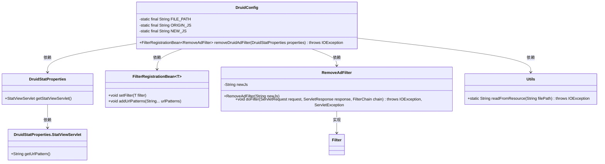
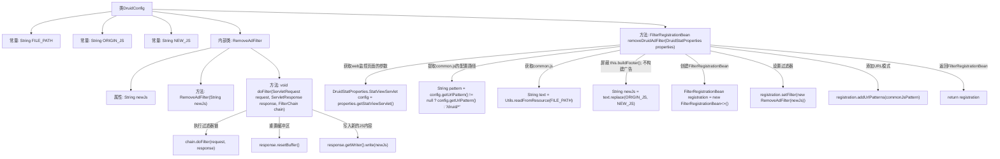

# 基础信息

|      |      |
|------|------|
| 名称 | DruidConfig |
| 编码语言 | .java |
| 代码路径 | JeecgBoot/jeecg-boot/jeecg-boot-base-core/src/main/java/org/jeecg/config/DruidConfig.java |
| 包名 | org.jeecg.config |
| 依赖项 | ['java.io.IOException', 'javax.servlet', 'org.springframework.boot.autoconfigure.AutoConfigureAfter', 'org.springframework.boot.autoconfigure.condition.ConditionalOnProperty', 'org.springframework.boot.autoconfigure.condition.ConditionalOnWebApplication', 'org.springframework.boot.web.servlet.FilterRegistrationBean', 'org.springframework.context.annotation.Bean', 'org.springframework.context.annotation.Configuration', 'com.alibaba.druid.spring.boot.autoconfigure.DruidDataSourceAutoConfigure', 'com.alibaba.druid.spring.boot.autoconfigure.properties.DruidStatProperties', 'com.alibaba.druid.util.Utils'] |
| 概述说明 | 配置类通过替换JS脚本去除Druid监控页面广告。 |

# 说明

该内容描述了一种通过替换JS脚本来去除Druid监控页面广告的方法。具体操作是修改配置类，将原有的JS脚本替换为无广告版本，从而实现去除广告的效果。这种方法直接针对监控页面的前端展示进行优化，无需改动后端逻辑，操作简便且效果明显。

# 类列表 Class Summary

| 名称   | 类型  | 说明 |
|-------|------|-------------|
| DruidConfig | class | 配置类去除Druid监控页面广告，通过替换JS脚本实现。 |

## 类 DruidConfig

|      |      |
|------|------|
| 访问范围 | @Configuration;@AutoConfigureAfter(DruidDataSourceAutoConfigure.class);public |
| 类型 | class |
| 名称 | DruidConfig |
| 说明 | 配置类去除Druid监控页面广告，通过替换JS脚本实现。 |

### UML类图

类图描述：
`DruidConfig` 类负责配置 Druid 监控页面的广告去除功能，依赖于 `DruidStatProperties` 和 `Utils` 类。`DruidStatProperties` 包含 `StatViewServlet` 内部类，用于获取监控页面的 URL 模式。`FilterRegistrationBean` 是一个泛型类，用于注册过滤器。`RemoveAdFilter` 是 `Filter` 接口的实现类，负责过滤并替换广告脚本。`Utils` 类提供了从资源文件中读取内容的功能。

### 内部方法调用关系图

这段代码定义了一个名为 `DruidConfig` 的配置类，用于去除 Druid 监控页面的广告。通过 `removeDruidAdFilter` 方法，获取并修改 `common.js` 文件中的广告构建语句，然后注册一个自定义的 `RemoveAdFilter` 过滤器，将修改后的 `common.js` 内容返回给客户端。该过滤器在 `doFilter` 方法中执行过滤逻辑，重置响应缓冲区并写入新的 JS 内容。

### 字段列表 Field List

| 名称  | 类型  | 说明 |
|-------|-------|------|
| NEW_JS = "//this.buildFooter();" | String | 定义私有静态常量字符串NEW_JS，值为"//this.buildFooter();"。 |
| FILE_PATH = "support/http/resources/js/common.js" | String | 私有静态字符串常量FILE_PATH指向资源文件common.js路径。 |
| ORIGIN_JS = "this.buildFooter();" | String | 私有静态常量ORIGIN_JS定义为"this.buildFooter();"。 |

### 方法列表 Method List

| 名称  | 类型  | 说明 |
|-------|-------|------|
| removeDruidAdFilter | FilterRegistrationBean<RemoveAdFilter> | 在Web应用中，根据配置启用Druid广告过滤，注册过滤器屏蔽广告。 |

