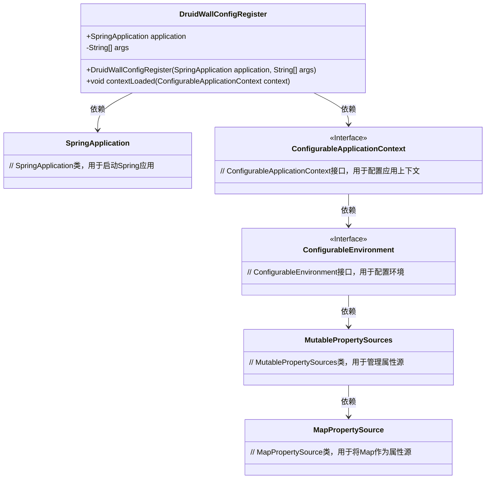
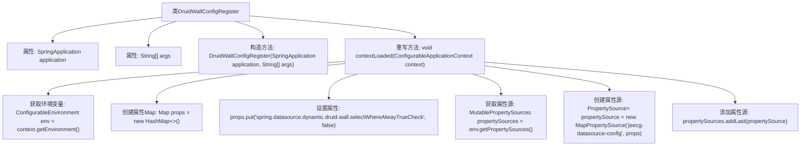

# 基础信息

|      |      |
|------|------|
| 名称 | DruidWallConfigRegister |
| 编码语言 | .java |
| 代码路径 | JeecgBoot/jeecg-boot/jeecg-boot-base-core/src/main/java/org/jeecg/config/DruidWallConfigRegister.java |
| 包名 | org.jeecg.config |
| 依赖项 | ['org.springframework.boot.SpringApplication', 'org.springframework.boot.SpringApplicationRunListener', 'org.springframework.context.ConfigurableApplicationContext', 'org.springframework.core.env.ConfigurableEnvironment', 'org.springframework.core.env.MapPropertySource', 'org.springframework.core.env.MutablePropertySources', 'org.springframework.core.env.PropertySource', 'java.util.HashMap', 'java.util.Map'] |
| 概述说明 | DruidWallConfigRegister类监听Spring启动，动态配置数据源属性。 |

# 说明

DruidWallConfigRegister类负责监听Spring应用的启动过程，并在启动时动态配置数据源的属性。该类的主要功能是确保在Spring应用启动时，能够根据实际需求动态调整Druid数据源的配置参数，从而优化数据源的使用和管理。通过这种方式，DruidWallConfigRegister类帮助应用在运行时灵活应对不同的数据源配置需求，提升系统的整体性能和稳定性。

# 类列表 Class Summary

| 名称   | 类型  | 说明 |
|-------|------|-------------|
| DruidWallConfigRegister | class | DruidWallConfigRegister类监听Spring启动，配置数据源动态属性。 |

## 类 DruidWallConfigRegister

|      |      |
|------|------|
| 访问范围 | public |
| 类型 | class |
| 名称 | DruidWallConfigRegister |
| 说明 | DruidWallConfigRegister类监听Spring启动，配置数据源动态属性。 |

### UML类图

这段代码定义了一个`DruidWallConfigRegister`类，该类实现了`SpringApplicationRunListener`接口。`DruidWallConfigRegister`类在Spring应用启动时，通过`contextLoaded`方法向应用环境中添加了一个自定义的属性源，用于配置Druid数据源的防火墙规则。代码中涉及到的类包括`SpringApplication`、`ConfigurableApplicationContext`、`ConfigurableEnvironment`、`MutablePropertySources`和`MapPropertySource`，它们分别用于管理Spring应用的启动、配置应用上下文、管理环境属性源等。

### 内部方法调用关系图

这段代码定义了一个名为 `DruidWallConfigRegister` 的类，该类实现了 `SpringApplicationRunListener` 接口。它通过构造函数接收 `SpringApplication` 和命令行参数，并在 `contextLoaded` 方法中动态配置数据源属性。具体来说，它创建了一个包含特定属性的 `Map`，并将其添加到 Spring 环境中的属性源中，以禁用 Druid 数据源的 `selectWhereAlwayTrueCheck` 检查。

### 字段列表 Field List

| 名称  | 类型  | 说明 |
|-------|-------|------|
| args | String[] | 私有字符串数组变量args。 |
| application | SpringApplication | 声明一个SpringApplication类型的公共变量application。 |

### 方法列表 Method List

| 名称  | 类型  | 说明 |
|-------|-------|------|
| contextLoaded | void | 重写contextLoaded方法，设置数据源配置并添加到环境属性源。 |

