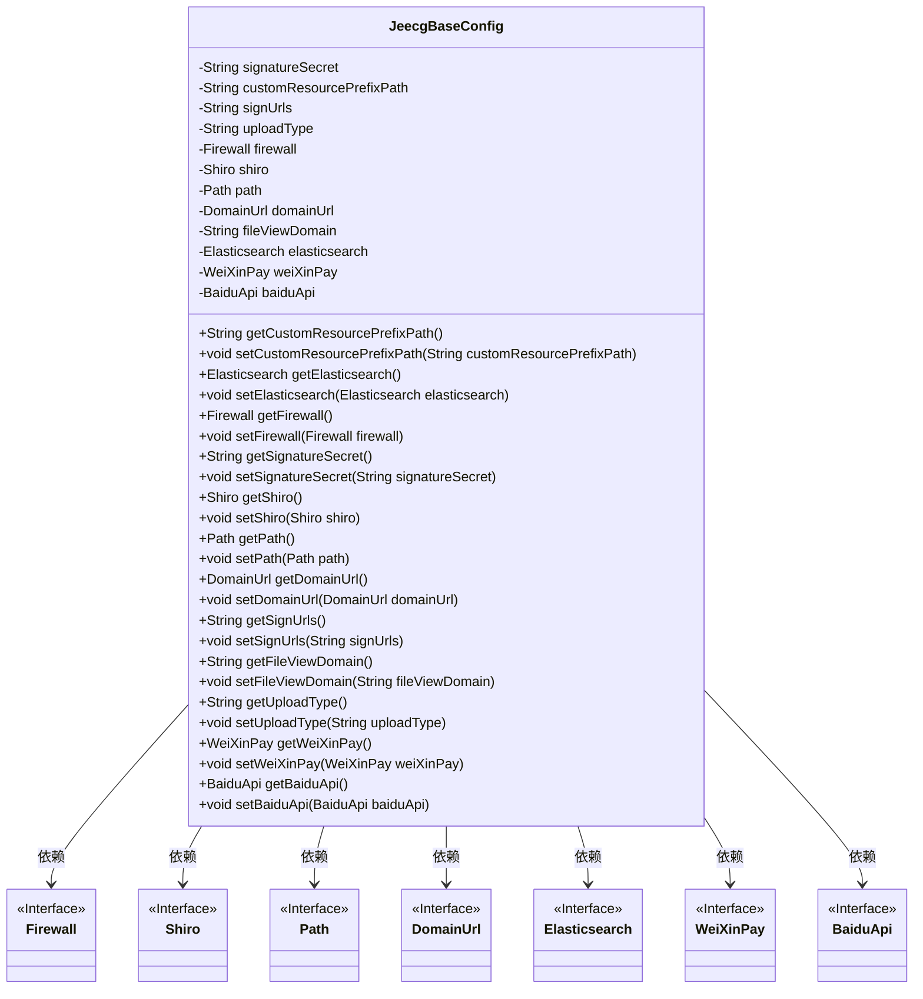

# 基础信息

|      |      |
|------|------|
| 名称 | JeecgBaseConfig |
| 编码语言 | .java |
| 代码路径 | JeecgBoot/jeecg-boot/jeecg-boot-base-core/src/main/java/org/jeecg/config/JeecgBaseConfig.java |
| 包名 | org.jeecg.config |
| 依赖项 | ['org.jeecg.config.vo', 'org.springframework.boot.context.properties.ConfigurationProperties', 'org.springframework.stereotype.Component'] |
| 概述说明 | JeecgBaseConfig类包含签名、资源、接口、上传、安全、文件、ES、微信支付和百度API等配置属性。 |

# 说明

JeecgBaseConfig类是一个配置类，包含多个关键属性，用于管理和控制系统的各项功能。这些属性包括签名密钥，用于确保数据传输的安全性；资源前缀，用于指定资源路径；接口校验，用于验证接口的合法性；上传模式，用于控制文件上传的方式；安全配置，用于设置系统的安全策略；文件预览，用于配置文件预览功能；ES配置，用于管理Elasticsearch的相关设置；微信支付和百度API，分别用于集成微信支付功能和百度API服务。这些属性共同构成了系统的核心配置，确保各项功能正常运行。

# 类列表 Class Summary

| 名称   | 类型  | 说明 |
|-------|------|-------------|
| JeecgBaseConfig | class | JeecgBaseConfig类包含签名密钥、资源前缀、接口校验、上传模式、安全配置、文件预览、ES配置、微信支付和百度API等属性。 |

## 类 JeecgBaseConfig

|      |      |
|------|------|
| 访问范围 | @Component("jeecgBaseConfig");@ConfigurationProperties(prefix = "jeecg");public |
| 类型 | class |
| 名称 | JeecgBaseConfig |
| 说明 | JeecgBaseConfig类包含签名密钥、资源前缀、接口校验、上传模式、安全配置、文件预览、ES配置、微信支付和百度API等属性。 |

### UML类图

**描述**：`JeecgBaseConfig` 类是一个配置类，用于管理多个配置项，包括签名密钥、自定义资源路径、上传模式、安全模式配置等。该类依赖于多个接口，如 `Firewall`、`Shiro`、`Path` 等，这些接口定义了不同的配置项的具体实现。通过 `JeecgBaseConfig` 类，可以方便地获取和设置这些配置项的值。

### 内部方法调用关系图

这段代码定义了一个名为`JeecgBaseConfig`的类，该类用于配置和管理Jeecg平台的基础设置。类中包含多个属性，如签名密钥、资源路径、上传模式等，并提供了相应的getter和setter方法来访问和修改这些属性。通过`@Component`和`@ConfigurationProperties`注解，该类可以与Spring框架集成，从配置文件中自动加载属性值。

### 字段列表 Field List

| 名称  | 类型  | 说明 |
|-------|-------|------|
| uploadType | String | 定义了一个私有字符串变量uploadType。 |
| customResourcePrefixPath | String | 定义私有字符串变量customResourcePrefixPath。 |
| path | Path | 定义了一个私有路径变量path。 |
| shiro | Shiro | 私有Shiro对象声明。 |
| fileViewDomain | String | 私有字符串变量，用于存储文件查看域名。 |
| signUrls | String | 定义私有字符串变量signUrls。 |
| firewall | Firewall | 定义了一个私有的防火墙对象。 |
| elasticsearch | Elasticsearch | 私有Elasticsearch实例声明。 |
| domainUrl | DomainUrl | 私有变量domainUrl用于存储域名URL。 |
| weiXinPay | WeiXinPay | 私有属性WeiXinPay对象weiXinPay。 |
| signatureSecret = "dd05f1c54d63749eda95f9fa6d49v442a" | String | 私有字符串变量signatureSecret赋值为"dd05f1c54d63749eda95f9fa6d49v442a"。 |
| baiduApi | BaiduApi | 声明了一个私有的BaiduApi对象baiduApi。 |

### 方法列表 Method List

| 名称  | 类型  | 说明 |
|-------|-------|------|
| setBaiduApi | void | 设置百度API实例方法，用于赋值类成员变量。 |
| setUploadType | void | 该方法用于设置上传类型，将传入的uploadType赋值给类的成员变量。 |
| getFirewall | Firewall | 获取防火墙实例的方法。 |
| getSignatureSecret | String | 该方法返回签名密钥。 |
| setSignUrls | void | 设置签名URL的方法。 |
| setDomainUrl | void | 设置域名的URL地址。 |
| getDomainUrl | DomainUrl | 获取domainUrl的公共方法。 |
| getElasticsearch | Elasticsearch | 该方法返回Elasticsearch实例。 |
| setShiro | void | 设置Shiro对象的方法。 |
| setFileViewDomain | void | 设置文件视图域的方法。 |
| getShiro | Shiro | 获取Shiro实例的方法。 |
| getCustomResourcePrefixPath | String | 获取自定义资源前缀路径的方法。 |
| setElasticsearch | void | 设置Elasticsearch实例的方法。 |
| getWeiXinPay | WeiXinPay | 获取微信支付实例。 |
| setFirewall | void | 设置防火墙实例的方法。 |
| setCustomResourcePrefixPath | void | 设置自定义资源前缀路径方法。 |
| getUploadType | String | 获取上传类型的方法。 |
| getBaiduApi | BaiduApi | 获取BaiduApi实例的方法。 |
| setWeiXinPay | void | 设置微信支付实例方法。 |
| getPath | Path | 获取路径方法返回路径对象。 |
| setPath | void | 设置路径对象的方法。 |
| getSignUrls | String | 获取签名字符串URL的方法。 |
| getFileViewDomain | String | 获取文件查看域名的Java方法。 |
| setSignatureSecret | void | 设置签名密钥的方法。 |

